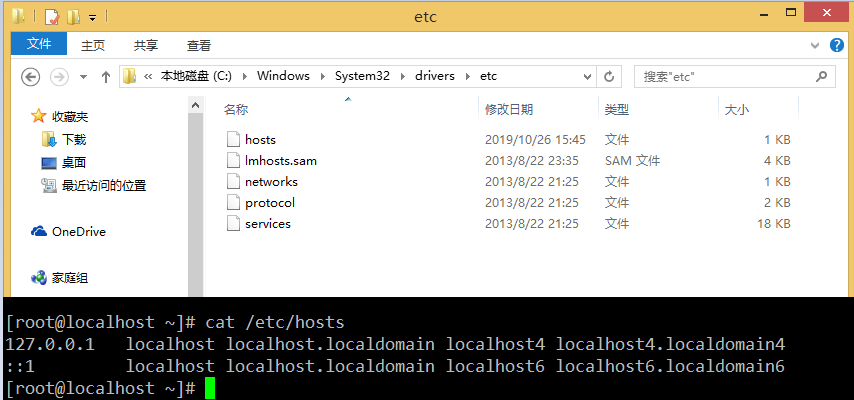
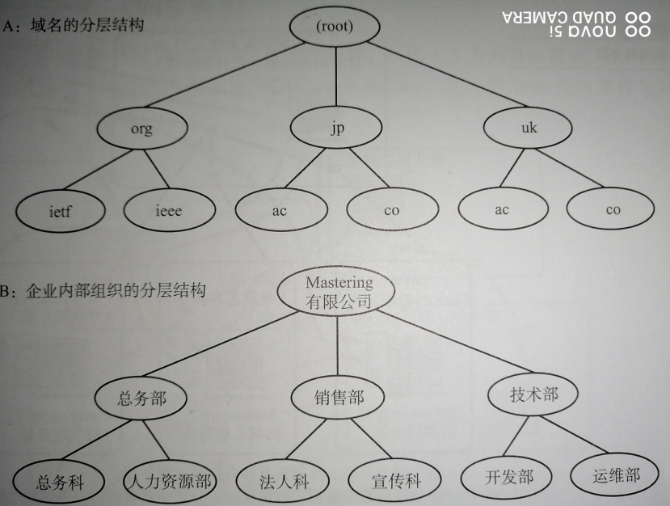
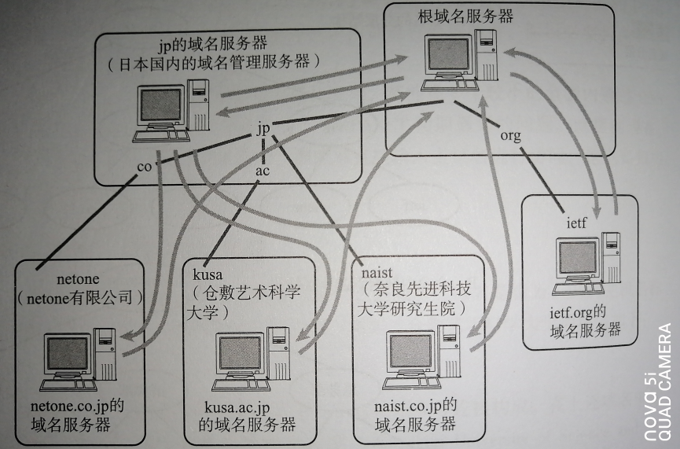
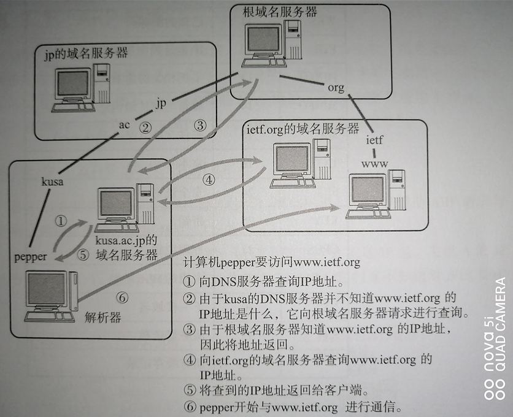
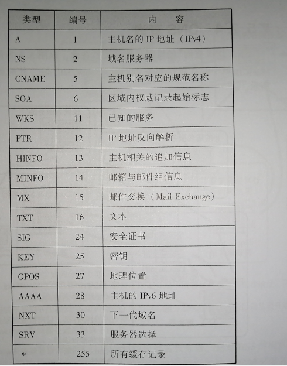
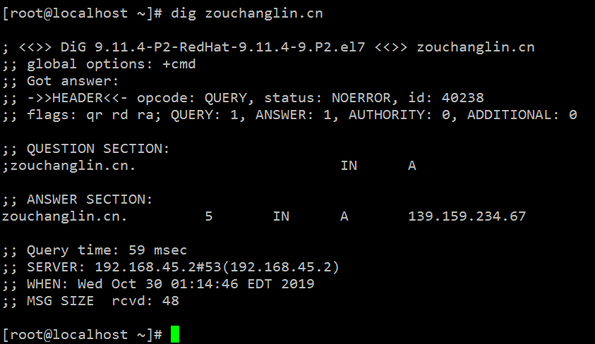
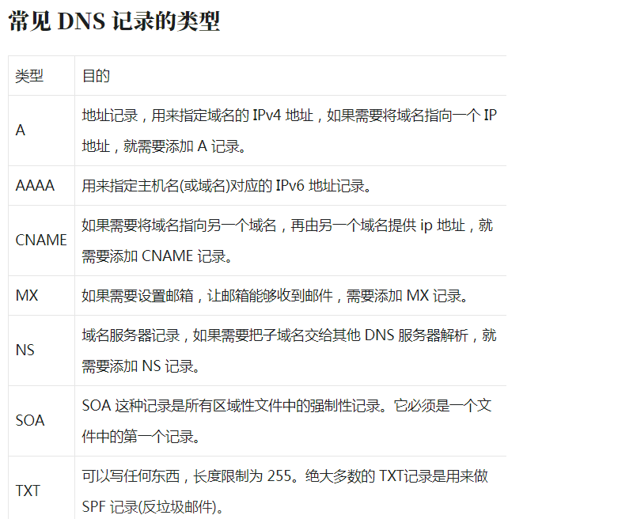
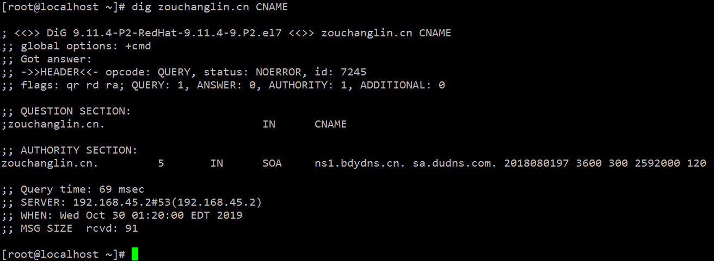
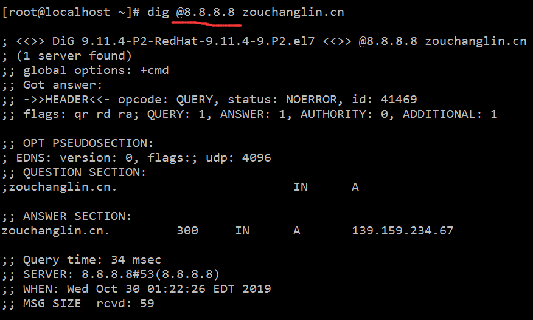
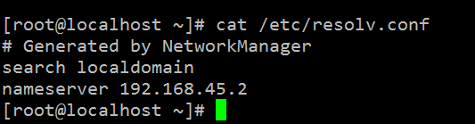

# 1、什么是DNS

DNS(Domain Name System) DNS是一整套从域名映射到IP的系统

TCP/IP中使用IP地址和端口号来确定网络上的一台主机的一个程序。但是IP地址不方便记忆。于是人们发明了一种叫主机名的东西，是一个字符串，并且使用hosts文件来描述主机名和IP地址的关系。

最初，通过互连网信息中心(SRI-NIC)来管理这个hosts文件，如果一个新计算机要接入网络，或者某个计算机IP变更，都需要到信息中心申请变更hosts文件，而且其他计算机也需要定期下载更新新版本的hosts文件才能正确上网。这样就太麻烦了，于是产生了DNS系统，一个组织的系统管理机构，维护系统内的每个主机的IP和主机名的对应关系，如果新计算机接入网络，将这个信息注册到数据库；用户输入域名的时候，会自动查询DNS服务器，由DNS服务器检索数据库，得到对应的IP地址。

至今，我们的计算机上仍然保留了hosts文件，在域名解析的过程中仍然会优先查找hosts文件的内容。Windows和Linux上的host文件如图：



# 2、域名与根服务器

域名的构成

域名是指为了识别主机名称和其他机构组织名称的一种具有分层的名称，比如我的网站的域名是 zouchanglin.cn ，zouchanglin表示我自己，cn则代表中国，在使用域名的时候，可以在每个机构后面追加上机构的域名，比如：我的博客网站域名可以是 blog.zouchanglin.cn，我的视频分享网站可以是 video.zouchanglin.cn ，我的线上小卖部的网站可以是 shop.zouchang.cn ...... ，出现了带层次的域名之后，每个组织或者个人就可以自由的为主机命名了， DNS分成如下图，看起来是个树形结构，如果说顶点是树的根，那么底下就是树的各层枝叶，顶点的下一层叫做第一层域名，包括 cn (中国)、jp(日本)、uk(英国)...还包括edu(教育机构)、com(企业)...



域名服务器管理域名的主机和相应的软件，它可以管理所在分层的域的相关信息，所管理的分层叫做ZONE，每层都设有一个域名服务器。



各个域的分层上都设定有各自的域名服务器

各层域名服务器都了解该层以下分层中所有域名服务器的IP地址，因此葱根域名服务器开始呈现树状连接

由于所有域名服务器都知道根服务器的IP地址，所以如果从根开始按照顺序跟踪，可以访问世界所有的域名服务器的地址

一般为了提高容灾能力一般会设置至少两个以上的域名服务器，所有域名服务器都必须注册根域名服务器的IP地址，因为NDS根据IP地址进行检索的时候，需要从根域名服务器开始按顺序进行。


# 4、DNS查询过程



收到查询请求的服务器首先会在自己的数据控中进行查找，如果有该域名对应的IP地址就返回，如果没有，则域名服务器再想上一层根域名服务器进行查询处理，因此如图所示从根开始对这棵树进行遍历，直到找到指定的域名服务器，并由这个域名服务器返回想要的数据，一般查询到后会保存在缓存了里，减少每次都需要查询时的性能损耗。

# 5、DNS如同互联网的分布式数据库

前面提到DNS是一种通过主机名检索IP地址的系统，然而它所管理的信息不仅仅是这些主机名跟IP地址之间的映射关系，它还要管理众多其他信息，参考下表：



主机名与IP地址对应的信息叫做A记录，反之，从IP地址检索主机名叫做PTR，此外，上层和下层域名服务器IP地址的映射叫做NS记录，特别需要指出的是MX记录，这类记录注册了电子邮件地址与邮件接收服务器的主机名

# 6、使用dig分析DNS过程

安装 dig 工具

```bash
yum install bind-utils
```

之后就可以使用 dig 指令查看域名解析过程了



开头位置是 dig 指令的版本号

第二部分是服务器返回的详情，重要的是 status 参数，NOERROR 表示查询成功

QUESTION SECTION 表示要查询的域名是什么

ANSWER SECTION 表示查询结果是什么

最下面是一些结果统计，包含查询时间和 DNS 服务器的地址等


默认情况下 dig 命令查询 A 记录，上图中显示的 A 即说明查询的记录类型为 A 记录。在尝试查询其它类型的记录前让我们先来了解一下常见的 DNS 记录类型。



除了 A 记录，常见的 DNS 记录还有 CNAME，我们可以在查询时指定要查询的 DNS 记录类型



这样结果中就只有 CNAME 的记录。其实我们可以在查询中指定任何DNS记录的类型

从指定的 DNS 服务器上查询，本次查询的 DNS 服务器为 8.8.8.8



如果不指定 DNS 服务器，dig 会依次使用 /etc/resolv.conf 里的地址作为 DNS 服务器



dig命令执行查询时都经历了哪些过程? +trace 选项就可以看到。它会输出从根域到最终结果的所有信息

```bash
[root@localhost ~]# dig +trace zouchanglin.cn

; <<>> DiG 9.11.4-P2-RedHat-9.11.4-9.P2.el7 <<>> +trace zouchanglin.cn
;; global options: +cmd
.                       5       IN      NS      c.root-servers.net.
.                       5       IN      NS      g.root-servers.net.
.                       5       IN      NS      b.root-servers.net.
.                       5       IN      NS      e.root-servers.net.
.                       5       IN      NS      k.root-servers.net.
.                       5       IN      NS      m.root-servers.net.
.                       5       IN      NS      f.root-servers.net.
.                       5       IN      NS      a.root-servers.net.
.                       5       IN      NS      j.root-servers.net.
.                       5       IN      NS      i.root-servers.net.
.                       5       IN      NS      d.root-servers.net.
.                       5       IN      NS      l.root-servers.net.
.                       5       IN      NS      h.root-servers.net.
;; Received 239 bytes from 192.168.45.2#53(192.168.45.2) in 10 ms

cn.                     172800  IN      NS      a.dns.cn.
cn.                     172800  IN      NS      b.dns.cn.
cn.                     172800  IN      NS      c.dns.cn.
cn.                     172800  IN      NS      d.dns.cn.
cn.                     172800  IN      NS      e.dns.cn.
cn.                     172800  IN      NS      f.dns.cn.
cn.                     172800  IN      NS      g.dns.cn.
cn.                     172800  IN      NS      ns.cernet.net.
cn.                     86400   IN      DS      57724 8 2 5D0423633EB24A499BE78AA22D1C0C9BA36218FF49FD95A4CDF1A4AD 97C67044
cn.                     86400   IN      RRSIG   DS 8 1 86400 20191111170000 20191029160000 22545 . d5pIvGPmRwXNYubnmNxTJ8V8CCz+gXsfhIa6r9CnL7e21vrU4gbf5vyp UcSbSDzzPYB4NkV2RShBLsh4xIV3eonb3HmxS/rIWMKDZavg9vMYAaEp BRB1ZYG4BS35cXeBNaeVs295wFQbRXq4jOT1MIwqeOsgIweG56gpeiKs 4aJdaZ4CSxzfpf0k5R4rntfPO7nJ/Dq/e/onnF7Xk4W3WJr0kTFY5a1G IBnT1VRPckGIphJ5yjNrRiar3qumG1A0y2Q1RZPpMhnbSIunT+Wdj5ZI EatiCeqDopMK3D6m82iBEZycB4yprwI/zVGJxL5xPJMAxFhgf9hI+AyS QnFW1w==
;; Received 705 bytes from 192.58.128.30#53(j.root-servers.net) in 32 ms

zouchanglin.cn.         86400   IN      NS      ns2.bdydns.cn.
zouchanglin.cn.         86400   IN      NS      ns1.bdydns.cn.
3QDAQA092EE5BELP64A74EBNB8J53D7E.cn. 21600 IN NSEC3 1 1 10 AEF123AB 3QLMP0QRNQ96G5AFGOPNB7U7IJ4MBP4B NS SOA RRSIG DNSKEY NSEC3PARAM
3QDAQA092EE5BELP64A74EBNB8J53D7E.cn. 21600 IN RRSIG NSEC3 8 2 21600 20191117072923 20191018072244 38388 cn. HXL4nUKND4ZJq6ZnjNKV0IyMCWh21KV9DA/hc/SBYpBNSE8fdq1Y7KlG O8DO+sgP/M68Zrkuml7cFTiFaJ1uYo7gHD55knKBrc1EbLRI3SehH6Q7 5iTGkZKEt70J2F4MnJ7gTdXUUhaJj5pEC8TiIB/Jebn5BV+FnyRh6XKJ s/c=
SCLRQS9HBJL71295P4F8PH8S15CT2KFH.cn. 21600 IN NSEC3 1 1 10 AEF123AB SCPV80H0ATA0D0PS0V2HRUN4JOBNVAF5 CNAME RRSIG
SCLRQS9HBJL71295P4F8PH8S15CT2KFH.cn. 21600 IN RRSIG NSEC3 8 2 21600 20191117074411 20191018065339 38388 cn. NdnRI6dmaFEFC0Qr/KbXIHQCXKt5jRLC+swFocjNI4BQCbvs3vhr37aZ 2VfW/lCxGPtvp5uV8juI7CY5X71w7MwCblJfZmsQ5n6Y9kfV4INqAW3E mOvoLcwX2mAwWQ4+pACdR5vdg7b6zdHBcdBvLJL2iCN8oU7826uaKNlb DR0=
;; Received 609 bytes from 103.137.60.44#53(ns.cernet.net) in 51 ms

zouchanglin.cn.         300     IN      A       139.159.234.67
;; Received 59 bytes from 119.75.222.53#53(ns2.bdydns.cn) in 40 ms

[root@localhost ~]#
```

