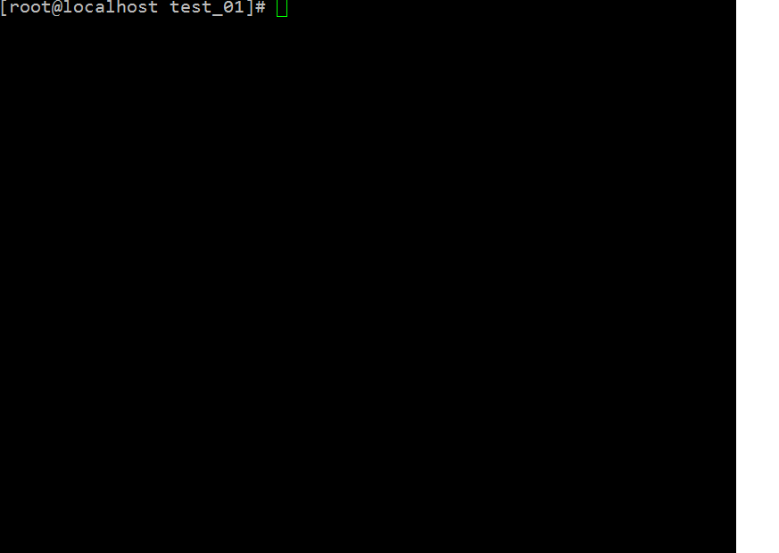
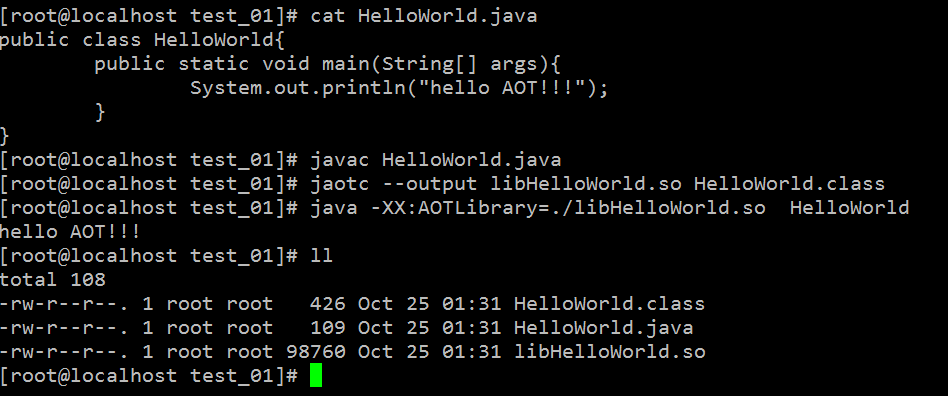
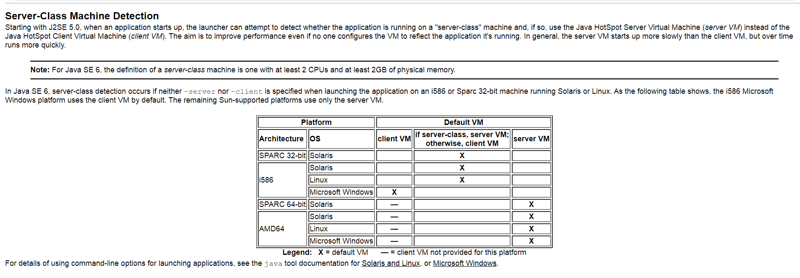
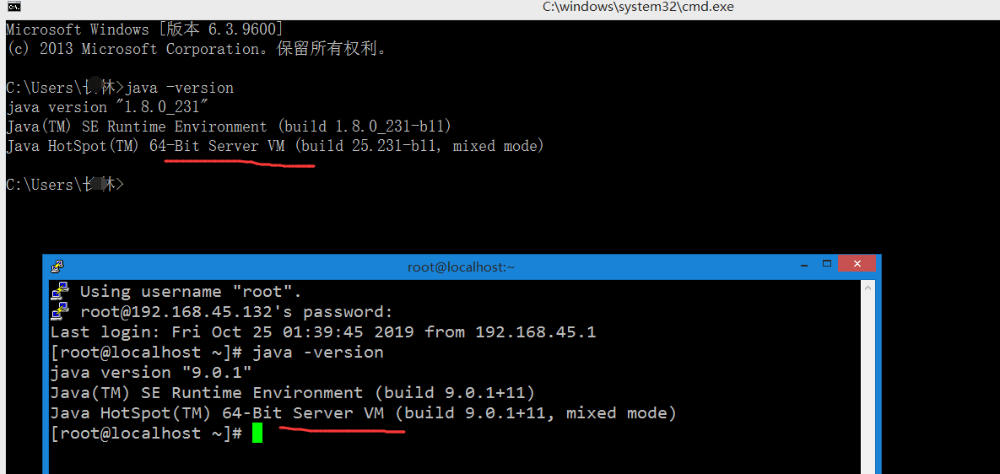

 

# Java是编译型还是解释型语言
关于这个问题我想表达一下自己的看法：Java 的源代码，通过Javac编译成为字节码，然后在运行时通过Java 虚拟机内嵌的解释器将字节码转换成为最终的机器码。但是常见的 JVM，比如我们大多数情况使用的 Oracle JDK 提供的 Hotspot JVM，都提供了 JIT（Just-In-Time）编译器，也就是通常所说的动态编译器，JIT 能够在运行时将热点代码编译成机器码，这种情况下部分热点代码就属于编译执行，而不是解释执行了。

那么什么样的代码算是热点代码呢？被多次调用的方法和被多次执行的循环体都属于热点代码！

编译型语言：把做好的源程序全部编译成二进制代码的可运行程序。然后，可直接运行这个程序。如C/C++
解释型语言：把做好的源程序翻译一句，然后执行一句，直至结束！ 如Python

结论：很显然，Java是解释型的语言，因为虽然Java也需要编译，编译成class文件，但是class文件并不是机器可以识别的语言，而是字节码，最终还是需要 JVM的解释，才能在各个平台执行，这同时也是Java跨平台的原因。所以直接从定义上来说Java属于解释型语言！

# 三种编译模式

Java 虚拟机启动时，可以指定不同的参数对运行模式进行选择。 比如，指定"-Xint"，就是告诉 JVM 只进行解释执行，不对代码进行编译，这种模式抛弃了JIT可能带来的性能优势。毕竟解释器（interpreter）是逐条读入，逐条解释运行的。与其相对应的，还有一个"-Xcomp"参数，这是告诉 JVM 关闭解释器，不要进行解释执行，或者叫作最大优化级别，但是这种模式未必是高效的。"-Xcomp"会导致JVM 启动变慢非常多，同时有些 JIT 编译器优化方式，比如分支预测，往往并不能进行有效优化。

1、只进行解释执行：-Xint  
-Xint标记会强制JVM执行所有的字节码，当然这会降低运行速度，通常低10倍或更多。  

2、关闭解释器：-Xcomp  
JVM在第一次使用时会把所有的字节码编译成本地代码，从而带来最大程度的优化。这听起来不错，因为这完全绕开了缓慢的解释器。然而，很多应用在使用-Xcomp也会有一些性能损失，当然这比使用-Xint损失的少，原因是-xcomp没有让JVM启用JIT编译器的全部功能。JIT编译器在运行时创建方法使用文件，然后一步一步的优化每一个方法，有时候会主动的优化应用的行为。  

3、混合模式：-Xmixed  
解释执行+JIT

通过下图也可以对比出这三种启动方式的速度：

# JDK9的AOT

通过 AOT（Ahead-of-Time Compilation）， 编译代码加快应用程序启动，因为虽然这种代码通常比JIT 编译代码慢，但是却比解释代码快很多倍。此外，因为加载和绑定AOT编译代码的时间通常比检测和动态编译一个重要方法的时间少，所以能够在程序执行的早期达到那样的性能。类似地，交互式应用程序可以很快地从本地代码中获益，无需使用引起较差响应能力的动态编译。

只有在执行代码引用类的时候才加载该类。因为是在程序执行前进行AOT 编译的，所以编译器无法预测加载了哪些类。就是说编译器无法获知任何静态字段的地址、任何对象的任何实例字段的偏移量或任何调用的实际目标，甚至对直接调用（非虚调用）也是如此。虽然AOT是有好处的，但是缺少关于静态、字段、类和方法的信息意味着严重限制了 Java 编译器中优化框架的大部分功能。这实际上限制了Java 语言本身的动态特性，牺牲了平台无关性和代码！

# JVM的server/client型
现在的JVM运行Java程序（和其它的兼容性语言）时在高效性和稳定性方面做的非常出色。自适应内存管理、垃圾收集、及时编译、动态类加载、锁优化等等。在运行时，JVM会不断的计算并优化应用或者应用的某些部分。

有两种类型的 HotSpot JVM，即"server"和 "client"。服务端的VM中的默认为堆提供了一个更大的空间以及一个并行的垃圾收集器，并且在运行时可以更大程度地优化代码。客户端的VM更加保守一些，这样可以缩短JVM的启动时间和占用更少的内存。 从J2SE 5.0开始，当应用程序启动时，启动程序可以尝试检测该应用程序是否在"服务器级"计算机上运行，如果是，则使用JavaHotSpotServer虚拟机(服务器VM) 而不是JavaHotSpot客户端虚拟机（客户端VM）。目的是即使没有人配置VM来反映它正在运行的应用程序，也可以提高性能。通常，服务器VM的启动速度比客户端VM的启动速度慢，但随着时间的推移，运行速度会更快。

在Java SE 6中，如果在运行Solaris或Linux的i586或Sparc 32位计算机上启动应用程序时-server-client指定也未指定，则将进行服务器类型检测 。如下表所示，默认情况下，i586 Microsoft Windows平台使用客户端VM。其余的Sun支持的平台仅使用服务器VM：
https://docs.oracle.com/javase/6/docs/technotes/guides/vm/server-class.html
参考下表：x表示默认的虚拟机类型        - 表示 这个平台没有提供客户端VM

如何验证这个表呢？

以windows版本的来看(Linux的JDK9是我刚才安装的)输出显示的是Java版本号(1.8.0_231)和JRE确切的build号(1.8.0_231-b11)。我们也可以看到JVM的名字(HotSpot)、类型(client)和build ID（25.231-b11)）。除此之外，我们还知道JVM以混合模式(mixed mode)在运行，这是HotSpot默认的运行模式，意味着JVM在运行时可以动态的把字节码编译为本地代码。