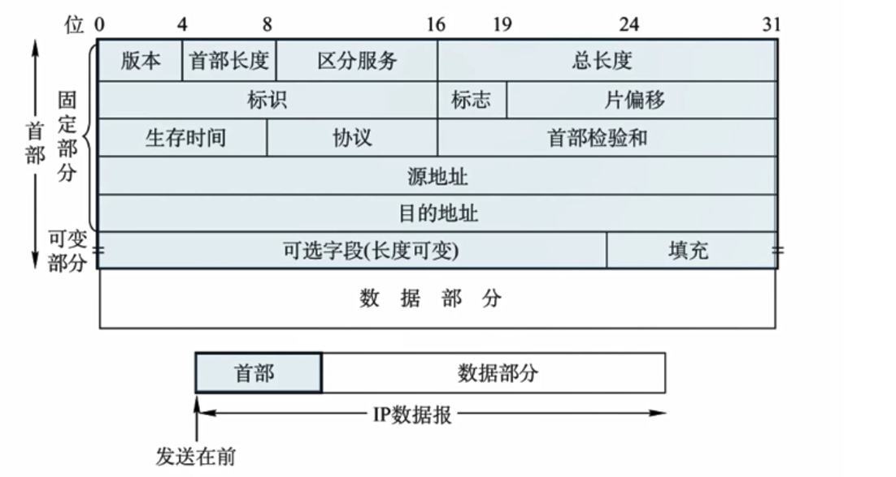

# IP数据报格式

下面是首部的结构：

这里的长度单位都是位（比特位）

## 1、版本

4位版本号(version)：指定IP协议的版本，对于IPv4来说，就是4

## 2、首部长度

4位头部长度(header length)：IP头部的长度，单位是4比特，最小为5（因为固定部分为20字节，所以最小就是5），也就是说首部长度是 4×5=20到 4×15=60之间

## 3、区分服务

8位服务类型(Type Of Service)：3位优先权字段(已经弃用)，4位TOS字段，和1位保留字段(必须置为0)。4位
TOS分别表示：最小延时、 最大吞吐量、 最高可靠性、最小成本。 这四者相互冲突，只能选择一个。对于
ssh/telnet这样的应用程序，最小延时比较重要；对于ftp这样的程序，最大吞吐量比较重要。

## 4、总长度

16位总长度(total length)：IP数据报整体占多少个字节

## 5、标识

16位标识(id)：唯一的标识主机发送的报文。如果IP报文在数据链路层被分片了，那么每一个片里面的这个
id都是相同的。

## 6、标志

3位标志字段：第一位保留（保留的意思是现在不用，但是还没想好说不定以后要用到）。第二位置为1表示禁
止分片，这时候如果报文长度超过MTU，IP模块就会丢弃报文。第三位表示“更多分片”，如果分片了的话，最后一个分片置为1，其他是0。类似于一个结束标记。

## 7、片偏移

13位分片偏移(framegament offset)：是分片相对于原始IP报文开始处的偏移。其实就是在表示当前分片
在原报文中处在哪个位置，实际偏移的字节数是这个值 * 8 得到的。因此，除了最后一个报文之外，其他报
文的长度必须是8的整数倍（否则报文就不连续了）。

## 8、生存时间

8位生存时间(Time To Live, TTL)：数据报到达目的地的最大报文跳数，一般是64。每次经过一个路由，TTL
就减一，一直减到0还没到达，那么就丢弃了。这个字段主要是用来防止出现路由循环

## 9、协议

8位协议：表示上层协议的类型

## 10、首部校验和

16位头部校验和：使用CRC进行校验，来鉴别头部是否损坏。也就是二进制的和！

## 11、源地址和目的地址

32位源地址和32位目标地址： 表示发送端和接收端

## 12、可选字段和填充

用来支持排错、测量以及安全等措施

# IP数据报分片

## 1、最大传送单元MTU

MTU全称是maximum transmission unit，是指链路层数据帧可封装数据的上限，以太网的MTU是1500字节。

## 2、IP数据报的标识

回顾一下IP数据报中的标识：唯一的标识主机发送的报文。如果IP报文在数据链路层被分片了，那么每一个片里面的这个id都是相同的。

## 3、IP数据报的标识字段

回顾一下IP数据报中的标志字段：

## 4、IP数据报的片偏移

片偏移：指出较长分组分片后，某片在原分组中的相对位置，以8B为单位。除了最后一个分片，每个分片长度一定是8B的整数倍。

## 5、分片示例

以太网帧中的数据长度规定最小46字节，最大1500字节，ARP数据包的长度不够46字节，要在后面补填充位；最大值1500称为以太网的最大传输单元(MTU)，不同的网络类型有不同的MTU；

如果一个数据包从以太网路由到拨号链路上，数据包长度大于拨号链路的MTU了，则需要对数据包进行分片(fragmentation)；不同的数据链路层标准的MTU是不同的；

下面以1420比特为最大值进行分片：

这个例子其实很好理解，首部必须占用了20位，数据划分为1400位+1400位+1000位，他们都来自同一个数据报，所以标识都是一样的（在这里假设都为12345），数据报1、2、3DF都是0则表示允许分片，数据报1、2MF都是1表示后面还有分片，数据报3的MF为0，代表自己是最后一个分片，后面没有分片了，至于片偏移这个额也是可以计算的，数据报1的片偏移为0，1400/8=175，所以数据报2的片偏移为175，数据报3的片偏移为350，通过片偏移就是为了数据重组或者合并后仍然是原来未分片时候的顺序！

