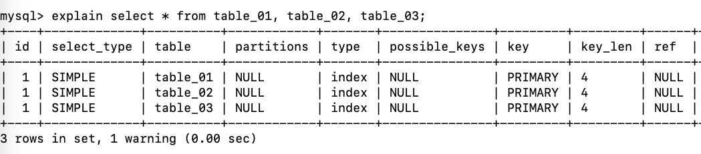
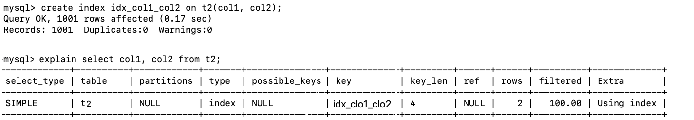

## 前提知识

Mysq中有专门负责优化 SELECT语句的优化器模块，主要功能：通过计算分析系统中收集到的统计信息，为客户端请求的 Query提供他认为最优的执行计划(他认为最优的数据检索方式，但不见得是DBA认为是最优的)

当客户端向 MySQL请求一条 Query，命令解析器模块完成请求分类，区别出是 SELECT并转发给 MySQL Query Optimizer时， MySQL Query Optimizer首先会对整条 Query进行优化，处理掉一些常量表达式的预算直接换算成常量值。并对 Query中的查询条件进行简化和转换，如去掉一些无用或显而易见的条件、结构调整等。然后分析 Query中的Hint信息(如果有)，看显示Hint信息是否可以完全确定该 Query的执行计划。如果没有Hint或Hint信息还不足以完全确定执行计划，则会读取所涉及对象的统计信息，根据 Query进行写相应的计算分析，然后再得出最后的执行计划。

## MySQL常见性能瓶颈

CPU：CPU在饱和的时候一般发生在数据装入内存或从磁盘上读取数据时候

IO：磁盘I/O瓶颈发生在装入数据远大于内存容量的时候

服务器硬件的性能瓶颈：top、free、 iostat 和 vmstat来查看系统的性能状态

## Explain-执行计划

用 EXPLAIN关键字可以模拟优化器执行SQL查询语句，从而知道 MySQL是如何处理你的sqL语句的。分析你的査询语句或是表结构的性能瓶颈！

用法：explain + SQL

### explain能干啥？

表的读取顺序

数据读取操作的操作类型

哪些索引可以使用

哪些索引被实际使用

表之间的引用

每张表有多少行被优化器查询

### 执行计划包含的信息

下面解释一下这些字段是干啥的：

#### 1、id

select查询的序列号，包含一组数字，表示查询中执行select子句或操作表的顺序。有三种情况：

1、id相同，执行顺序由上至下

2、id不同，如果是子査询，id的序号会递増，id值越大优先级越高，越先被执行

PRIMARY就是主查询，id越大越先被执行，则毫无疑问在这样的子查询中，肯定最先要查询的表就是table_03，所以这是MySQL自己约定的顺序，就和运算符优先级一样！SUBQUERY 代表最外层查询。

3、id相同不同，同时存在

id如果相同，可以认为是一组，从上往下顺序执行；在所有组中，id值越大，优先级越高，越先执行，衍生=DERIVED，所以这里就体现了explain的第一个用处，那就是它能看出表的读取和加载顺序！

#### 2、select_type

SIMPLE、PRIMARY、SUBQUERY、DERIVED、UNION、UNION RESULT、

查询的类型，主要是用于区别普通査询、联合査询、子査询等的复杂查询

SIMPLE：简单的 select查询，查询中不包含子查询或者 UNION

PRIMARY：查询中若包含任何复杂的子部分，最外层查询则被标记为PRIMARY

SUBQUERY：在 SELECT或 WHERE列表中包含了子查询

DERIVED：在FROM列表中包含的子查询被标记为 DERIVED(衍生)，MySQL会递归执行这些子查询，把结果放在临时表里。

UNION：若第二个 SELECT出现在UNION之后，则被标记为UNION；若UNON包含在FRON子句的子查询中，外层 SELECT将被标记为: DERIVED

UNION RESULT：从 UNION表获取结果的 SELECT

所以这样就看到了数据读取操作的操作类型

#### 3、table

这个基本不用说，显示这一行的数据是关于哪张表的

#### 4、type

type显示的是访问类型，是较为重要的一个指标，结果值从最好到最坏依次是:

system > const > eq_ref > ref > fulltext > ref_or_null > index_merge >unique_subquery >index _subquery > range > index > ALL 

**一般来说，得保证查询至少达到 range级别，最好能达到ref**

这样查询的类型就是ALL，如果数据达到百万级别的一个全表扫描，那么性能肯定会下降的！

常见的type就这些：system > const > eq_ref > ref > range > index > ALL

* system  表只有一行记录(等于系统表)，这是 const类型的特例，平时不会出现，这个也可以忽略不计

* const  表示通过索引一次就找到了，const用于比较primary key或者unique索引。因为只匹配一行数据，所以很快。如将主键至于where列表中，MySQL就能将该查询转换为一个常量，比如where id = 1就被当成是常量

  

* eq_ref  唯一性索引，对于每个索引键，表中只有一条记录与之匹配，常见于主键或唯一索引扫描

  

* ref  非唯一性索引扫描，返回匹配某个单独值的所有行本质上也是一种索引访问，它返回所有匹配某个单独值的行。然而，能会找到多个符合条找和扫描的混合，与eq_ref对比，其实可以发现ref是对非唯一索引进行扫描，其实也就是对数据表的非主键字段建立索引，然后通过这个索引进行扫描，结果可想而知肯定是非唯一性的！

* range  只检索给定范围的行，使用一个索引来选择行。key列显示使用了哪个索引，一般就是在你的 where语句中出现 between、<、>、in等的查询，这种范围扫描索引比全表扫描要好，因为它只需要开始于索引的某一点，而结束于另一点，不用扫描全部索引。

  

  

* index  Full Index scan，index与ALL区别为index类型只遍历索引树。这通常比ALL快，因为索引文件通常比数据文件小 (也就是说虽然叫all和index都是读全表,但 index是从索引中读取的，而all是从硬盘中读的

  

* all  FulITable scan，将遍历全表以找到匹配的行

#### 5、possible_keys

显示可能应用在这张表中的索引，一个或多个。

查询涉及的字段上若存在索引，则该索引将被列出，**但不一定被查询实际使用**

#### 6、key

实际使用的索引。如果为null则没有使用索引

查询中若使用了覆盖索引，则索引和查询的select字段重叠。

所以possible_keys和key实际上是告诉了使用者，MySQL理论上会用到哪些索引，实际上会用到哪些索引。

这就是覆盖索引，也就是如果你要查询的字段顺序正好与索引建立的顺序相等，那么查询类型那直接变为index查询，而不是ref类型！

#### 7、key_len

表示索引中使用的字节数，可通过该列计算查询中使用的索引的长度。在不损失精确性的情况下，长度越短越好

key_len显示的值为索引最大可能长度，并非实际使用长度，即key_len是根据表定义计算而得，不是通过表内检索出的

这个其实比较容易理解，精度越高，需要的索引字节数也变长了，很显然，更高精度的查询付出的代价就是key_len变长了！

#### 8、ref

显示索引那一列被使用了，如果可能的话，是一个常数。那些列或常量被用于查找索引列上的值，比如:

所以通过这里我们已经知道哪些索引可以使用，哪些索引被实际使用！

#### 9、rows

显示索引那一列被使用了，如果可能的话，是一个常数。那些列或常量被用于查找索引列上的值，越少越好！

通过上面的例子进行分析，在没建立索引前，扫描了641行，先加载t2，再加载t1，查询t2表的时候是ALL，也就是逐行扫描，并且本来可以使用主键索引，但是依旧没什么意义，所以还是以逐行扫描的方式进行查询，这样会有640行结果。接下来对t2表建立复合索引，所以可供选择的索引就有主见索引、自己新建的复合索引。很明显，新建复合索引之后呢，查询的时候不再采用逐行扫描的方式，而是选择了复合索引，行数降到了142行，总共143行就可以搞定这个查询问题！

#### 10、Extra

额外的，扩展的。包含不适合在其他列中显示但十分重要的额外信息！

① Using filesort

说明mysql会对数据使用一个外部的索引排序，而不是按照表内的索引顺序进行读取。MySQL中无法利用索引完成排序操作成为"文件排序"，这种文件排序是需要尽量避免的。

② Using temporary

使用了临时表保存中间结果，MySQL在对查询结果排序时使用临时表。常见于排序order by 和分组查询 group by。这个动作更耗费时间，如果说Using filesort 是九死一生的话那么出现Using temporary是十死无生了

通过上面的例子我们应该明白，如果建立了索引，那么在进行group by的时候应该按照建立索引的顺序使用到索引，否则会造成Using filesort 和 Using temporary。

③ Using index

表示相应的select操作中使用了覆盖索引（Coveing Index）,避免访问了表的数据行，效率不错！如果同时出现using where，表明索引被用来执行索引键值的查找；如果没有同时出现using where，表面索引用来读取数据而非执行查找动作。

索引覆盖

覆盖索引( Covering Index)，一说为索引覆盖。

理解方式一：就是 select的数据列只用从索引中就能够取得，不必读取数据行，MySQL可以利用索引返回 select列表中的字段，而不必根据索引再次读取数据文件。换句话说查询列要被所建的索引覆盖！

理解方式二：索引是高效找到行的一个方法，但是一般数据库也能使用索引找到一个列的数据，因此它不必读取整个行。毕竟索引叶子节点存储了它们索引的数据；当能通过读取索引就可以得到想要的数据，那就不需要读取行了。一个素引包含了(或覆盖了)满足查询结果的数据就叫做覆盖索引

注意：

如果要使用覆盖索引，一定要注意 select列表中只取出需要的列，不可 ` select * `，因为如果将所有字段一起做索引会导致索引文件过大，查询性能下降

④ Using where

表明使用了where过滤

⑤ Using join buffer

使用了连接缓存，Join查询动作平凡，数据量大的时候就需要增大join buffer的容量

⑥ impossible where

where子句的值总是false，不能用来获取任何元组

比如这样的MySQL不能理解的SQL。

⑦ select tables optimized away

在没有GROUPBY子句的情况下，基于索引优化MIN/MAX操作或者，对于MyISAM存储引擎优化`COUNT(*)` 操作，不必等到执行阶段再进行计算，查询执行计划生成的阶段即完成优化。

⑧ distinct

优化distinct，在找到第一匹配的元组后即停止找同样值的工作

### 小练习

执行顺序是：

第一行(执行顺序4)：id列为1，表示是 union里的第一个 select，select type列的primary表示该查询为外层查询。tabe列被标记为`<derived3>`，表示查询结果来自一个衍生表，其中 derived3中3代表该查询衍生自第三个select查询，即id为3的 select【select d1 name......】

第二行(执行顺序2)：id为3，是整个查询中第三个selec的一部分。因查询包含在from中，所以为 derived【 select id, name from t1 where other_column="】

第三行(执行顺序3)：select列表中的子查询select type为subquery，为整个查询中的第二个 select【 select id from t3】

第四行(执行顺序1)：select type为unon，说明第四个select是unon里的第二个select，最先执行【 select name, id from t2】

第五行(执行顺序5)：代表从union的临时表中读取行的阶段，table列的< unIon1,4>表示用第一个和第四个select的结果进行union操作。【两个结果union操作】

