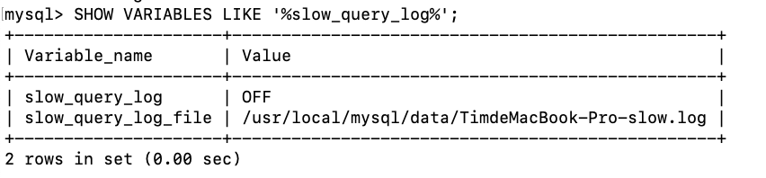
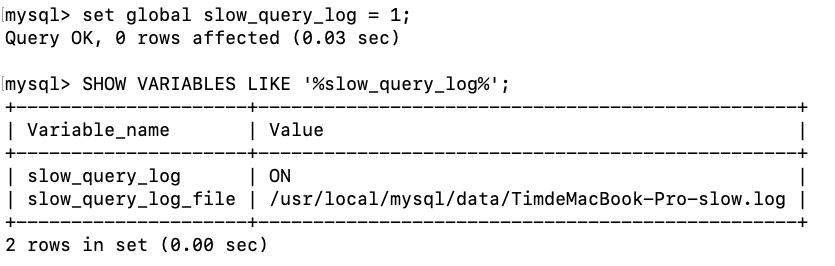
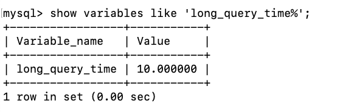
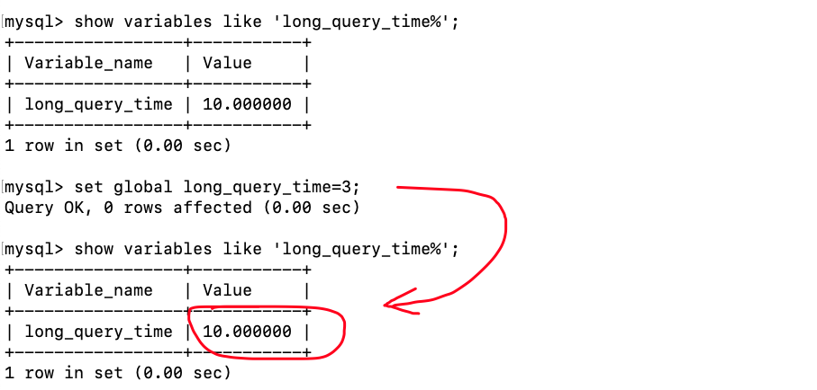
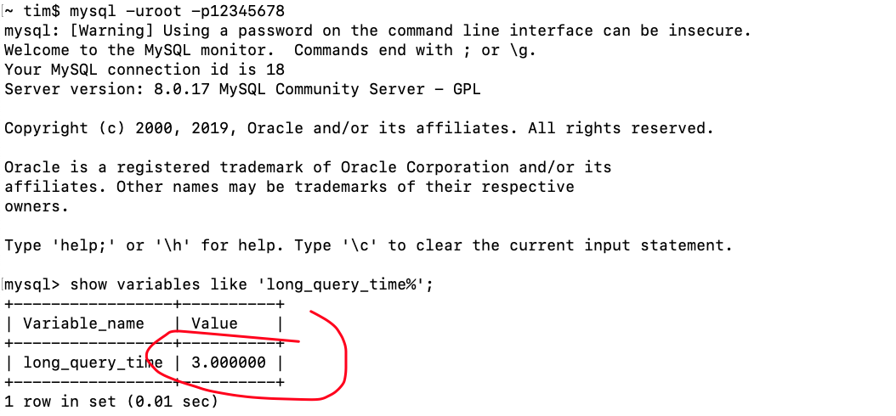
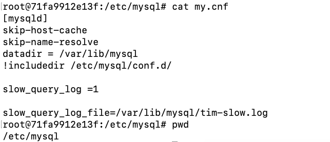
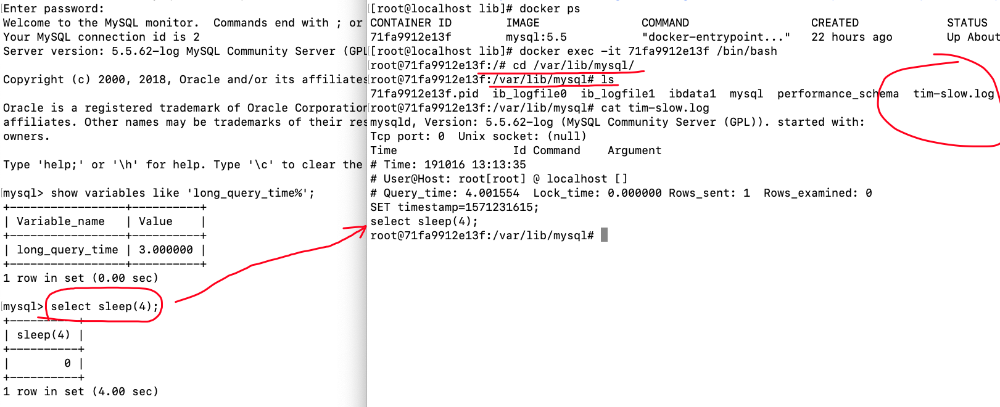
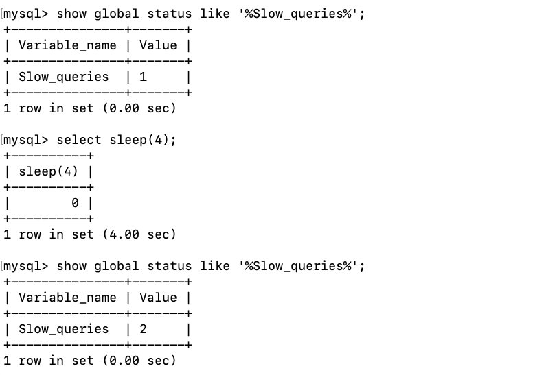
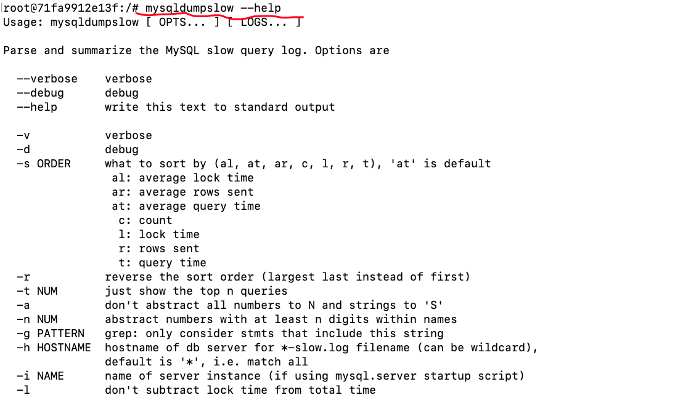

# 慢查询日志

## 什么是慢查询日志

MySQL的慢查询日志是 MySQL提供的一种日志记录，它用来记录在 MySQL 中响应时间超过阀值的语句，具体指运行时间超过long_query_time 值的 SQL，则会被记录到慢查询日志中

具体指运行时间超过 long_query_time 值的 SQL，则会被记录到慢查询日志中。long_query_time 的默认值为 10, 意思是运行 10 秒以上的语句

由它来查看哪些 SQL 超出了我们的最大忍耐时间值，比如一条SQL执行超过 5 秒钟，我们就算慢 SQL，希望能收集超过 5 秒的SQL，结合之前explain进行全面分析


默认情况下，MySQL 数据库没有开启慢査询日志，需要我们手动来设置这个参数。当然，如果不是调优需要的话，一般不建议启动该参数，因为开启慢查询日志会或多或少带来一定的性能影响。慢査询日志支持将日志记录写入文件！

## 如何开启慢查询

查看开启状态

```sql
SHOW VARIABLES LIKE '%slow_query_log%'
```



开启慢查询

```sql
set global slow_query_log = 1
```

使用 set global_slow_query_log = 1 开启了慢查询日志只对当前数据库生，如果 MYSQL 重启后则会失效。



如果要永久生效，就必须修改配置文件 my.cnf（其它系统变量也是如此）修改 my.cnf 文件，[mysqld]下增加或修改参数

slow_query_log 和 slow_query_log_file 后，然后重启 MySQL 服务器。也即将如下两行配置进my.cnf文件

```ini
slow_query_log =1

slow_query_log_file=/var/lib/mysql/tim-slow.log
```

关于慢查询的参数 slow_query_log_fie，它指定慢查询日志文件的存放路径，系统默认会给一个缺省的文件host_name-slow.log（如果没有指定参数 slow_query_log_file的话）

那么开启慢查询日志后，什么样的SQL参会记录到慢查询里面？

通过 show variables like 'long_query_time%' 来查看默认时间长度，单位是秒：

 

同样的，可以使用命令修改，也可以在my.cnf里面配置。假如运行时间正好等于 long_query_time 的情况，并不会被记录下来。也就是说，在MySQL源码里是判断大于 long_query_time，而非大于等于!

设置记录的阈值：

```sql
set global long_query_time=3;
```



设置了但是还是没有发生更改？为什么？此时需要重新开启一个会话才可以：



接下来实行一个较慢的查询，如下图，但是记得要在配置文件中做如下配置：



接着去日志文件中查看存在哪些超过阈值的SQL就好了：



查询当前系统中有多少条慢查询记录：



记载一下我的配置文件

```ini
slow_query_log=1;
slow_query_log_file=/var/lib/mysql/tim-slow.log;
long_query_time=3;
log_output=FILE
```

## 日志分析工具mysqldumpshow



在生产环境中，如果要手工分析日志，查找、分析 SQL，显然是个体力活，MYSQL 提供了日志分析工具mysqldumpshow

* s:是表示按何种方式排序
* c:访问次数
* l:锁定时间
* r:返回记录
* t:查询时间
* al:平均锁定时间
* ar:平均返回记录数
* at:平均查询时间
* t:即为返回前面多少条的数据
* g:后边搭配一个正则匹配模式，大小写不敏感的


下面是使用示例：

得到返回记录集最多的 10 个 SQL

```bash
mysqldumpslow -s r -t 10 /var/lib/mysql/tim-slowlog
```

得到访问次数最多的 10 个 SQL

```bash
mysqldumpslow -s c-t 10 /var/lib/mysql/tim-slow log
```

得到按照时间排序的前 10 条里面含有左连接的查询语句

```bash
mysqldumpslow -s t -t 10 -g "left join" /var/lib/mysql/tim-slowlog
```

另外建议在使用这些命令时结合和 more 使用，否则有可能出现爆屏情況 

```bash
mysqldumpslow -s r -t 10 /var/lib/mysq/tim-slow.log | more
```