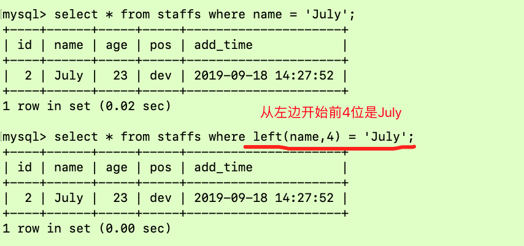

## 索引分析

### 案例一 单表分析

假设这样一张表，下面是建表语句

```sql
CREATE TABLE `article` (
  `id` int(10) NOT NULL,
  `author_id` int(10) NOT NULL,
  `category_id` int(10) NOT NULL,
  `views` int(10) NOT NULL,
  `comments` int(10) NOT NULL,
  `title` varchar(255) NOT NULL,
  `content` text NOT NULL,
  PRIMARY KEY (`id`)
) ENGINE=InnoDB DEFAULT CHARSET=utf8;

-- ----------------------------
-- Records of article
-- ----------------------------
BEGIN;
INSERT INTO `article` VALUES (1, 1, 1, 1, 1, '1', '1');
INSERT INTO `article` VALUES (2, 2, 2, 2, 2, '2', '2');
INSERT INTO `article` VALUES (3, 1, 1, 3, 3, '3', '3');
COMMIT;
```


查询 category_id为1且 comments大于1的情况下，views最多的 article_id：

```sql
explain select id, author_id from article where category_id = 1 and comments > 1 order by views desc limit 1;
```


很显然，type是ALL，即最坏的情况。Exta里还出现了 Using filesort 也是最坏的情况。优化是必须的，先来看看这张表的索引：

```sql
mysql> show index from article;
+---------+------------+----------+--------------+-------------+-----------+-------------+----------+--------+------+------------+---------+---------------+
| Table   | Non_unique | Key_name | Seq_in_index | Column_name | Collation | Cardinality | Sub_part | Packed | Null | Index_type | Comment | Index_comment |
+---------+------------+----------+--------------+-------------+-----------+-------------+----------+--------+------+------------+---------+---------------+
| article |          0 | PRIMARY  |            1 | id          | A         |           2 |     NULL | NULL   |      | BTREE      |         |               |
+---------+------------+----------+--------------+-------------+-----------+-------------+----------+--------+------+------------+---------+---------------+
1 row in set (0.00 sec)
```

很显然，只有主键索引。那么接下来开始建索引吧，有两种方式：

```sql
alter table article add index idx_article_ccv(category_id, comments, views);

create index idx_article_ccv on article(category_id, comments, views);
```

建好索引后


关于Using index condition https://blog.csdn.net/z69183787/article/details/53393153 。 建立索引后，也可以明显看出来用到了索引，避免了全表扫描，但是还是存在文件排序：


这是为什么呢？原因是我们SQL语句中的>1， >1是个范围，如果改成=1呢？


很显然，这是两个常量字段都是const，也就不需要文件内排序，但是这样是属于更改题目。所以这也说明了一个问题，就是范围后的索引会失效，也就是把索引放到一个范围后面，这个索引成了失效索引！所以尽量给定具体值，不要给范围。

所以如果非要在给定范围内查找，这个索引是不合适的，我们需要重建索引，先把之前的索引删除：

```sql
drop index idx_article_ccv on article;
```

当我们建立索引的后，type变成了 range，这是可以忍受的。但是 extra里使用 Using files仍是无法接受的

但是我们已经建立了索引，为啥没用呢？这是因为按照 BTree索引的工作原理，先排序 category_id，如果遇到相同的 category_id则再排序 comments，如果遇到相同的 comments则再排序views。当 comments字段在联合索引里处于中间位置时，因 comments > 1条件是一个范围值(所谓 range)，MySQL无法利用索引再对后面的views部分进行检索，即 range类型查询字段后面的索引无效。

好了，接下来开始重新建立索引：

```sql
alter table article add index idx_article_cv(category_id, views);

create index idx_article_cv on article(category_id, views);
```


### 案例二 两表分析

如下两张表，分别插入20条数据：

```sql
create table if not exists class(
    id int(10) unsigned not null auto_increment,
    card int(10) unsigned not null,
    primary key (id)
);

create table if not exists book(
    bookid int(10) unsigned not null auto_increment,
    card int(10) unsigned not null,
    primary key (bookid)
);

insert into class(card)values (FLOOR(1 + RAND() * 20));
insert into book(card)values (FLOOR(1 + RAND() * 20));
```

下面开始explain分析：


两个type都是ALL，那么究竟是在class加索引还是book加索引呢？

实验一：左连接 + 索引加在右表


实验二：接下来删除book的card索引，对右表建立索引。也就是：左连接 + 索引加在左表


通过实验一和实验二的对比，可以看到 **左连接 + 索引加在右表 ** 第二行的type变为了 ref ，rows也变成了优化比较明显。这是由左连接特性决定的。 left join 条件用于确定如何从右表搜索行，左表一定都有，所以右表是我们的关键点，一定需要建立索引。

所以说有时对于DBA建好的索引也无需修改，我们需要修改SQL语句中表的位置即可！比如对于上述例子：

```sql
select * from book right join class on class.card = book.card;
```

同样的道理， right join 条件用于确定如何从左表搜索行，右表一定都有，所以左表是我们的关键点，一定需要建立索引。

### 案例三 三表分析

还是依照上面的两张表，再新建一张表，并插入20条数据：

```sql
create table if not exists phone(
    phoneid int(10) unsigned not null auto_increment,
    card int(10) unsigned not null,
    primary key (phoneid)
);

insert into phone(card)values (FLOOR(1 + RAND() * 20));
```

```sql
explain select * from class left join book on class.card = book.card left join phone on book.card = phone.card;
```


现在对phone和book表的card字段建立索引：


后2行的type都是ref且总rows优化很好效果不错。因此索引最好设置在需要经常查询的字段中。


JOIN语句的优化：

尽可能减少JOIN语句中的NestedLoop的循环总次数："永远用小结果集驱动大的结果集"

优先优化NestedLoop的循环的内层

保证JOIN语句中被驱动表上Join条件字段已经被索引

当无法保证被驱动表的JOIN条件字段被索引且内存资源充足的前提下，不要太吝惜 JoinBuffer的设置


## 索引失效

先建示例表与该表的索引：

```sql
create table staffs(
    id int primary key auto_increment,
    name varchar(24) not null default '' comment '姓名',
    age int not null default 0 comment '年龄',
    pos varchar(20) not null default '' comment '职位',
    add_time timestamp not null default current_timestamp comment '入职时间'
)charset utf8 comment '员工记录表';

INSERT INTO staffs(NAME, age, pos, add_time)VALUES('z3', 22, 'manager', NOW());
INSERT INTO staffs(NAME, age, pos, add_time) VALUES('July', 23, 'dev', NOW());
INSERT INTO staffs(NAME, age, pos, add_time) VALUES('2000', 23, 'dev', NOW());
SELECT * FROM staffs;

alter table staffs add index idx_staffs_nameAgePos(name, age, pos);

show index from staffs;
```

1、全值匹配我最爱

2、最佳左前缀法则

3、不在索引列上做任何操作(计算、函数、(自动or手动)类型转换)，会导致索引失效而转向全表扫描

4、存储引擎不能使用索引中范围条件右边的列

5、尽量使用覆盖索引(只访问索引的查询(索引列和查询列一致)，减少 select

6、mysql在使用不等于(=或者<>)的时候无法使用索引会导致全表扫描

7、is null, is not null也无法使用索引

8、like以通配符开头('%abc…')mysq索引失效会变成全表扫描的操作

9、字符串不加单引号索引失效

10、少用or，用它来连接时会索引失效


### 1、全值匹配我最爱

```sql
explain select * from staffs where name = 'July';
explain select * from staffs where name = 'July' and age = 23;
explain select * from staffs where name = 'July' and age = 23 and pos = 'dev';
```


### 2、最佳左前缀法则

但是请看下面这种情况


很明显建的索引没用到，但是如果只是根据name字段来查询却又可以用到索引。如果索引了多列，要遵守最佳左前缀法则。指的是查询从索引的最左前列开始并且不跳过索引中的列。否则会引起索引失效！这也是最常用的法则！很形象的一个例子：带头大哥不能死，name索引相当于火车头，age、pos是车厢，所以没有name火车肯定动不了，但是如果只有火车头，那么也是能动的，单独的车厢不能运动而已！

那么这样呢？

```sql
explain select * from staffs where name = 'July' and pos = 'dev';
```


上面这条SQL很显然用到了索引，但是key_len还是74没变，其实这条SQL只用到了name索引，并未用到pos索引。这违反了最佳左前缀法则，因为age索引还没用到就用pos，肯定pos会无效的。拿上面的火车举例子，如果中间的车厢断开了，后面的车厢肯定也动不了了。所以最佳左前缀法则还是很重要的！

### 3、不在索引列上做任何操作

不在索引列上做任何操作（计算、函数、（自动or手动）类型转换），会导致索引失效而转向全表扫描



接下来分别看看他们的执行计划：


很明显，在索引列上做任何操作（计算、函数、（自动or手动）类型转换），会导致索引失效而转向全表扫描！所以这一点是非常需要注意的！

### 4、存储引擎不能使用索引中范围条件右边的列


如上图所示，索引一旦出现范围条件，那么后面的索引会失效。出现范围的索引呢也是会用到，比如这里的age字段排序，但是级别从ref降到了range级别，在数据量非常大的情况下还是很损伤性能的！

### 5、尽量使用覆盖索引

尽量使用覆盖索引（只访问索引的查询，即索引列和查询列一致），减少使用select*


可以看出如果只是要检索字段，那就尽量明确写出需要查询的字段，不要写select * ，只查询索引字段的话就会使用Using index，而不是Using where。

### 6、在使用不等于的时候无法使用索引

mysql在使用不等于（!=或者<>）的时候无法使用索引会导致全表扫描


### 7、is null、is not null 也无法使用索引


关键字段尽量避免null值，最好设置默认值！

### 8、like以通配符开头索引失效会变成全表扫描

like以通配符开头（'$abc...'）mysql索引失效会变成全表扫描操作


通过上面的例子可以看出，like的%尽量加在右边。而且like查询是一个范围查询！

解决like'%字符串%'索引不被使用的方法？？看看下面的示例：

```sql
create table tbl_user(
    id int(11) not null auto_increment,
    name varchar(20) default null,
    age int(11) default null,
    email varchar(20) default null,
    primary key(id)
)engine=INNODB auto_increment=1 default charset=utf8;

insert into tbl_user (name, age, email) values ('1aa1', 21, 'b@163.com');
insert into tbl_user (name, age, email) values ('2aa2', 222, 'a@163.com');
insert into tbl_user (name, age, email) values ('3aa3', 265, 'c@163.com');
insert into tbl_user (name, age, email) values ('4aa4', 21, 'd@163.com');
```


```sql
create index idx_user_nameAge on tbl_user(name, age);

show index from tbl_user;
```

通过建立覆盖索引来避免全表扫描，从下图可以看出类型为index：


所以说：like百分写右边，复合索引解决两边都是百分号的问题！需要时建立了索引，查询的字段是建立了索引的字段，那就没问题。如果包含了其他字段，就会造成索引失效！

### 9、字符串不加单引号索引失效

varchar类型必须加单引号，下面的示例可以说明问题：


这是为什么呢？因为MySQL自动识别name是一个varchar类型，所以如果没有在SQL语句中没加单引号，MySQL会自动发生隐式类型转换，所以参考第三条，这必然导致索引失效，在开中应该尽量避免

### 10、少用or，用or来连接时索引失效


## 优化总结

全值匹配我最爱，最左前缀要遵守；

带头大哥不能死，中间兄弟不能断；

索引列上少计算，范围之后全失效；

like 百分写最右，覆盖素引不写星；

不等空值还有or，索引失效要少用；

varchar引号不可丢，SQL高级也不难！


打油诗解读：通俗来讲，长话短说，最好是查找的值都是建立索引的字段，要遵守最佳左前缀匹配法则，第一个索引没用上其他的都用不上，中间的索引没用上后面的也用不上。索引字段不要函数计算、自动或手动的类型转换。凡是在范围条件之后的索引全部失效，like的百分号写在最后边，实在是需要两边都是百分号那么建立索引，并且别查找其他非索引字段，也就是尽量别写select * 。尽量不使用不等于、大于、小于等条件，尽量不要使用or进行连接，否则会导致索引失效。对于varchar类型的字段不要忘记写引号，避免发生隐式类型转换。