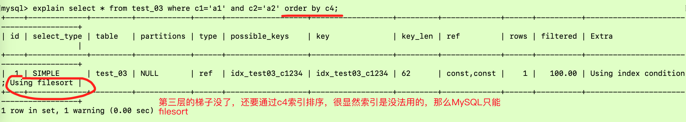
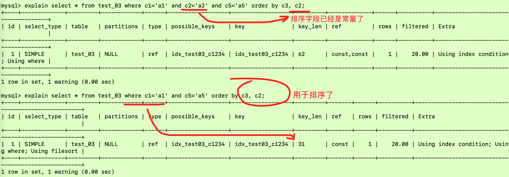

先看下面的一个示例：

```sql
create table test_03(
    id int primary key not null auto_increment,
    c1 char(10),
    c2 char(10),
    c3 char(10),
    c4 char(10),
    c5 char(10)
);

insert into test_03(c1, c2, c3, c4, c5) values ('a1', 'a2', 'a3', 'a4', 'a5');
insert into test_03(c1, c2, c3, c4, c5) values ('b1', 'b2', 'b3', 'b4', 'b5');
insert into test_03(c1, c2, c3, c4, c5) values ('c1', 'c2', 'c3', 'c4', 'c5');
insert into test_03(c1, c2, c3, c4, c5) values ('d1', 'd2', 'd3', 'd4', 'd5');
insert into test_03(c1, c2, c3, c4, c5) values ('e1', 'e2', 'e3', 'e4', 'e5');

create index idx_test03_c1234 on test_03(c1, c2, c3, c4);

show index from test_03;

explain select * from test_03 where c1='a1' and c2='a2' and c3='a3' and c4='a4';
explain select * from test_03 where c4='a1' and c3='a2' and c1='a3' and c2='a4';
```


很显然最下面的SQL语句并没有按照索引的建立顺序来查询，但是由于MySQL优化器对这条SQL做了优化，使得优化后的语句和上面的是一样的顺序，这样就能顺利用到索引了！但是由于这样写SQL语句还是会让底层做一次SQL优化，所以还不如一开始就按照建立索引的顺序来写SQL。


上面的SQL会导致c4这个索引失效，那么如果是c4的范围条件写前面呢？同样的道理，SQL优化器会对SQL语句做优化，优化后的语句成了`explain select * from test_03 where c1='a1' and c2='a2' and c3='a3' and c4>'c4';` 所以自然会用到四个索引了！


再看看下面的order by的例子，很显然用于查找的索引有两个就是c1、c2。c3用于排序了而不是查找，c4这个索引没有用到：


所以上面的SQL和`explain select * from test_03 where c1='a1' and c2='a2' order by c3;` 一样的，和c4根本没有关系了



上面这个例子呢主要是说中间兄弟没了，也就是你都没有给我第三层梯子，我怎么通过第四层排序，所以只能硬着头皮完成任务，那就Using filesort 呗！


用到了一个c1索引，但是c2、c3用于排序，无filesort


用了c1、c2两个字段索引，但是c2、c3用于排序，无filesort。看看下面这一种情况，为什么`explain select * from test_03 where c1='a1' and c2='a2' and c5='a5' order by c3, c2;` 并没有产生文件内排序呢？



因为c2已经是常量了，在已知字段是常量的情况下需要排序吗？肯定不需要。所以即使你写成了order by c3,c2 但是实际上只是对c3排序！


由上面的例子可以看出，用到了c1来查找，c4由于中间兄弟的消失是失效的索引，c2、c3用于分组，但是c2、c3如果不按照顺序分组的话就基本是是死掉了，出现了using temporary，这个是什么意思呢？看这个[Explain中的Using temporary](http://zouchanglin.cn/articles/2019/09/17/1568720691924.html#b3_solo_h4_14) 

group 表面上是分组，分组之前必排序，所以说和order by排序的法则和索引优化的原则是一致的！

定值、范围还是排序，一般order by是给个范围。group by 基本上都需要进行排序，会有临时表产生

一般性建议：

对于单键索引，尽量选择针对当前query过滤性更好的索引

在选择组合索引的时候，当前Query中过滤性最好的字段在索引字段顺序中，位置越靠前越好。

在选择组合索引的时候，尽量选择可以能包含当前query中的where子句中更多字段的索引

尽可能通过分析统计信息和调整query的写法来达到选择合适索引的目的