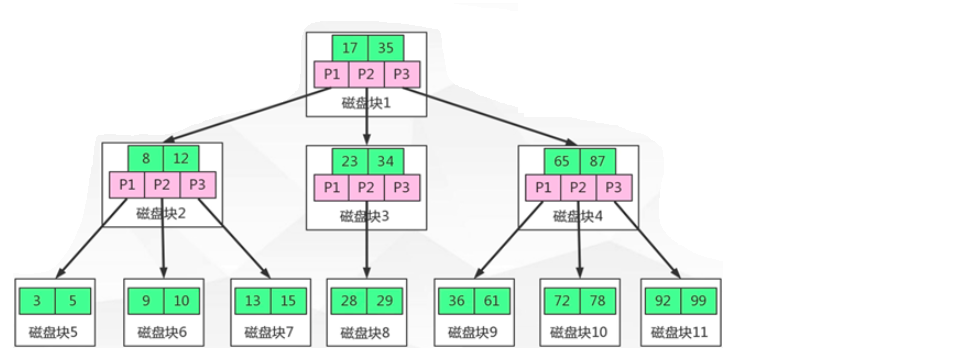

# MySQL索引优化

## 一、性能下降主要原因

往往体现在执行时间长 / 等待时间长

### 1、SQL语句写的很烂

### 2、索引失效（单值索引、复合索引）

单值索引的建立：

假设一张表(user)的字段是id、name、email、wechat_num，如果要执行查询`select * from user where name = ''`，但是这样做在数据量很大的情况下会很慢，所以根据name字段建立索引，`create index idx_user_name on user(name)` idx_user_name是索引名称，user是表名，name是索引字段

复合索引的建立：

与上面的例子是相似的，假设要执行查询`select * from user where name='' and email=''`，那么如果要建立复合索引，`create index idx_user_nameEmail on user(name, email)`

比如：


### 3、关联查询太多join

设计缺陷或者不得已的需求，大多发生在老旧的系统中

### 4、服务器调优及各个参数设置

比如缓冲区大小、线程数、连接数等等

## 二、常见通用的Join查询

### 1、SQL执行顺序

手写顺序


机读顺序


所以整个SQL的解析流程为：


Join总结


### 2、SQL Join的练习

建表插入数据，做练习准备

```sql
use day01;
create table tbl_dept(
    id int(11) not NULL auto_increment,
    deptName varchar(30) default NULL,
    locAdd varchar(40) default NULL,
    primary key (id)
)engine=INNODB auto_increment=1 default charset=utf8;

create table tbl_emp(
    id int(11) not null auto_increment,
    name varchar(20) default null,
    deptId int(11) default null,
    primary key (id),
    key fk_dept_id(deptId)
    #constraint fk_dept_id foregin key('deptId') references tbl_dept(id)
)engine=innodb auto_increment=1 default charset=utf8;

insert into tbl_dept(deptName, locAdd) values ('RD', 11);
insert into tbl_dept(deptName, locAdd) values ('HR', 12);
insert into tbl_dept(deptName, locAdd) values ('MK', 13);
insert into tbl_dept(deptName, locAdd) values ('MIS', 14);
insert into tbl_dept(deptName, locAdd) values ('FD', 15);

insert into tbl_emp(name, deptId) VALUES ('z3', 1);
insert into tbl_emp(name, deptId) VALUES ('z4', 1);
insert into tbl_emp(name, deptId) VALUES ('z5', 1);
insert into tbl_emp(name, deptId) VALUES ('z3', 1);

insert into tbl_emp(name, deptId) VALUES ('w5', 2);
insert into tbl_emp(name, deptId) VALUES ('w6', 2);
insert into tbl_emp(name, deptId) values ('s7', 3);
insert into tbl_emp(name, deptId) values ('s8', 4);
insert into tbl_emp(name, deptId) values ('s9', 51);
```


下面是INNER JOIN的查询示例，可以看出查询结果是AB的共有部分：


A独有+AB共有


B独有+AB共有


A排除AB共有


B排除AB共有


AB全有，下面是full join


但是却报错了，是因为MySQL是不支持这种语法的，但是Orcal数据库却是支持的，所以这么干：A的独有+B的独有+AB共有，所以需要合并去重的操作，使用`union`


AB 的独有


## 三、索引简介

### 1、什么是索引

MySQL官方对索引的定义为：索引(Index)是帮助MySQL高校获取数据的数据结构。

可以得到索引的本质：索引是数据结构

很简单，如果对于一个无顺字典，我要查找Mysql这个单词，那么唯一的方法是遍历， 如果词典按照A-Z排序的话，只需要从M开始的页就好了！这就是索引，所以索引有两大功能：排序和快速查找。则索引就是**排好序的快速查找数据结构**

在数据之外，数据库系统还维护着满足特定查找算法的数据结构，这些数据结构以某种方式引用（指向数据），这样就可以在这些数据结枃上实现高级査找算法。这种数据结构，就是索引，如下图：


为了加快 Col2 的查找，可以维护一个右边所示的二叉査找树，每个节点分别包含素引键值和一个指向对应数据记录物理地址的指针，这样就可以运用二叉查找在一定的复杂度内获取到相应数据，从而快速的检索出符合条件的记录！

数据本身之外，数据库还维护着一个满足特定査找算法的数据结构，这些数据结构以某种方式指向数据，这样就可以在这些数据结构的基础上实现高级查找算法，这种数据结构就是索引。

一般来说索引本身也很大，不可能全部存储在内存中，因此索引往往以索引文件的形式存储的磁盘上，我们平常所说的素引，如果没有特别指明，都是指 B 树（多路搜素树，并不一定是二又的）结构组织的索引。其中聚集索引，次要索引复合索引，前缀索引，唯一索引默认都是使用 B+树索引，统称索引。当然，除了 B+树这种类型的索引之外，还有哈稀索引（hash index等）


### 2、索引的优缺点

优点一：类似大学图书馆建书目索引，提高数据检索的效率，降低数据库的 IO 成本

优点二：通过索引列对数据进行排序，降低数据排序的成本，降低了 CPU 的消耗

所以在多个条件查询的情况下常常建立复合索引

缺点一：实际上索引也是一张表，该表保存了主键与索引字段，并指向实体表的记录，所以索引列也是要占用空间的

缺点二：虽然索引大大提高了査询速度，同时却会降低更新表的速度，如对表进行 INSERT、UPDATE 和 DELETE

因为更新表时，MSQL 不仅要保存数据，还要保存一下索引文件每次更新添加了索引列的字段都会调整因为更新所带来的键值变化后的索引信息

缺点三：索引只是提高效率的一个因素，如果你的 MYSQL 有大数据量的表，就需要花时间研究建立最优秀的素引，或优化查询

### 3、索引的分类

单值索引：即一个索引只包含单个列，一个表可以有多个单列索引（建议一张表索引不要超过5个，优先考虑复合索引）

唯一索引：索引列的值必须唯一，但允许有空值

复合索引：即一个索引包含多个列

### 4、索引建立基本语法

创建索引

如果是CHAR,VARCHAR类型，length可以小于字段实际长度；如果是BLOB和TEXT类型，必须指定length。

```sql
CREATE [UNIQUE] INDEX  indexName ON mytable(columnname(length));
```

如果加上`[UNIQUE]` 就是唯一索引，下面这种方式也可以建立索引

```sql
ALTER mytable ADD [UNIQUE]  INDEX [indexName] ON(columnname(length));
```

删除索引

```sql
DROP INDEX [indexName] ON mytable;
```

查看索引

```sql
SHOW INDEX FROM table_name\G
```

四种方式来添加数据表的索引

`ALTER TABLE tbl_nme ADD PRIMARY KEY (column_list) ` 该语句添加一个主键，这意味着索引值必须是唯一的，且不能为 NULL

`ALTER TABLE tbl_name ADD UNIQUE index_name (column_list）` 这条语句创建索引的值必须是唯一的（除了 NULL 外，NULL 可能会出现多次）

`ALTER TABLE tbl_name ADD INDEX index_name (column_list）` 添加普通索引，索引值可出现多次

`ALTER TABLE tbl_name ADD FULLTEXT index_name (column_list）`该语句指定了索引为 FULLTEXT，用于全文索引


### 5、MySQL索引结构

BTree索引、Hash索引、full-text全文索引、R-Tree索引

我们主要看看BTree索引：




颗 b+树，浅蓝色的块我们称之为一个磁盘块，可以看到每个磁盘块包含几个数据项（深蓝色所示）和指针（黄色所示）如磁盘块 1 包合数据项 17 和 35, 包含指针 P1、P2、P3,

P1 表示小于 17 的磁盘块，P2 表示在 17 和 35 之间的磁盘块，P3 表示大于 35 的磁盘块

真实的数据存在于叶子点即 3、5、9、10、13、15、28、29、36、60、75、79、90、99 非叶子节点只不存储真实的数据，只存储指引搜索方向的数据项，如 17、35 并不真实存在于数据表中

如果要查找数据项29，那么首先会把磁盘块1由磁盘加载到内存，此时发生一次O，在内存中用二分查找确定29在17和35之间，锁定磁盘块1的P2指针，内存时间因为非常短(相比磁盘的IO)可以忽略不计，通过磁盘块1的P2指针的磁盘地址把磁盘块3由磁盘加载到内存，发生第二次IO，29在26和30之间，锁定磁盘块3的P2指针，通过指针加载磁盘块8到内存，发生第三次IO，同时内存中做二分查找找到29，结束查询，总计三次IO。

真实的情况是，3层的B+树可以表示上百万的数据，如果上百万的数据查找只需要三次O，性能提高将是巨大的，如果没有索引，每个数据项都要发生一次IO，那么总共需要百万次的IO，显然成本非常非常高

### 6、哪些情况下需要建立索引

（1）主键自动建立唯一索引

（2）频繁作为查询条件的字段应该创建索引

（3）查询中与其它表关联的字段,外键关系建立索引

（4）频繁更新的字段不适合创建索引，因为每次更新不单单是更新了记录还会更新索引，加重IO负担

（5）Where条件里用不到的字段不创建索引

（6）单键/组合索引的选择问题，who?(在高并发下倾向创建组合索引)

（7）查询中排序的字段，排序字段若通过索引去访问将大大提高排序速度

（8）查询中统计或者分组字段

### 7、那些情况下不需要建立索引

（1）表记录太少

（2）经常增删改的表  Why？提高了查询速度，同时却会降低更新表的速度，如对表进行 INSERT、 UPDATE和 DELETE，因为更新表时，MySQL不仅要保存数据，还要保存一下索引文件

（3）数据重复且分布平均的表字段，因此应该只为最经常查询和最经常排序的数据列建立索引。注意，如果某个数据列包含许多重复的内容，为它建立索引就没有太大的实际效果


假如一个表有10万行记录，有一个字段A只有T和F两种值，且每个值的分布概率大约为50%，那么对这种表A字段建索引一般不会提高数据库的査询速度。索引的选择性是指索引列中不同值的数目与表中记录数的比。如果一个表中有2000条记录，表索引列有1980个不同的值，那么这个索引的选择性就是1980/2000=0.99。一个索引的选择性越接近于1，这个索引的效率就越高。