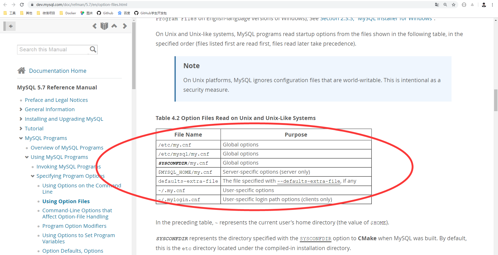
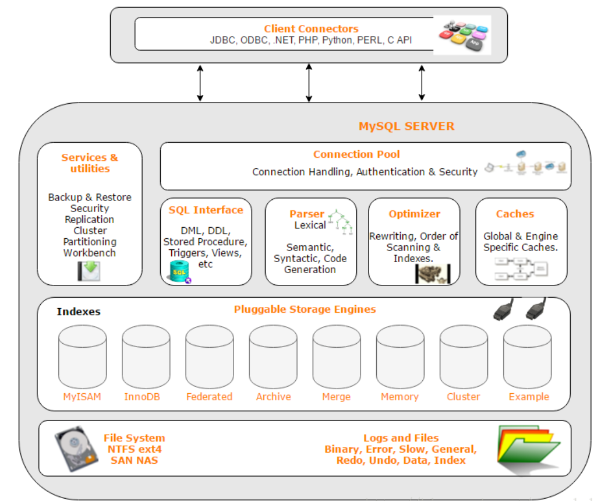
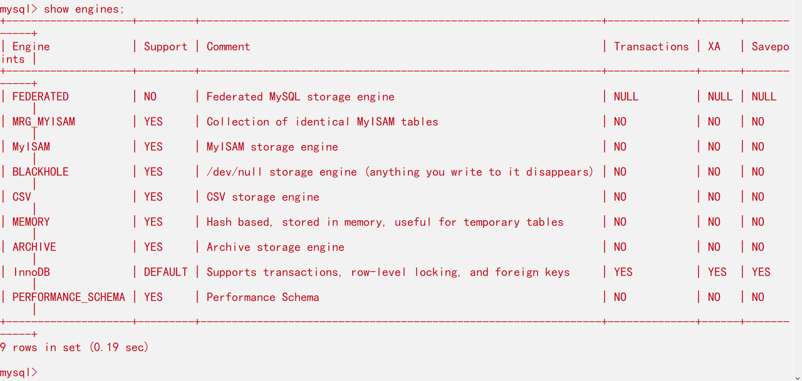

现在开始学习MySQL高级部分的知识，比如MySQL内核、SQL优化、SQL服务器的优化、各种参数常亮的设定、查询语句优化、主从复制、软硬件升级、容灾备份、SQL编程之类的东西。不过接下来学到的呢只是作为一个后台Java开发者应该掌握的知识，很完整的SQL优化需要很深的功底，大公司甚至有专门的DBA写上面这些东西，从IT时代到互联网时代，不断增长的是数据，所以学习一下MySQL优化还是很重要的！

## 一、Linux下安装MySQL的目录说明

| 路径                | 解释                      | 备注                         |
| ------------------- | ------------------------- | ---------------------------- |
| `/var/lib/mysql`    | mysql数据库文件的存放路径 | /var/lib/mysql/数据库名称    |
| `/usr/share/mysql`  | 配置文件目录              | mysql.server 命令及配置文件` |
| `/usr/bin`          | 命令相关目录              | mysqladmin、mysqldump等命令  |
| `/etc/init.d/mysql` | 启停相关脚本              |                              |

## 二、MySQL配置文件说明

MySQL的配置文件，在5.6的版本下MySQL配置文件在/usr/share/mysql 下名称叫做my-default.cnf，可是在MySQL5.7中就没有这个配置文件了，其实是从5.7.18开始不在二进制包中提供my-default.cnf文件，my.cnf文件就是把在命令行上启动MySQL时后面的参数用cnf文件配置好，那么下载启动时就不再需要在命令上加如参数。这个my.cnf文件可以是自定义位置，也可以使用如下默认的位置，只要放在默认位置，MySQL自动识别（初始位置在下方列表），官方说明是这样的



| 文件名                | 目的                                           |
| --------------------- | ---------------------------------------------- |
| `/etc/my.cnf`         | 全局选项                                       |
| `/etc/mysql/my.cnf`   | 全局选项                                       |
| `SYSCONFDIR/my.cnf`   | 全局选项                                       |
| `$MYSQL_HOME/my.cnf`  | 服务器特定选项（仅限服务器）                   |
| `defaults-extra-file` | 指定的文件 `--defaults-extra-file`，如果有的话 |
| `~/.my.cnf`           | 用户特定选项                                   |
| `~/.mylogin.cnf`      | 用户特定的登录路径选项（仅限客户端）           |

在上表中，`〜`表示当前用户的主目录（$ HOME的值）。

SYSCONFDIR表示在构建MySQL时使用CMake的SYSCONFDIR选项指定的目录。默认情况下，这是位于已编译安装目录下的etc目录

MYSQL_HOME是一个环境变量，包含特定于服务器的my.cnf文件所在目录的路径。如果未设置MYSQL_HOME并使用mysqld_safe程序启动服务器，则mysqld_safe将其设置为BASEDIR（MySQL基本安装目录）。

DATADIR通常是`/usr/local/mysql/data`，尽管这可能因平台或安装方法而异。该值是编译MySQL时内置的数据目录位置，而不是mysqld启动时使用`--datadir`选项指定的位置。在运行时使用`--datadir`不会影响服务器在处理任何选项之前查找其读取的选项文件的位置。

如果找到给定选项的多个实例，则最后一个实例优先，但有一个例外：对于mysqld， `--user`选项的第一个实例用作安全预防措施，以防止在选项文件中指定的用户被在命令行上覆盖。

这些配置有关的参数说明也在官网可以找到，`https://dev.mysql.com/doc/refman/5.7/en/option-files.html`

下面给出一些常用的配置选项：

```
# MySql5.7配置文件my.cnf设置
[client]
port = 3306
socket = /tmp/mysql.sock
 
[mysqld]
############################### 基础设置 #####################################
# Mysql服务的唯一编号 每个mysql服务Id需唯一
server-id = 1
 
# 服务端口号 默认3306
port = 3306
 
# mysql安装根目录
basedir = /opt/mysql
 
# mysql数据文件所在位置
datadir = /opt/mysql/data
 
# 临时目录 比如load data infile会用到
tmpdir  = /tmp
 
# 设置socke文件所在目录
socket  = /tmp/mysql.sock
 
# 主要用于MyISAM存储引擎,如果多台服务器连接一个数据库则建议注释下面内容
skip-external-locking
 
# 只能用IP地址检查客户端的登录，不用主机名
skip_name_resolve = 1
# 数据库默认字符集,主流字符集支持一些特殊表情符号（特殊表情符占用4个字节）
character-set-server = utf8mb4
 
# 数据库字符集对应一些排序等规则，注意要和character-set-server对应
collation-server = utf8mb4_general_ci
 
# 设置client连接mysql时的字符集,防止乱码
init_connect='SET NAMES utf8mb4'
 
# 是否对sql语句大小写敏感，1表示不敏感
lower_case_table_names = 1
 
# 最大连接数
max_connections = 400
# 最大错误连接数
max_connect_errors = 1000
 
# TIMESTAMP如果没有显示声明NOT NULL，允许NULL值
explicit_defaults_for_timestamp = true
 
# SQL数据包发送的大小，如果有BLOB对象建议修改成1G
max_allowed_packet = 128M
 
# MySQL连接闲置超过一定时间后(单位：秒)将会被强行关闭
# MySQL默认的wait_timeout  值为8个小时, interactive_timeout参数需要同时配置才能生效
interactive_timeout = 1800
wait_timeout = 1800

# 内部内存临时表的最大值 ，设置成128M。
# 比如大数据量的group by ,order by时可能用到临时表，
# 超过了这个值将写入磁盘，系统IO压力增大
tmp_table_size = 134217728
max_heap_table_size = 134217728


 
########################## 用户进程分配到的内存设置BEGIN #########################
## 每个session将会分配参数设置的内存大小
# 用于表的顺序扫描，读出的数据暂存于read_buffer_size中，当buff满时或读完，将数据返回上层调用者
# 一般在128kb ~ 256kb,用于MyISAM
# read_buffer_size = 131072
# 用于表的随机读取，当按照一个非索引字段排序读取时会用到，
# 一般在128kb ~ 256kb,用于MyISAM
# read_rnd_buffer_size = 262144
# order by或group by时用到
# 建议先调整为2M，后期观察调整
sort_buffer_size = 2097152
# 一般数据库中没什么大的事务，设成1~2M，默认32kb
binlog_cache_size = 524288
 
############################ 日志设置 ##########################################
# 数据库错误日志文件
log_error = error.log
 
# 慢查询sql日志设置
slow_query_log = 1
slow_query_log_file = slow.log
# 检查未使用到索引的sql
log_queries_not_using_indexes = 1
# 针对log_queries_not_using_indexes开启后，记录慢sql的频次、每分钟记录的条数
log_throttle_queries_not_using_indexes = 5
# 作为从库时生效,从库复制中如何有慢sql也将被记录
log_slow_slave_statements = 1
# 慢查询执行的秒数，必须达到此值可被记录
long_query_time = 2
# 检索的行数必须达到此值才可被记为慢查询
min_examined_row_limit = 100
 
# mysql binlog日志文件保存的过期时间，过期后自动删除
expire_logs_days = 5
 
############################主从复制 设置########################################
# 开启mysql binlog功能
log-bin=mysql-bin
# binlog记录内容的方式，记录被操作的每一行
binlog_format = ROW

# 作为从库时生效,想进行级联复制，则需要此参数
log_slave_updates
 
# 作为从库时生效,中继日志relay-log可以自我修复
relay_log_recovery = 1
 
# 作为从库时生效,主从复制时忽略的错误
slave_skip_errors = ddl_exist_errors
 
##---redo log和binlog的关系设置BEGIN---##
#(步骤1) prepare dml相关的SQL操作，然后将redo log buff中的缓存持久化到磁盘
#(步骤2)如果前面prepare成功，那么再继续将事务日志持久化到binlog
#(步骤3)如果前面成功，那么在redo log里面写上一个commit记录
#当innodb_flush_log_at_trx_commit和sync_binlog都为1时是最安全的，
#在mysqld服务崩溃或者服务器主机crash的情况下，binary log只有可能丢失最多一个语句或者一个事务。
#但是都设置为1时会导致频繁的io操作，因此该模式也是最慢的一种方式。
#当innodb_flush_log_at_trx_commit设置为0，mysqld进程的崩溃会导致上一秒钟所有事务数据的丢失。
#当innodb_flush_log_at_trx_commit设置为2，只有在操作系统崩溃或者系统掉电的情况下，上一秒钟所有事务数据才可能丢失。
#commit事务时,控制redo log buff持久化磁盘的模式 默认为1
innodb_flush_log_at_trx_commit = 2
#commit事务时,控制写入mysql binlog日志的模式 默认为 0
#innodb_flush_log_at_trx_commit和sync_binlog都为1时，mysql最为安全但性能上压力也是最大
sync_binlog = 1
##---redo log 和 binlog的关系设置END---##
 
############################ Innodb设置 ##########################################
# 数据块的单位8k，默认是16k，16kCPU压力稍小，8k对select的吞吐量大
# innodb_page_size的参数值也影响最大索引长度，8k比16k的最大索引长度小
# innodb_page_size = 8192
# 一般设置物理存储的60% ~ 70%
innodb_buffer_pool_size = 1G
 
#5.7.6之后默认16M
# innodb_log_buffer_size = 16777216
# 该参数针对unix、linux，window上直接注释该参数.默认值为NULL
# O_DIRECT减少操作系统级别VFS的缓存和Innodb本身的buffer缓存之间的冲突
innodb_flush_method = O_DIRECT
 
# 此格式支持压缩, 5.7.7之后为默认值
innodb_file_format = Barracuda
 
# CPU多核处理能力设置，假设CPU是2颗4核的，设置如下
# 读多，写少可以设成2:6的比例
innodb_write_io_threads = 4
innodb_read_io_threads = 4
 
# 提高刷新脏页数量和合并插入数量，改善磁盘I/O处理能力
# 默认值200（单位：页）
# 可根据磁盘近期的IOPS确定该值
innodb_io_capacity = 500
 
# 为了获取被锁定的资源最大等待时间，默认50秒，超过该时间会报如下错误:
# ERROR 1205 (HY000): Lock wait timeout exceeded; try restarting transaction
innodb_lock_wait_timeout = 30
 
# 调整buffer pool中最近使用的页读取并dump的百分比,通过设置该参数可以减少转储的page数
innodb_buffer_pool_dump_pct = 40
 
# 设置redoLog文件所在目录, redoLog记录事务具体操作内容
innodb_log_group_home_dir = /opt/mysql/redolog/
 
# 设置undoLog文件所在目录, undoLog用于事务回滚操作
innodb_undo_directory = /opt/mysql/undolog/
 
# 在innodb_log_group_home_dir中的redoLog文件数, redoLog文件内容是循环覆盖写入。
innodb_log_files_in_group = 3
 
# MySql5.7官方建议尽量设置的大些，可以接近innodb_buffer_pool_size的大小
# 之前设置该值较大时可能导致mysql宕机恢复时间过长，现在恢复已经加快很多了
# 该值减少脏数据刷新到磁盘的频次
# 最大值innodb_log_file_size * innodb_log_files_in_group <= 512GB,单文件<=256GB
innodb_log_file_size = 1024M
 
# 设置undoLog文件所占空间可以回收
# 5.7之前的MySql的undoLog文件一直增大无法回收
innodb_undo_log_truncate = 1
innodb_undo_tablespaces = 3
innodb_undo_logs = 128
 
# 5.7.7默认开启该参数 控制单列索引长度最大达到3072
# innodb_large_prefix = 1
 
#5.7.8默认为4个, Inodb后台清理工作的线程数
# innodb_purge_threads = 4
 
# 通过设置配置参数innodb_thread_concurrency来限制并发线程的数量，
# 一旦执行线程的数量达到这个限制，额外的线程在被放置到对队列中之前，会睡眠数微秒，
# 可以通过设定参数innodb_thread_sleep_delay来配置睡眠时间
# 该值默认为0,在官方doc上，对于innodb_thread_concurrency的使用，也给出了一些建议:
# (1)如果一个工作负载中，并发用户线程的数量小于64，建议设置innodb_thread_concurrency=0；
# (2)如果工作负载一直较为严重甚至偶尔达到顶峰，建议先设置innodb_thread_concurrency=128,
### 并通过不断的降低这个参数，96, 80, 64等等，直到发现能够提供最佳性能的线程数
# innodb_thread_concurrency = 0
############################ 其他内容设置 ##########################################
[mysqldump]
quick
max_allowed_packet = 128M
[mysql]
no-auto-rehash
[myisamchk]
key_buffer_size = 20M
sort_buffer_size = 256k
read_buffer = 2M
write_buffer = 2M
[mysqlhotcopy]
interactive-timeout
[mysqld_safe]
# 增加每个进程的可打开文件数量.
open-files-limit = 28192
```

注意在修改MySQL的字符集编码的时候，即使修改了配置文件，在修改之前创建的数据库和表都不会发生更改，而是需要新建数据库才行。

### 二进制日志文件 log-bin

主要用于主从复制，`log-bin=mysql-bin`

### 错误日志 log-error  

错误日志，用于记录MySQL出现的错误信息

### 查询日志 log

默认是关闭的，记录查询的SQL语句，如果开启会降低MySQL的整体性能，因为记录日志也需要消耗系统资源

### 数据文件

在windows下，安装MySQL的目录/data 目录可以挑选很多数据库文件；在Linux下，这个默认路径是`/var/lib/mysql` 下，使用`ls -1F|grep ^d`即可过滤

#### frm文件

frm文件代表存放表结构

#### myd文件

myd文件存放的是表数据

#### myi文件

myi文件存放的是表的索引


## 三、MySQL逻辑架构介绍

MySQL 是一个可移植的数据库，几乎能在当前所有的操作系统上运行，如 Unix/Linux、Windows、Mac 和 Solaris。各种系统在底层实现方面各有不同，但是 MySQL 基本上能保证在各个平台上的物理体系结构的一致性：



说说这张图：
* Client Connectors 是客户端链接，这个不用细说，就是应用程序与Mysql交互的接口，毕竟Mysql是要为程序提供数据存储服务的，所以必须将操作接口暴露出来，假如你是一个Java开发者，那么JDBC可以轻松链接上Mysql服务，就可以让你的Java程序使用上Mysql提供的服务
* Connection Pool这个是连接池，Mysql与外界可能不止有一个连接，多次链接和断开会造成非常大的性能消耗，于是用使用连接池来管理这些链接，这就如Java的线程池来管理线程一样，通过连接池来避免性能损耗
* Management Serveices & Utilities是管理服务和工具组件，例如备份恢复、Mysql复制、安全性验证、集群、分区工作台等，下面会演示一个Mysql备份的例子
* SQL Interface 就是SQL接口，存储过程、触发器、视图等，接受用户的SQL命令，并且返回用户需要查询的结果。接收DML(data manipulation language)数据操纵语言、DDL(data definition language数据库定义语言、比如select from就是调用SQL Interface
* Parser 是解析器，SQL命令传递到解析器的时候会被解析器验证和解析。解析器是由Lex和YACC实现的，是一个很长的脚本，将SQL语句分解成数据结构，并将这个结构传递到后续步骤，以后SQL语句的传递和处理就是基于这个结构的，如果在分解构成中遇到错误，那么就说明这个sql语句是不合理的 
* Optimizer 是查询优化器，SQL语句在查询之前会使用查询优化器对查询进行优化，这个不难理解，假如你有一张`info` 表中的字段是年龄(很显然这个额字段值是大于0的)，如果你在查询的时候的SQL语句是`select * form info where age=-10`，那么这条语句经过优化器之后不会再被执行，这就好像优化器知道不可能存在年龄小于0的条目
* Caches 是高速缓存， 查询缓存，如果查询缓存有命中的查询结果，查询语句就可以直接去查询缓存中取数据。 通过LRU算法将数据的冷端溢出，未来得及时刷新到磁盘的数据页，叫脏页。 这个缓存机制是由一系列小缓存组成的。比如表缓存，记录缓存，key缓存，权限缓存等 
* Pluggable Storage Engines 是存储引擎，图中的圆柱体都是存储引擎，Mysql默认的存储引擎是`InnoDB`，后面谈论存储引擎
* FileSystem 就是文件系统，Mysql数据库的数据最终还是要存放到文件中，所以我们可以理解为数据库就是一种帮我们管理数据的软件，处于文件系统的应用程序之间专门提供数据管理的软件，把数据的增删改查以及他的功能做了完美的封装，使用起来安全性更高，更方便我们队数据进行操作


1、连接层

最上层是一些客户端和连接服务，包含本地sock通信和大多数基于客户端/服务端工具实现的类似于tcp/ip的通信。主要完成一些类似于连接处理、授权认证、及相关的安全方案。在该层上引入了线程池的概念，为通过认证安全接入的客户端提供线程。同样在该层上可以实现基于SSL的安全链接。服务器也会为安全接入的每个客户端验证它所具有的操作权限

2、服务层

第二层架构主要完成大多少的核心服务功能，如SQL接口，并完成缓存的查询，SQL的分析和优化及部分内置函数的执行。所有跨存储引擎的功能也在这一层实现，如过程、函数等。在该层，服务器会解析查询并创建相应的内部解析树，并对其完成相应的优化如确定查询表的顺序，是否利用索引等，最后生成相应的执行操作。如果是select语句，服务器还会查询内部的缓存。如果缓存空间足够大，这样在解决大量读操作的环境中能够很好的提升系统的性能。

3、引擎层

存储引擎层，存储引擎真正的负责了MySQL中数据的存储和提取，服务器通过API与存储引擎进行通信。不同的存储引擎具有的功能不同，这样我们可以根据自己的实际需要进行选取。后面我会在博客中介绍MyISAM和InnoDB。


### MySQL存储引擎

存储引擎是：数据库管理理系统如何存储数据、如何为存储的数据建立索引和如何更新、查询数据等技术的实现方法。
MySQL的核心就是插件式存储引擎，支持多种存储引擎，所以你可以看到在Mysql的架构图上存储引擎的小插头，存储引擎是插拔式的，默认是InnoDB（从MySQL5.5.8开始，之前是MyISAM），当然也可以选择其他的存储引擎
使用`show engines;`命令可以查看支持的存储引擎：



查看MySQL当前默认的存储引擎

```sql
mysql> show variables like '%storage_engine%';
+----------------------------+--------+
| Variable_name              | Value  |
+----------------------------+--------+
| default_storage_engine     | InnoDB |
| default_tmp_storage_engine | InnoDB |
| storage_engine             | InnoDB |
+----------------------------+--------+
3 rows in set (0.00 sec)
```


接下来说说他们的区别：

| 特点         | Myisam | BDB  | Memory | InnoDB | Archive |
| :----------- | :----: | :--: | :----: | :----: | :-----: |
| 存储限制     |  没有  | 没有 |   有   |  64TB  |  没有   |
| 事物安全     |        | 支持 |        |  支持  |         |
| 锁机制       |  表锁  | 页锁 |  表锁  |  行锁  |  行锁   |
| B树索引      |  支持  | 支持 |  支持  |  支持  |         |
| 哈希索引     |        |      |  支持  |  支持  |         |
| 全文索引     |  支持  |      |        |        |         |
| 集群索引     |        |      |        |  支持  |         |
| 数据缓存     |        |      |  支持  |  支持  |         |
| 索引缓存     |  支持  |      |  支持  |  支持  |         |
| 数据可压缩   |  支持  |      |        |        |  支持   |
| 空间使用     |   低   |  低  |  中等  |   高   |   低    |
| 批量插入速度 |   高   |  高  |   高   |   低   | 非常高  |
| 支持外键     |        |      |        |  支持  |         |

#### MyISAM存储引擎
MyISAM是MySQL官方提供默认的存储引擎，其特点是不支持事务、表锁和全文索引，对于一些OLAP系统(OLAP 系统强调数据分析，强调SQL执行市场，强调磁盘I/O，强调分区等)，操作速度快。关于[《OLAP、OLTP的介绍和比较》](https://www.cnblogs.com/hhandbibi/p/7118740.html)

每个MyISAM在磁盘上存储成三个文件。文件名都和表名相同，扩展名分别是.frm（存储表定义）、.MYD (MYData，存储数据)、.MYI (MYIndex，存储索引)。这里特别要注意的是MyISAM不缓存数据文件，只缓存索引文件。

#### InnoDB存储引擎
InnoDB存储引擎支持事务，主要面向OLTP方面的应用，其特点是行锁设置、支持外键，并支持类似于Oracle的非锁定读，即默认情况下读不产生锁。InnoDB将数据放在一个逻辑表空间中。InnoDB通过多版本并发控制来获得高并发性，实现了ANSI标准的4种隔离级别，默认为Repeatable，使用一种被称为next-key locking的策略避免幻读。

对于表中数据的存储，InnoDB采用类似Oracle索引组织表Clustered的方式进行存储。

InnoDB 存储引擎提供了具有提交、回滚和崩溃恢复能力的事务安全。但是对比Myisam的存储引擎，InnoDB 写的处理效率差一些并且会占用更多的磁盘空间以保留数据和索引


#### NDB存储引擎
NDB存储引擎是一个集群存储引擎，类似于Oracle的RAC，但它是Share Nothing的架构，因此能提供更高级别的高可用性和可扩展性。NDB的特点是数据全部放在内存中，因此通过主键查找非常快。

关于NDB，有一个问题需要注意，它的连接(join)操作是在MySQL数据库层完成，不是在存储引擎层完成，这意味着，复杂的join操作需要巨大的网络开销，查询速度会很慢。

#### Memory (Heap) 存储引擎
Memory存储引擎（之前称为Heap）将表中数据存放在内存中，如果数据库重启或崩溃，数据丢失，因此它非常适合存储临时数据。


#### Archive存储引擎
正如其名称所示，Archive非常适合存储归档数据，如日志信息。它只支持INSERT和SELECT操作，其设计的主要目的是提供高速的插入和压缩功能。

#### Federated存储引擎
Federated存储引擎不存放数据，它至少指向一台远程MySQL数据库服务器上的表，非常类似于Oracle的透明网关。
#### InnoDB与MyISAM应用场景
参考：[《InnoDB与MyISAM两者的区别》](https://www.cnblogs.com/kevingrace/p/5685355.html)
MyISAM管理非事务表。它提供高速存储和检索，以及全文搜索能力。如果应用中需要执行大量的SELECT查询，那么MyISAM是更好的选择。

InnoDB用于事务处理应用程序，具有众多特性，包括ACID事务支持。如果应用中需要执行大量的INSERT或UPDATE操作，则应该使用InnoDB，这样可以提高多用户并发操作的性能


所以MySQL的特点可以总结为：

和其它数据库相比，MySQL有点与众不同，它的架构可以在多种不同场景中应用并发挥良好作用。主要体现在存储引擎的架构上，插件式的存储引擎架构将查询处理和其它的系统任务以及数据的存储提取相分离。这种架构可以根据业务的需求和实际需要选择合适的存储引擎。

### Alibaba用哪个？

Percona为MySQL数据库服务器进行了改进，在功能和性能上较MySQL有着很显著的提升。该版本提升了在高负载情况下的InnoDB的性能、为DBA提供一些非常有用的性能诊断工具；另外有更多的参数和命令来控制服务器行为。该公司新建了一款存储引擎叫XtraDB完全可以替代innodb,并且在性能和并发上做得更好，阿里巴巴大部分mysql数据库其实使用的percona的原型加以修改。