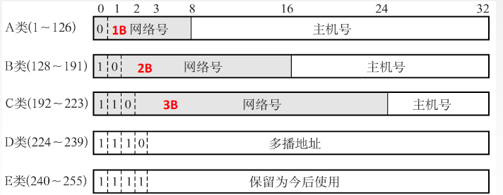

# 私有IP地址

之前我们讨论了， IPv4协议中，IP地址数量不充足的问题
NAT技术当前解决IP地址不够用的主要手段，是路由器的一个重要功能；
NAT能够将私有IP对外通信时转为全局IP。也就是就是一种将私有IP和全局IP相互转化的技术方法；
很多学校, 家庭, 公司内部采用每个终端设置私有IP，而在路由器或必要的服务器上设置全局IP；
全局IP要求唯一，但是私有IP不需要；在不同的局域网中出现相同的私有IP是完全不影响的；

路由器对目的地址是私有IP地址的数据报一律不进行转发。

# 网络地址转换 NAT

网络地址转换NAT (Network Address Translation) ：在专用网连接到因特网的路由器上安装NAT软件，安装了NAT软件的路由器叫NAT路由器，它至少有一个有效的外部全球IP地址。

NAT路由器将源地址从10.0.0.10替换成全局的IP 202.244.174.37；
NAT路由器收到外部的数据时，又会把目标IP从202.244.174.37替换回10.0.0.10；
在NAT路由器内部，有一张自动生成的，用于地址转换的表；
当 10.0.0.10 第一次向 163.221.120.9 发送数据时就会生成表中的映射关系；

# 网段划分

IP地址分为两个部分，网络号和主机号

网络号：保证相互连接的两个网段具有不同的标识；
主机号：同一网段内，主机之间具有相同的网络号，但是必须有不同的主机号；

不同的子网其实就是把网络号相同的主机放到一起，如果在子网中新增一台主机，则这台主机的网络号和这个子网的网络号一致，但是主机号必须不能和子网中的其他主机重复。通过合理设置主机号和网络号，就可以保证在相互连接的网络中，每台主机的IP地址都不相同。

手动管理子网内的IP，是一个相当麻烦的事情。有一种技术叫做DHCP，能够自动的给子网内新增主机节点分配IP地址，避免了手动管理IP的不便。一般的路由器都带有DHCP功能。因此路由器也可以看做一个DHCP服务器。

过去曾经提出一种划分网络号和主机号的方案，把所有IP 地址分为五类，如下图所示：

A类 0.0.0.0到127.255.255.255
B类 128.0.0.0到191.255.255.255
C类 192.0.0.0到223.255.255.255
D类 224.0.0.0到239.255.255.255
E类 240.0.0.0到247.255.255.255

随着Internet的飞速发展，这种划分方案的局限性很快显现出来，大多数组织都申请B类网络地址，导致B类地址很快就分配完了，而A类却浪费了大量地址。

分类的IP地址的弱点:
1、IP地址空间的利用率有时很低
2、两级IP地址不够灵活

针对这种情况提出了新的划分方案，称为CIDR(Classless Interdomain Routing)：
引入一个额外的子网掩码(subnet mask)来区分网络号和主机号；子网掩码也是一个32位的正整数，通常用一串 "0" 来结尾；将IP地址和子网掩码进行 "按位与" 操作, 得到的结果就是网络号；网络号和主机号的划分与这个IP地址是A类、B类还是C类无关；

子网掩码可以分离出IP地址中的网络地址和主机地址，那为什么要分离呢？因为两台计算机要通讯，首先要判断是否处于同一个广播域内，即网络地址是否相同。如果网络地址相同，表明接受方在本网络上，那么可以把数据包直接发送到目标主机，否则就需要路由网关将数据包转发送到目的地。 

# 路由

在复杂的网络结构中， 找出一条通往终点的路线；

当IP数据包，到达路由器时， 路由器会先查看目的IP；路由器决定这个数据包是能直接发送给目标主机，还是需要发送给下一个路由器；依次反复；一直到达目标IP地址；

那么如何判定当前这个数据包该发送到哪里呢？这个就依靠每个节点内部维护一个路由表；可以使用route查看路由表：

路由表的Destination是目的网络地址，Genmask是子网掩码，Gateway是下一跳地址，Iface是发送接
口，也就是网卡，Flags中的U标志表示此条目有效(可以禁用某些条目)，G标志表示此条目的下一跳地址是某个路由器的地址，没有G标志的条目表示目的网络地址是与本机接口直接相连的网络，不必经路由器转发；

如果要发送的数据包的目的地址是192.168.45.3 

跟第一行的子网掩码做与运算，与第一行的目的网络地址不符
跟第二行的子网掩码做与运算，与第二行的目的网络地址不符
跟第三行的子网掩码做与运算，得到192.168.45.0，正是第三行的目的网络地址，因此从eth1接口发送出去；

如果要发送的数据包的目的地址是202.10.1.2

依次和路由表前几项进行对比，发现都不匹配；
按缺省路由条目，从eth34接口发出去，发往192.168.10.1路由器；
由192.168.10.1路由器根据它的路由表决定下一跳地址；

# ARP协议

ARP不是一个单纯的数据链路层的协议，而是一个介于数据链路层和网络层之间的协议

ARP协议的作用：ARP协议建立了主机IP地址和MAC地址的映射关系。

在网络通讯时，源主机的应用程序知道目的主机的IP地址和端口号，却不知道目的主机的硬件地址；数据包首先是被网卡接收到再去处理上层协议的，如果接收到的数据包的硬件地址与本机不符，则直接丢弃；因此在通讯前必须获得目的主机的硬件地址；不过ARP协议只能用于IPv4，不能够用于IPv6，IPv6中可以用ICMPv6替代ARP发送邻居探索消息！

源主机发出ARP请求，询问 IP地址是172.20.1.2的主机的硬件地址是多少，并将这个请求广播到本地网段(以太网帧首部的硬件地址填FF:FF:FF:FF:FF:FF表示广播)；
目的主机接收到广播的ARP请求，发现其中的IP地址与本机相符，则发送一个ARP应答数据包给源主机，将自
己的硬件地址填写在应答包中；
每台主机都维护一个ARP缓存表，可以用arp -a命令查看。缓存表中的表项有过期时间(一般为20分钟)，如果20分钟内没有再次使用某个表项，则该表项失效，下次还要发ARP请求来获得目的主机的硬件地址：

这种缓存可以有效减少ARP包的发送，反之，接受ARP包的主机也可以通过这个ARP包把发送方的MAC地址缓存起来，从而根据MAC地址发送ARP响应包给发送端主机，并作为响应，因此在接收主机缓存MAC地址也是一种提高效率的方式。

MAC地址的缓存是有期限的，超过这个期限，缓存的内容将被清除，这使得MAC地址与IP地址对应关系发生了变化，也依旧能够将IP数据报正确的发给目标地址。

ARP包格式：

硬件类型指链路层网络类型，1为以太网；

上层协议类型指要转换的地址类型，0x0800为IP地址；

HLEN：MAC地址的长度 = 6 (字节)；

PLEN：IP地址的长度 = 4 (字节)；

操作码 ： 该字段为1表示ARP请求，op字段为2表示ARP应答。

## IP地址和MAC地址缺一不可

如图所示，主机A想要发IP数据报给主机B的时候必须经过路由器c，即使主机A知道了主机B的MAC地址，，由于路由器会隔断两个网络，还是无法实现从主机A直接发送到主机B，此时主机A必须先把数据报发送给路由器C的MAC地址C1：

在以太网上发送IP数据包的时候，“下一次要经过那个路由发送数据包” 这一信息非常重要，而这里的“下一个路由器” 就是相应的MAC地址。由此看来IP地址和MAC地址缺一不可，将这两个地址关联起来就形成了ARP协议。

