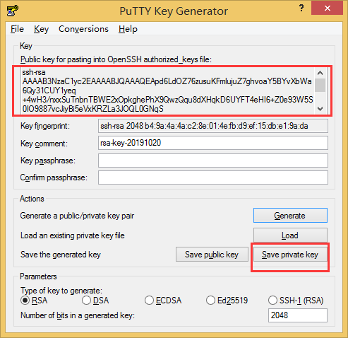

putty这个软件是个轻量且好用的ssh工具，Xshell、Xftp这些需要收费，有学生家庭版但是要申请，而且有一定的期限的，不是很方便。putty这个工具倒是不错，可是每次登陆需要输入密码，于是下面挤在一个无需登录密码的方式，那就是SSH密钥登录， 这种方式需要生成一组对应的公钥和密钥，然后把公钥放到Linux，私钥提供给putty。putty仍然不知道你的密码，而是通过与服务器核对密钥而核实身份。 

第一步：配置用户名


第二步： 生成公钥/私钥对


按照提示：不断移动鼠标这个进度条才会更新


第四步：保存生成功的密钥： 点击保存私钥(Save Private Key)，保存一个.ppk文件。  



 第五步：关联私钥文件


请先用putty，输用户名密码登录Linux， `vim ~/.ssh/authorized_keys`   把刚才copy下来的公钥粘到这个文件里去，直接右键即可粘贴，这样便实现了免密登录。


接下来还有个技巧:

创建putty.exe的快捷方式到桌面；然后运行putty，输入host name、port点击保存名称为 xxx

```
"C:\Program Files\PuTTY\putty.exe" -load "xxx" -ssh -l root -pw lhl123456an+
```

