# TCP协议特点

## 1、面向连接

传输控制协议Transmission Control Protocol 要对数据的传输进行一个详细的控制，TCP是面向连接(虚连接)的传输层协议，但注意此处的连接是虚连接：

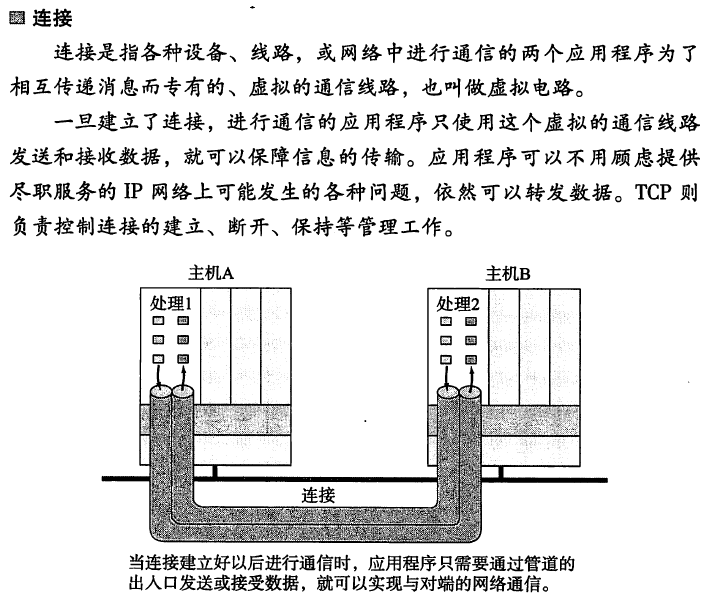

## 2、每个TCP连接只能是点对点

TCP连接是点对点的连接，而不是向广播那样的形式

## 3、可靠有序，不丢不重

TCP提供可靠交付的服务，无差错、不丢失、不重复、按序到达。可靠有序，不丢不重，后面会写到这些功能是如何实现的

## 4、TCP提供全双工通信

发送缓存：准备发送的数据 + 已发送但尚未收到确认的数据
接收缓存：按序到达但尚未被接受应用程序读取的数据 + 不按序到达的数据

## 5、面向字节流

TCP面向字节流，TCP把应用程序交下来的数据看成仅仅是一连串的无结构的字节流。

# TCP报文格式

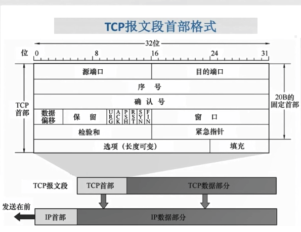

## 1、填充字段

首先看看填充字段，这个字段主要是为了保证添加选项字段后TCP首部是还是4字节的整数倍（通常填充的是全零字段）。

固定首部就是20字节（图中一行就是32位，8位是一个字节，所以图中的一行就是4字节，五行就是20字节）

## 2、源端口和目的端口

源端口和目的端口分别占用4字节，总占用8字节

## 3、序号

序号：在一个TCP连接中传送的字节流中的每一个字节都按顺序编号，本字段表示本报文段所发送数据的第一个字节的序号。如下图，如果发的是123号字节的数据，那么TCP报文中的头部序号就是1，如果发送的是456号字节的数据，那么TCP报文中的头部序号就是4：

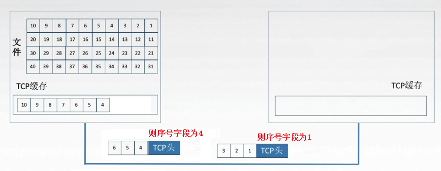

## 4、确认号

确认号：期望收到对方下一一个报文段的第一个数据字节的序号。若确认号为N，则证明到序号N-1为止的所有数据都已正确收到。如下图：接收端收到数据后要反馈给发送端，还是向发送端发一个确认报文，填写自己的确认号，发送端就知道了接收端收到了那些数据，没收到的超时要重发：

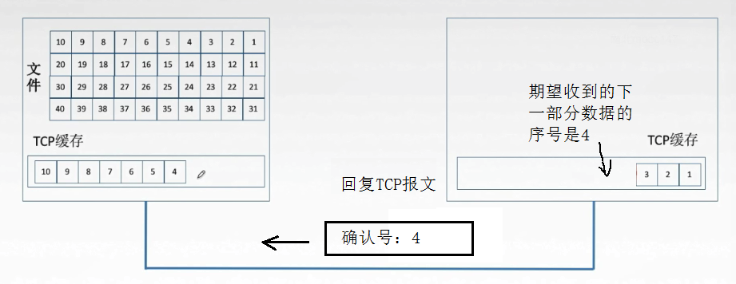

## 5、数据偏移

数据偏移(首部长度) ： TCP报文段的数据起始处距离TCP报文段的起始处有多远，以4字节为单位，即1个数值是4字节，首部长度包含固定的20字节，还有选项字段和填充字段，所以需要知道首部的长度，就需要这个字段来说明首部长度。 由于数据偏移字段只有4位的存储空间，最大为 1111 ，就是最大值为15，15 * 4 = 60字节，所以TCP协议首部最长为60字节（20字节固定大小 + 40字节的选项和填充字段）。

## 6、6个控制位

### URG - 紧急位

紧急位URG，URG=1时， 标明此报文段中有紧急数据，是高优先级的数据，应尽快传送，不用在缓存里排队，配合紧急指针字段使用

### ACK - 确认位

确认位ACK，ACK=1时确认号有效，在连接建立后所有传送的报文段都必须把ACK置为1

### PSH - 推送位

推送位PSH，PSH=1时， 接收方尽快交付接收应用进程，不再等到缓存填满再向上交付

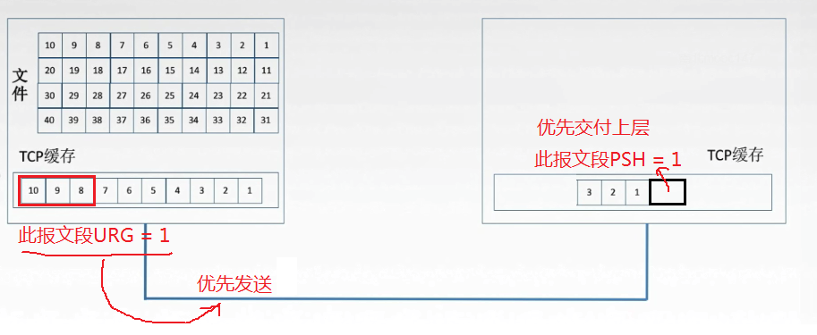

### RST - 复位

复位RST，RST=1时， 表明TCP连接中出现严重差错，必须释放连接，然后再重新建立传输链接。

### SYN - 同部位

同步位SYN，SYN=1时，表明是一个连接请求/连接接受报文，建立连接的时候表示此报文段为请求/连接接受报文

### FIN - 终止位

终止位FIN，FIN=1时， 表明此报文段发送方数据已发完，要求释放放连接

不过在书中也有这样描述的：

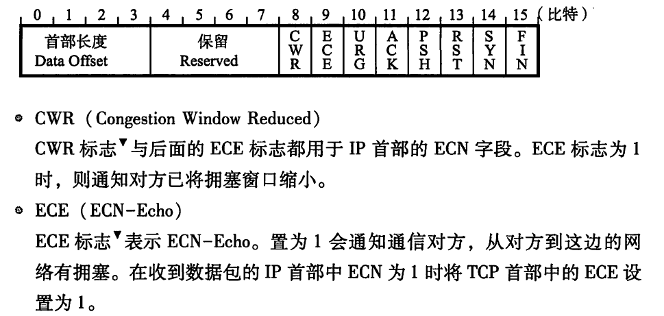

这个会在后面的拥塞控制中讲到！

## 7、窗口

窗口指的是发送本报文段的一方的接收窗口，即现在允许对方发送的数据量，反映了自己可以缓存的字节流，那么对方就知道了你的接收能力怎么样，以此决定向你发送报文的数据量应该控制在多大的范围。举个简单的例子，如果接收方发来的报文确认号是701， 窗口是1000，那么发送方接下来要发的报文就是701~1700的数据。

## 8、校验和

检验首部+数据，检验时要加上12字节的伪首部（IP首部）第四个字段为6（UDP中是17）

## 9、紧急指针

当URG=1时，这个字段才有用，指出本报文段中紧急数据的字节数，假设紧急指针为50，那么数据部分的1-50的数据才是紧急数据，剩下的是普通数据

## 10、选项

选项，例如最大报文段长度MSS、窗口扩大、时间戳、选择确认...

# TCP的连接管理

建立连接------》数据传送 --------》 释放连接

TCP连接的建立采用客户服务器方式，主动发起连接建立的应用进程叫做客户，而被动等待连接建立的应用进程叫服务器。

## 1、建立连接过程

step1、客户端发送连接请求报文段，无应用层数据， SYN = 1，seq = x(随机值，由客户端主机产生)，SYN为1很好理解，前面说到了SYN=1表明是一个连接请求/连接接受报文，建立连接的时候表示此报文段为请求/连接接受报文

step2、服务器端为该TCP连接分配缓存和变量，并向客户端返回确认报文段，允许连接，无应用层数据，SYN = 1，ACK = 1，seq=y(随机值)，ack=x+1。怎么理解呢？客户端首次发报文，这个报文是建立连接用的，所以客户端随机产生了一个序号seq=y，但是这个序号对于服务器是有用的，因为服务器通过客户端发来的seq就知道需要接收的下一个报文段的序号了，那就是seq的值再加一；

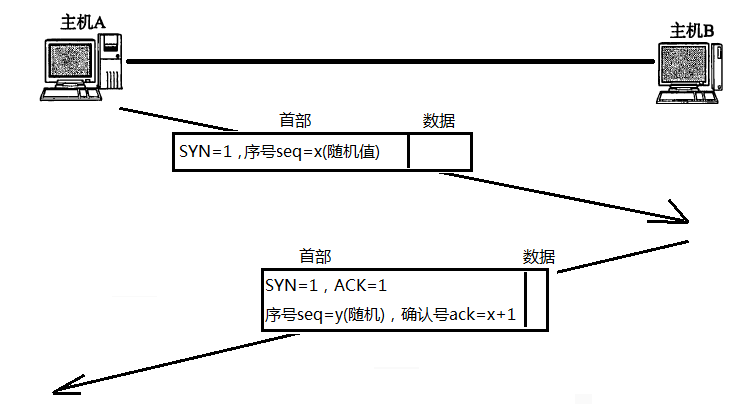

step3、客户端为该TCP连接分配缓存和变量，并向服务器端返回确认的确认，并且可以携带数据

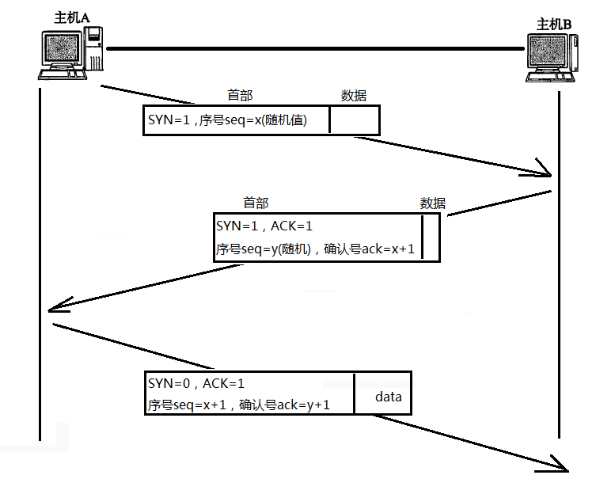

总结一下就是：

**第一次发数据包 (客户端->服务器)：客户端知道自己的发送能力正常；服务器知道自己的接收能力正常，也知道客户端的发送能力正常**

**第二次发数据包 (服务器->客户端)：客户端知道服务器的接收、发送能力正常，客户端知道自己的接收能力正常；服务器知道自己的发送能力正常**

**那么现在的问题就是：**

**客户端知道服务器的发送、接收能力都正常，同时也知道自己的发送、接收都正常，那么是不是可以通信了呢？？？？ 不可以，因为服务器目前只知道：自己的发送、接收能力正常，客户端的发送能力正常**

**唯一不能确定的是客户端的接收能力是否正常，所以通过第三次握手，确定了客户端的接收能力也是正常的！**

补上一张加上状态的图

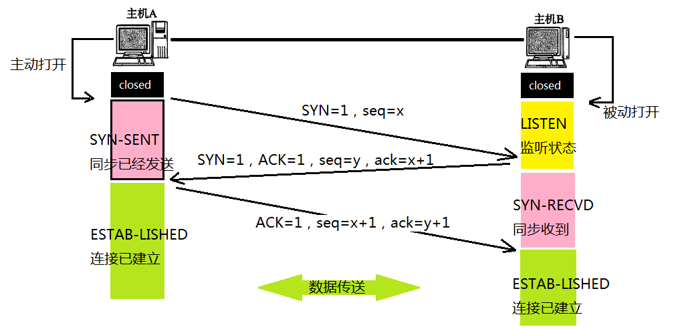

## 2、连接的释放过程

可以看出这是一个四次握手的过程

参与一条TCP连接的两个进程中的任何一个都能终止该连接，连接结束后，主机中的 资源 (缓存和变量) 将被释放。

step1、客户端发送连接释放报文段，停止发送数据，主动关闭TCP连接。

FIN=1，seq=u （u就等于前面已经传送过来的数据的最后一个字节的序号加1） 

step2、服务器端回送一个确认报文段，客户到服务器这个方向的连接就释放了，处于半关闭状态（close_wait），这个半关闭状态就是客户端停止发送数据，服务器端还可以发送数据。 TCP服务器通知高层的应用进程，客户端向服务器的方向就释放了，这时候处于半关闭状态，即客户端已经没有数据要发送了，但是服务器若发送数据，客户端依然要接受。这个状态还要持续一段时间，也就是整个CLOSE-WAIT状态持续的时间。 

ACK=1，seq=v，ack=u+1

step3、服务器端发完数据，就发出来连接释放报文段，主动关闭TCP连接

FIN=1，ACK=1，seq=w，ack=u+1

step4、客户端回送确认报文段，再等待时间计时器设置的2MSL（最长报文段寿命）后，连接彻底关闭

ACK=1，seq=u+1，ack=w+1

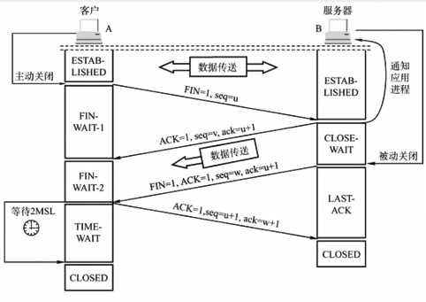

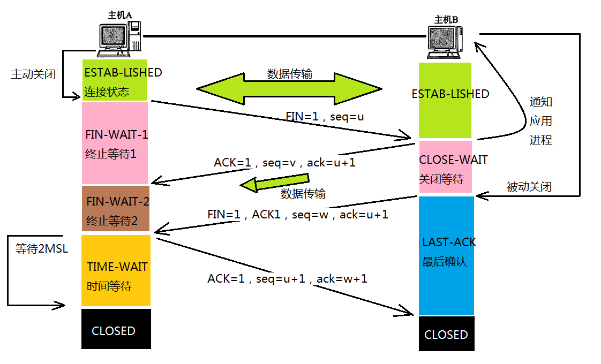

# TCP的其他问题

## 1、TCP泛洪攻击

SYN洪泛攻击，这种方式利用TCP协议的特性，就是三次握手。攻击者发送TCP SYN, SYN是TCP三次握手中的第-一个数据包，而当服务器返回ACK后，该攻击者就不对其进行再确认，那这个TCP连接就处于挂起状态，也就是所谓的半连接状态，服务器收不到再确认的话，还会重复发送ACK给攻击者。这样更加会浪费服务器的资源。攻击者就对服务器发送非常大量的这种TCP连接，由于每一个 都没法完成三次握手，所以在服务器上，这些TCP连接会因为挂起状态而消耗CPU和内存，最后服务器可能死机，就无法为正常用户提供服务了。

如何解决TCP泛洪攻击？

① 无效连接的监视释放

 监视系统的半开连接和不活动连接，当达到一定阈值时拆除这些连接，从而释放系统资源 

② SYN Cookie

它使用一种特殊的算法生成seq，这种算法考虑到了对方的IP、端口、己方IP、端口的固定信息，以及对方无法知道而己方比较固定的一些信息，如MSS(Maximum Segment Size，最大报文段大小，指的是TCP报文的最大数据报长度，其中不包括TCP首部长度)、时间等，在收到对方的ACK报文后，重新计算一遍，看其是否与对方回应报文中的（seq-1）相同，从而决定是否分配TCB资源

③ SYN Cache

系统在收到一个SYN报文时，在一个专用HASH表中保存这种半连接信息，直到收到正确的回应ACK报文再分配TCB。这个开销远小于TCB的开销。当然还需要保存序列号。

④ SYN Proxy防火墙

 一种方式是防止墙dqywb连接的有效性后，防火墙才会向内部服务器发起SYN请求。防火墙代服务器发出的SYN ACK包使用的序列号为c, 而真正的服务器回应的序列号为c', 这样，在每个数据报文经过防火墙的时候进行序列号的修改。另一种方式是防火墙确定了连接的安全后，会发出一个safe reset命令，client会进行重新连接，这时出现的syn报文会直接放行。这样不需要修改序列号了。但是，client需要发起两次握手过程，因此建立连接的时间将会延长。 