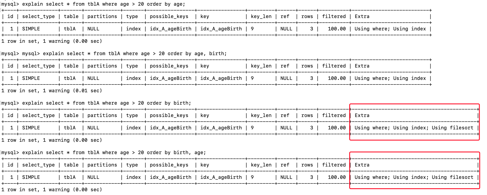
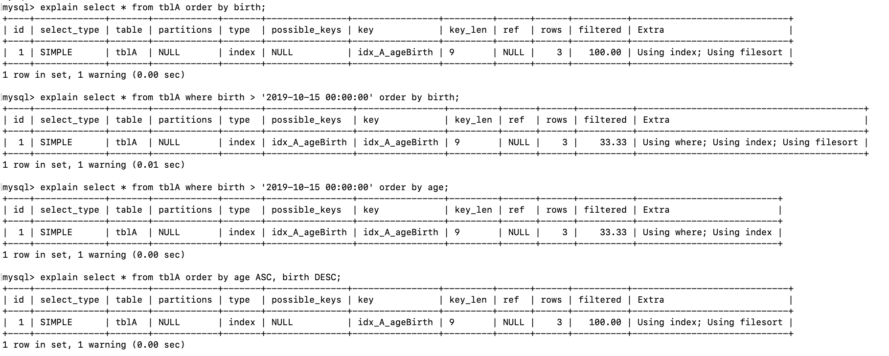

## 性能常见分析步骤

1、慢查询的开启并捕获 

2、explain+慢 SQL 分析

3、show profile 查询 SQL 在 MySQL 服务器里面的执行细节和生命周期情况

4、SQL数据库服务器的参数调优。


## 小表驱动大表

```java
for(int i = 0; i < 5; i++){
  for(int j = 0; j < 1000; j++){
    ...
  }
}

for(int i = 0; i < 1000; i++){
  for(int j = 0; j < 5; j++){
    ...
  }
}
```

用上面的代码举例子，如果是第一种for，那么就比如我们只建立了5次链接，而第二个for建立了1000次链接，毫无疑问，建立少的链接次数才是更优的选择！

优化原则：小表驱动大表，即小的数据集驱动大的数据集。

原理：

```sql
select * from A where id in (select id from B)

等价于

for select id from B

for select * from A where A.id = B.id
```

当B表的数据集必须小于A表的数据集的时候，用in优先于exists

```sql
select * from A where exists (select 1 from B where B.id = A.id)

等价于

for select id from A

for select * from B where B.id = A.id
```

 当A表的数据集小于B表的数据集的时候，用exists 优于in（A、B两表都应建立索引）

exists 用法：select ... from table where exists (subquery)

该语法可以理解为：将主查询的数据，放到子查询中做条件验证，根据验证结果（TRUE 或 FALSE）来决定主查询的数据结果是否得以保留。

1、exists（subquery）只返回true或者false，因此子査询中的 select * 也可以是 select 1 或其他，官方说法是实际执行时会忽略 SELECT 清单，因此没有区别

2、exists 子查询的实际执行过程可能经过了忧化而不是我们理解上的逐条对比，如果担忧效率问題，可进行实际检验以确定是否有效率问题

3、exists 子査询往往也可以用条件表达式、其他子査询或者 JOIN 来替代，何种最优需要具体回题具体分析

## order by优化

ORDER BY子句，尽量使用Index方式排序，避免使用FileSort方式排序

建表 + 插入数据 + 新建索引示例：

```sql
use day_07;

create table tblA(
    #id int primary key not null auto_increment,
    age int,
    birth TIMESTAMP not null
);
insert into tblA(age, birth) VALUES (22, NOW());
insert into tblA(age, birth) VALUES (23, NOW());
insert into tblA(age, birth) VALUES (24, NOW());

create index idx_A_ageBirth ON tblA(age, birth);

select * from tblA;
```





MySQL支持二种方式的排序，FileSort和Index，Index效率高。

它指MySQL扫描索引本身完成排序。FileSort方式效率较低。

order by满足两情况，会使用Index方式排序：

1、order by语句使用索引最左前列，这其实就是最佳左前缀法则

2、使用where子句与order by子句条件列组合满足索引最左前列，这同样也是符合最佳左前缀法则

所以，尽可能在索引列上完成排序操作，遵照索引建的最佳左前缀

### FileSort两种排序

如果不在索引列上，filesort有两种算法：双路排序和单路排序

双路排序：MySQL4.1 之前是使用双路排序，字面意思是两次扫描磁盘，最终得到数据。读取行指针和orderby列，对他们进行排序，然后扫描已经排序好的列表，按照列表中的值重新从列表中读取对应的数据传输。磁盘IO是非常耗时的，从磁盘取排序字段，在buffer进行排序，再从磁盘取其他字段。所以这就是两次磁盘扫描，也就是双路排序。


取一批数据，要对磁盘进行两次扫描，IO很耗时的，所以在mysql4.1之后，出现了第二张改进的算法，就是单路排序。

单路排序：从磁盘读取查询需要的所有列，按照orderby列在buffer对它们进行排序，然后扫描排序后的列表进行输出，它的效率更快一些，避免了第二次读取数据，并且把随机IO变成顺序IO，但是它会使用更多的空间，因为它把每一行都保存在内存中了。但是这种情况就害怕遇到一次拿数据拿不完的情况，那这样的话需要拿取多次数据，也就是多次IO，还不如以前的双路算法！

### 两种排序的坑

在 sort_buffer 中，方法B比方法A要多占用很多空间，因为方法B是把所有字段都取出，所以有可能取出的数据的总大小超出了sort_buffer的容量，导致每次只能取 sort_buffer容量大小的数据，进行排序（创建 tmp 文件，多路合并），排完再去取sort_buffer容量大小， 再排…从而多次IO，本来想省一次IO操作，反而导致了大量的O 操作，反而得不偿失

### order by优化策略

优化策略：增大sort_buffer_size参数的设置、增大max_length_for_sort_data参数的设置

1、order by时 select * 是一个大忌，只Query 需要的字段，这点非常重要。在这里的影响是：

* 当 Query 的字段大小总和小于 max_ length_for_ sort data 而且排序字段不是 TEXT|BLOB 类型时，会用改进后的算法——单路排序，否则用老算法一一多路排序

* 两种算法的数据都有可能超出 sort_buffer的容量，超出之后，会创建tmp文件进行合并排序，导致多次IO，但是用单路排序算法的风险会更大ー些，所以要提高 sort_buffer_size

2、尝试提高 sort_buffer_size

不管用哪种算法，提高这个参数都会提高效率，当然，要根据系统的能力去提高，因为这个参数是针对每个进程的

3、尝试提高 max_ length_for_sort_data

提高这个参数，会增加用改进算法的概率。但是如果设的太高，数据总容量超出 sort_buffer_size 的概率就增大，明显症状是高的磁盘IO活动和低的处理器使用率。


### order by优化总结 

Mysq 两种排序方式：文件排序或扫描有序索引排序， Mysql 能为排序与查询使用相同的索引

KEY a_b_c (a, b, c）

Order by 能使用索引最左前缀

```sql
order by a

order by a, b

order by a, b, c

order by a DESC, b DESC, c DESC
```

如果 where 使用索引的最左前缀定义为常量，则 order by 能使用索引

```sql
where a = const order by b, c

where a = const  and b = const order by c

where a = const and b > const order by c
```

不能使用索引进行排序

```sql
order by a ASC, b DESC, c DESC  # 排序方式不一致

where g = const order by b, c   # 丢失a索引

where a = const order by c      # 丢失b索引

where a = const order by d      # d不是索引的一部分

where a in (...) order by b, c  # 对于排序来说，多个相等条件也是范围查询
```


## group by优化

group by的优化和order by如出一辙， group by实质是先排序后进行分组，遵照索引建的最佳左前缀。当无法使用索引列，增大max_length_for_sort_data参数的设置或者增大sort_buffer_size参数的设置。where高于having，能写在where限定的条件就不要去having限定了。