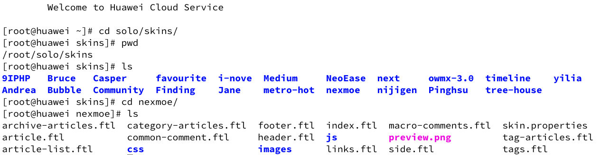
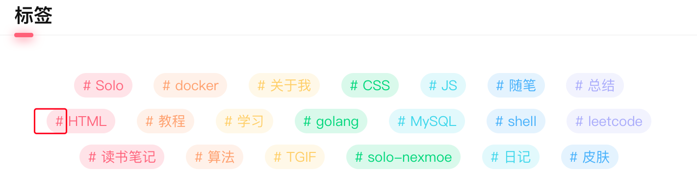
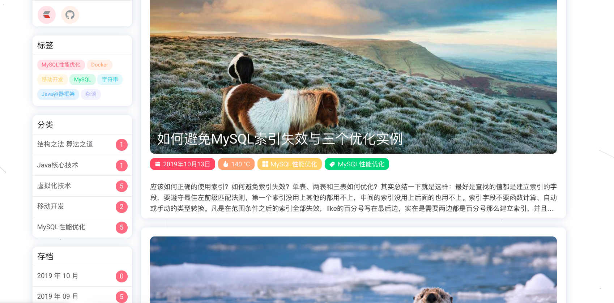

记录一个solo博客系统更换第三方皮肤的问题，在文档中其实没说清楚，文档原文是


**皮肤配置**

如果要使用其他皮肤，可以挂载目录 skins（里面需要包含所需使用的所有皮肤，官方所有皮肤可从这里下载）

地址是：https://github.com/b3log/solo-skins?utm_source=hacpai.com

```bash
--volume ~/skins/:/opt/solo/skins/
```

我下载的皮肤地址是 https://github.com/Programming-With-Love/solo-nexmoe 然后根据这样的配置方式Docker容器会启动失败，具体原因是：

```bash
Read skin [Pinghsu]'s configuration failed: null Can't load the default skins, please make sure skin [Pinghsu] is under skins directory and structure correctly
```

很显然solo没有读取到默认皮肤 Pinghsu，所以问题就很好解决了，去包含所有默认皮肤的的仓库，把工程clone下来，然后把新的皮肤放在和这些皮肤的同级目录下，删除README.md 文件就好了。



这个nexmoe 就是我新加入的第三方皮肤，顺便记载一下我的Docker启动参数配置：

```bash
docker run --detach  --name solo --network=host     --env RUNTIME_DB="MYSQL"     --env JDBC_USERNAME="root"     --env JDBC_PASSWORD="123456"     --env JDBC_DRIVER="com.mysql.cj.jdbc.Driver"     --env JDBC_URL="jdbc:mysql://127.0.0.1:3306/solo?useUnicode=yes&characterEncoding=UTF-8&useSSL=false&serverTimezone=UTC"     --volume /root/solo/skins/:/opt/solo/skins/     b3log/solo --listen_port=80 --server_scheme=http --server_host=zouchanglin.cn --server_port=80;
```

自动升级的脚本：

```bash
docker pull b3log/solo
docker stop solo
docker rm solo
docker run --detach  --name solo --network=host \
    --env RUNTIME_DB="MYSQL" \
    --env JDBC_USERNAME="root" \
    --env JDBC_PASSWORD="123456" \
    --env JDBC_DRIVER="com.mysql.cj.jdbc.Driver" \
    --env JDBC_URL="jdbc:mysql://127.0.0.1:3306/solo?useUnicode=yes&characterEncoding=UTF-8&useSSL=false&serverTimezone=UTC" \
    --volume /root/solo/skins/:/opt/solo/skins/ \
    b3log/solo --listen_port=80 --server_scheme=http --server_host=zouchanglin.cn --server_port=80
```


接下来说说如何去除便签前面的 # 号，其实这是一种风格，但是我还是不太喜欢这种的：



找到皮肤立面的 base.css 里面有content:"#"&nbsp; 删了即可！

这个皮肤看起来还不错哎，很追求细节，扁平化做得很好，没有明显的棱角！



地址是 https://github.com/Programming-With-Love/solo-nexmoe

