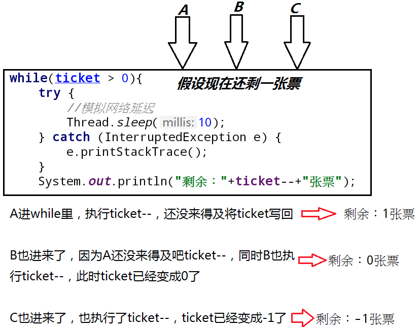
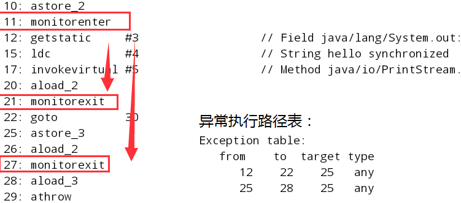
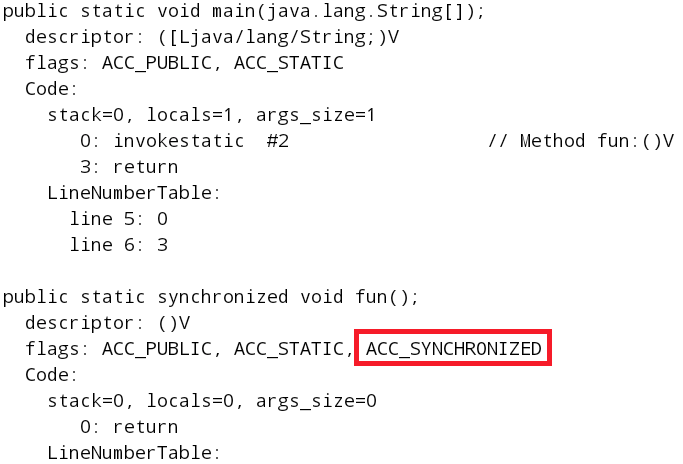
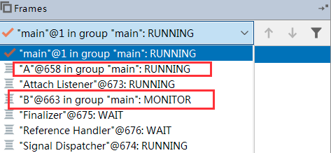
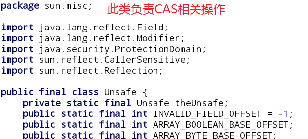
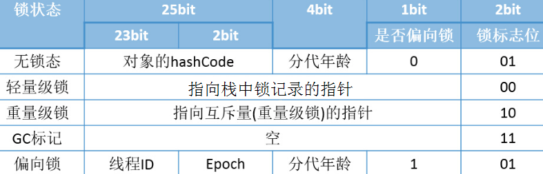
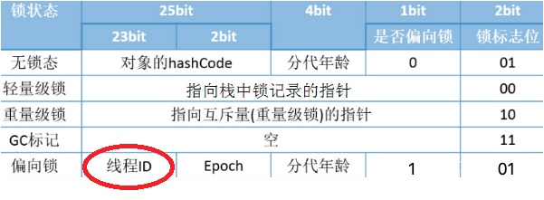
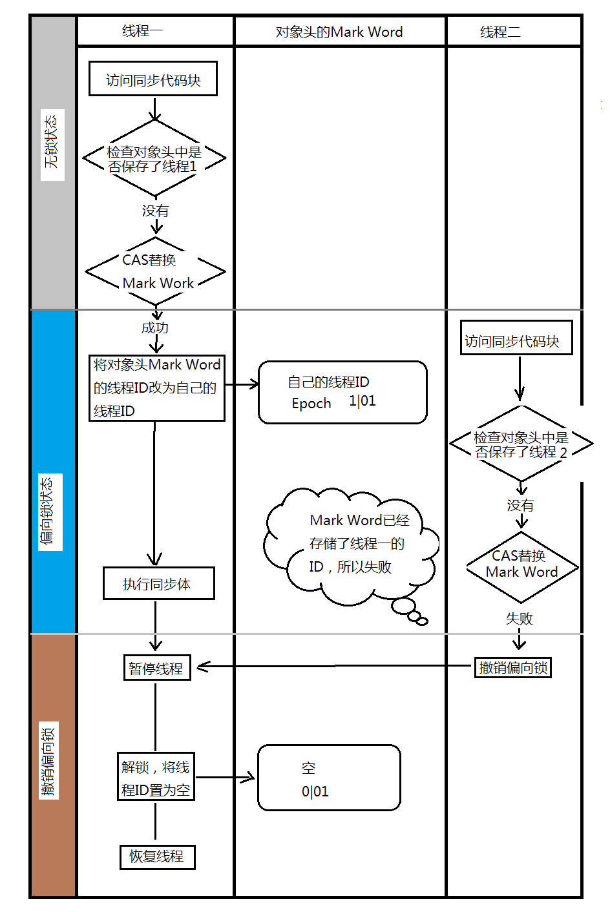
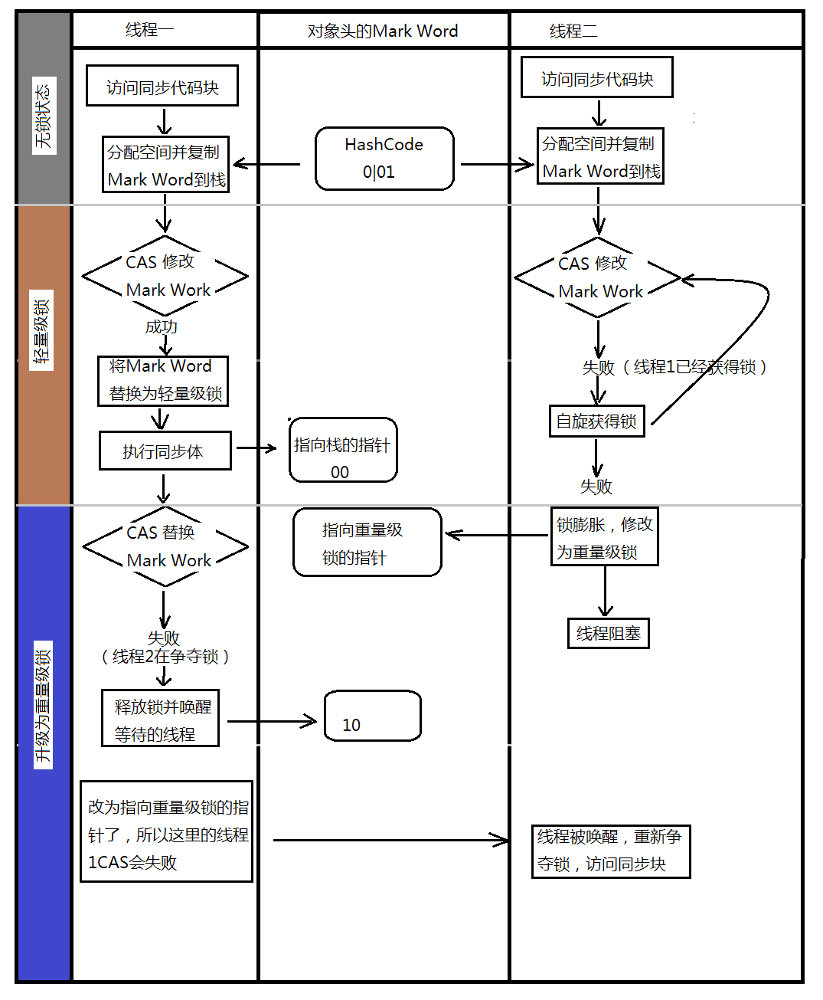

# 一、问题引出
线程的同步与死锁是多线程里面最需要重点理解的概念。这种操作的核心问题在于：每一个线程对象轮番强占资源带来的问题。

同步问题的引出需求：多个线程同时卖票(经典的卖票问题)
```java
package com.xpu.demo_03;
class B implements Runnable{
    private int ticket = 100;
    @Override
    public void run() {
        while(ticket > 0){
            try {
                //模拟网络延迟
                Thread.sleep(10);
            } catch (InterruptedException e) {
                e.printStackTrace();
            }
            System.out.println("剩余："+ticket--+"张票");
        }
    }
}
public class Demo2 {
    public static void main(String[] args) {
        B b = new B();
        Thread t1 = new Thread(b, "黄牛A");
        Thread t2 = new Thread(b, "黄牛B");
        Thread t3 = new Thread(b, "黄牛C");
        t1.start();
        t2.start();
        t3.start();
    }
}
```


# 二、问题分析
明明写的是ticket>0才进入并进行ticket--，为啥出现了-1这种情况呢？明显是不合常理的，这种问题我们称之为不同步操作。不同步唯一的好处就是处理速度快！



其实本质上就是最后一张票被大家卖了三次，所以出现了这种问题！
# 三、问题解决
本次将采用synchronized处理同步问题，synchronized处理同步问题有两种方式，同步代码块和同步方法：
```java
class B implements Runnable{
    private int ticket = 1000;
    @Override
    public void run() {
        for (int i = 0; i < 1000; i++) {
            synchronized (this){
                if(this.ticket>0) {
                    try {
                        //模拟网络延迟
                        Thread.sleep(10);
                    } catch (InterruptedException e) {
                        e.printStackTrace();
                    }
                    System.out.println(Thread.currentThread().getName()
                            + "剩余：" + ticket-- + "张票");
                }
            }
        }
    }
}
```
上面使用了同步代码块 : 如果要使用同步代码块必须设置一个要锁定的对象，所以一般可以锁定当前对象：this，接下来试一下同步方法：
同步方法标识此方法只有一个线程可以进入，包含一个隐式锁对象：this
```java
class B implements Runnable{
    private int ticket = 1000;
    @Override
    public void run() {
        for (int i = 0; i < 1000; i++) {
            sell();
        }
    }

    private synchronized void sell(){
        if(ticket > 0){
            System.out.println(Thread.currentThread().getName()
                    + "剩余：" + ticket-- + "张票");
        }
    }
}
```
# 四、synchronized锁的是什么？
接下来看看这样的一种情况：
```java
class Sync{
    public synchronized void fun(){
        System.out.println(Thread.currentThread().getName()+"fun方法开始");
        try {
            Thread.sleep(1000);
        } catch (InterruptedException e) {
            e.printStackTrace();
        }
        System.out.println(Thread.currentThread().getName()+"fun方法结束");
    }
}

class MyThread implements Runnable{

    @Override
    public void run() {
        Sync sync = new Sync();
        sync.fun();
    }
}
public class Demo {
    public static void main(String[] args) {
        MyThread myThread = new MyThread();
        Thread thread1 = new Thread(myThread, "线程A");
        Thread thread2 = new Thread(myThread, "线程B");
        Thread thread3 = new Thread(myThread, "线程C");

        thread1.start();
        thread2.start();
        thread3.start();
    }
}
```
按照道理来说，对于Sync的fun方法，应该同一时刻只会有一个线程进入，但是其实这里的同步方法的锁对象却不是同一个对象，三个线程new了三个对象，大家都抱着自己的锁，所以想要锁住必须是同一个对象锁！！！

在同步方法上面加上static就好了，为什么呢？
```java
class Sync{
    public static synchronized void fun(){
        System.out.println(Thread.currentThread().getName()
        +"fun方法开始");
        try {
            Thread.sleep(1000);
        } catch (InterruptedException e) {
            e.printStackTrace();
        }
        System.out.println(Thread.currentThread().getName()
        +"fun方法结束");
    }
}
```
static声明的方法是类方法，与对象无关了，所以只要是这个类的对象都可以锁住，此时用的锁对象是Sync.class对象，Sync.class对象在虚拟机中只有一份！
```java
class Sync{
    public synchronized void fun(){
        System.out.println(Thread.currentThread()
        .getName()+"fun方法开始");
        try {
            Thread.sleep(1000);
        } catch (InterruptedException e) {
            e.printStackTrace();
        }
        System.out.println(Thread.currentThread()
        .getName()+"fun方法结束");
    }
}

class MyThread implements Runnable{
    private Sync sync;

    public MyThread(Sync sync) {
        this.sync = sync;
    }

    @Override
    public void run() {
        sync.fun();
    }
}
public class Demo {
    public static void main(String[] args) {
        Sync sync = new Sync();
        MyThread myThread = new MyThread(sync);
        Thread thread1 = new Thread(myThread, "线程A");
        Thread thread2 = new Thread(myThread, "线程B");
        Thread thread3 = new Thread(myThread, "线程C");

        thread1.start();
        thread2.start();
        thread3.start();
    }
}
```
再思考两个问题(前提是线程中是同一个对象)：
```java
class Sync{
    public synchronized void funA(){
       //问题一：线程1进入funA方法了,线程2能否进入funB()?
        while(true){
            //问题二：线程1在这里是否可以调用funB()?
        }
    }
    public synchronized void funB(){}
}
```
对于问题一：很显然不能，同步方法采用的是对象锁，如果是同一个对象的话，如果A线程获取到了锁，而且进入死循环，那么其他的线程是获取不到锁的，自然其他的线程也就无法进入线程B！

对于问题二：很显然可以，对象已经获得锁了，那么在这期间它干什么都是可以的，直到释放锁之前，一切畅通无阻！


# 五、synchronized底层分析
首先，我们归纳一下同步的方式，以及相应的方式应锁的是什么：
一、同步代码块：
1、锁类的实例对象
```java
synchronized(this){...}
```
2、锁类对象（class对象），又叫做全局锁，可以理解为把代码锁住了，无论多少对象产生，一定能锁住
```java
synchronized(XXXX.class){...}
```
3、锁任意实例对象
```java
synchronized(new String())
```
二、同步方法
1、普通方法+synchronized：锁的是当前对象
2、静态方法+synchronized：锁的是类，也是全局锁，效果等同于同步代码块的锁类对象

## 对象锁（monitor）机制 —— JDK1.6的重量级锁
### 一、同步代码块：
```java
public class Demo {
    public static void main(String[] args) {
        Object object = new Object();
        synchronized (object){
            System.out.println("hello synchronized");
        }
    }
}
```
使用`javap -V` 查看反编译后的输出信息：
```java
public static void main(java.lang.String[]);
    descriptor: ([Ljava/lang/String;)V
    flags: ACC_PUBLIC, ACC_STATIC
    Code:
      stack=2, locals=4, args_size=1
         0: new           #2                  // class java/lang/Object
         3: dup
         4: invokespecial #1                  // Method java/lang/Object."<init>":()V
         7: astore_1
         8: aload_1
         9: dup
        10: astore_2
        11: monitorenter
        12: getstatic     #3                  // Field java/lang/System.out:Ljava/io/PrintStream;
        15: ldc           #4                  // String hello synchronized
        17: invokevirtual #5                  // Method java/io/PrintStream.println:(Ljava/lang/String;)V
        20: aload_2
        21: monitorexit
        22: goto          30
        25: astore_3
        26: aload_2
        27: monitorexit
        28: aload_3
        29: athrow
        30: return
      Exception table:
         from    to  target type
            12    22    25   any
            25    28    25   any

```

**执行同步代码块后首先要执行monitorenter指令，退出时要执行monitorexit指令。**

**使用内建锁synchronized进行同步，关键在于要获取指定锁对象的monitor对象，当线程获取到monitor后才能向下执行，否则就只能等待，这个获取的过程是互斥的，即同一时刻只有一个线程能够获取到对象monitor。**



**通常一个monitorenter指令会包含若干个monitorexit指令，原因在于JVM需要确保锁在正常执行路径以及异常执行路径都能正确的解锁！**

### 二、同步方法
```java
public class Demo {
    public static void main(String[] args) {
        fun();
    }
    public static synchronized void fun(){}
}
```



**一：当使用synchronized标记方法时，编译后字节码中的方法访问标记多了一个ACC_SYNCHRONIZED。该标记表示：进入该方法时，JVM需要进行monitorenter操作，退出方法时，无论是否正确返回，JVM均需要进行monitorexit操作。**


**二、当执行monitorenter时，如果目标锁对象的monitor计数器为0，表示此对象没有被任何其他对象所持有，此时JVM会将该锁对象的持有线程设置为当前线程，并将计数器+1；**


**三、如果目标锁对象的计数器不为0，判断目标锁对象的持有持有线程是不是当前线程，如果是再次将计数器+1（锁的可重入性），如果锁对象的持有线程不是当前线程，当前线程需要等待，直到持有线程释放锁。**
>之所以采用这种计数器的方式，是为了允许同一个线程重复获取同一把锁。举个例子，如果一个 Java 类中拥有多个 synchronized 方法，那么这些方法之间的相互调用，不管是直接的还是间接的，都会涉及对同一把锁的重复加锁操作。因此，我们需要设计这么一个可重入的特性，来避免编程里的隐式约束。

**四、当执行monitorexit指令时，JVM会将锁对象的计数器-1，当计数器减为0时，表示该锁对象已经被释放。**

可重入性的证明：
```java
class MyThread implements  Runnable{

    @Override
    public void run() {
        test1();
    }

    public synchronized void test1(){
        System.out.println("A线程进入test1()...");
        test2();
    }

    public synchronized void test2(){
    	System.out.println(Thread.currentThread().getName()+
      		"线程进入test2()...");
       }
    }
}
public class Demo {
    public static void main(String[] args){
        MyThread my = new MyThread();
        Thread threadA = new Thread(my, "A");
        threadA.start();
    }
}
```
互斥的证明：
```java
class MyThread implements  Runnable{

    @Override
    public void run() {
        test1();
        test2();
    }

    public synchronized void test1(){
        System.out.println("A线程进入test1()...");
        if(Thread.currentThread().getName().equals("A")){
            while (true){}
        }
    }
    public synchronized void test2(){
        if(Thread.currentThread().getName().equals("B")){
            System.out.println("B线程进入该同步方法test2()..");
        }else{
            System.out.println(Thread.currentThread().getName()+"线程进入test2()...");
        }
    }
}
public class Demo {
    public static void main(String[] args){
        MyThread my = new MyThread();
        Thread threadA = new Thread(my, "A");
        threadA.start();
        try {
            Thread.sleep(1000);
        } catch (InterruptedException e) {
            e.printStackTrace();
        }
        Thread threadB = new Thread(my, "B");
        threadB.start();
    }
}
```



好了，JDK6之前的对象锁（monitor）机制已经讲述完毕了，这个其实是重量级锁，为什么是重量级锁呢？因为这个锁是阻塞式的，这也就意味着效率非常低，没有成功获取锁的线程会阻塞，会从用户态切换到内核态，再次切换回去又是一笔重大的开销，所以JDK6之前的对象锁是重量级的锁，效率很低，于是在JDK5出现了Lock体系，synchronized对象锁也得到了优化。

> interrupt():
> 1、线程中没有调用wait()、sleep()、join()，isInterrupt()：true
> 2、线程调用了wait()、sleep()、join()，调用interrupt引发中断异常，catch中捕获异常，退出，中断状态设置为false

# JDk1.5提供的Lock锁
```java
class MyThread implements Runnable {
    private int ticket = 100;
    private Lock lock = new ReentrantLock();
    @Override
    public void run() {
        for (int i = 0; i < 100; i++) {
            try {
                lock.lock();
                try {
                    Thread.sleep(20);
                } catch (InterruptedException e) {
                    e.printStackTrace();
                }
                if(ticket > 0){
                    System.out.println(Thread.currentThread().getName()
                            +"剩下"+ticket--+"张票");
                }
            } catch (Exception e) {
                e.printStackTrace();
            } finally {
                lock.unlock();
            }
        }
    }
}
```
在JDK1.5中，synchronized是性能低效的。因为这是一个重量级操作，它对性能最大的影响是阻塞的是实现，挂起线程和恢复线程的操作都需要转入内核态中完成，这些操作给系统的并发性带来了很大的压力。相比之下使用Java提供的Lock对象，性能更高一些。

到了JDK1.6，发生了变化，对synchronize加入了很多优化措施，有自适应自旋，锁消除，锁粗化，轻量级锁，偏向锁等等。导致在JDK1.6上synchronize的性能并不比Lock差。官方也表示，他们也更支持synchronized，在未来的版本中还有优化余地，所以还是提倡在synchronized能实现需求的情况下，优先考虑使用synchronized来进行同步。

# synchronized优化
现在我们对Synchronized应该有所印象了，它最大的特征就是在同一时刻只有一个线程能够获得对象的监视器（monitor），从而进入到同步代码块或者同步方法之中，即表现为互斥性（排它性）。这种方式肯定效率低下，每次只能通过一个线程，既然每次只能通过一个，这种形式不能改变的话，那么我们能不能让每次通过的速度变快一点呢？

打个比方，去收银台付款，之前的方式是，大家都去排队，然后取纸币付款收银员找零，有的时候付款的时候在包里拿出钱包再去拿出钱，这个过程是比较耗时的，然后，支付宝解放了大家去钱包找钱的过程，现在只需要扫描下就可以完成付款了，也省去了收银员跟你找零的时间的了。同样是需要排队，但整个付款的时间大大缩短，是不是整体的效率变高速率变快了？这种优化方式同样可以引申到锁优化上，缩短获取锁的时间。

## CAS操作
### CAS操作概念
悲观锁（JDK1.6之前的内建锁）：使用锁时，线程获取锁是一种悲观锁策略，即假设每一次执行临界区代码都会产生冲突，所以当前线程获取到锁的时候同时也会阻塞其他线程获取该锁。
乐观锁（LOCK）：假设所有线程访问共享资源时不会出现冲突，既然不会出现冲突自然就不会阻塞其他线程，线程不会出现被阻塞状态。

CAS操作（又称为无锁操作）是一种乐观锁策略，那么，如果出现冲突了怎么办？无锁操作是使用CAS(compare and swap)又叫做比较交换来鉴别线程是否出现冲突，出现冲突就重试当前操作直到没有冲突为止。
### CAS操作过程
一般来讲，CAS交换过程分三个阶段（V，O，N）
V:内存中地址存放的实际值
O:预期值（旧值）
N:更新后的值

当执行CAS后，当V==O，即旧值和内存中实际值相等，表示上次修改后没有任何线程再次修改此值，因此可将N替换到内存中，如果V!=O，表示内存中的值已经被其他线程修改，所以无法将N替换，返回最新的V值。

当多个CAS操作同一个变量时，只有一个线程会成功，并成功更新变量值，其余线程均会失败，失败线程会重新尝试或将线程挂起(阻塞)

元老级内建锁（Synchronized）最主要的问题：当存在线程竞争情况下会出现线程阻塞以及唤醒带来的性能问题，对应互斥同步（阻塞同步），效率降低。而CAS并不是武断地将线程挂起，而是会尝试若干次CAS操作，并非进行耗时的挂起与唤醒操作，因此非阻塞式同步。

CAS的实现需要硬件指令集的支撑，在JDK1.5后虚拟机才可以使用处理器提供的CMPXCHG指令实现！



### CAS操作的问题
#### 1、A-B-A问题：
比如线程1检测到变量值为：A，但是线程2修改为B了，线程3把B修改为A了，A去检查结果还是A，以为没有人更改过！

解决方案：沿用数据库的乐观锁机制，添加版本号1A->2B->3A
JDK1.5提供atomic包下AtomicStampedeReference来解决CAS的ABA问题
#### 2、自旋（CAS）会浪费大量的处理器资源
阻塞不会浪费CPU资源，与线程阻塞相对比，自旋会浪费大量CPU资源，因为此时线程仍处于运行状态，只不过跑的是无用指令，期望在无用指令时，锁能被释放出来。

解决方案：自适应自旋。根据以往自旋等待时能否获取到锁来动态调整自旋时间（循环尝试的数量），如果在上一次自旋时获取到锁，则此次自旋时间长一点，如果上一次自旋结束还没有获取到锁，此次自旋时间短一点。打个比方：如果你上一次看到十字路口是红灯，你是选择刹车呢（自旋）？还是直接熄火（线程挂起）？结果你等了好长时间也没变绿灯，那么你下次再次遇到红灯的时候会选择刹车时间短一点，如果在你的刹车时间内还没变绿灯，那么就选择熄火；如果你等了很短一段时间就变成了绿灯，那么下次你肯定踩刹车的时间会更长一点，因为你相信很短的时间就可以等到绿灯，车就不用熄火了！

#### 3、公平性问题
很显然，如果刚好显示绿灯了，之前踩刹车的人肯定比重新打火的人更快的跑起来，所以自旋的线程其实相对于挂起的线程更容易获取到锁，这就导致了不公平的问题。
处于阻塞状态的线程无法立刻竞争被释放的锁，而处于自旋状态的线程很可能先获取到锁。内建锁无法实现公平性。lock体系可以实现公平锁（一定会让等待时间最长的线程最先获取到锁）。

## Java对象头
JDK1.6之后对内建锁做了优化（新增偏向、轻量级锁），下面是锁的四种状态，锁状态在对象头的mark word中
* 无锁状态	0 01
* 偏向锁	1 01
* 轻量级锁 00
* 重量级锁（JDK1.6之前）10


这四种状态随着竞争情况逐渐升级，锁可以升级不能降级，为了提高获得锁与释放锁的效率，

在同步的时候是获取对象的monitor,即获取到对象的锁。那么对象的锁怎么理解？无非就是类似对对象的一个标志，那么这个标志就是存放在Java对象的对象头。Java对象头里的Mark Word里默认的存放的对象的Hashcode，分代年龄和锁标记位。32位JVM Mark Word默认存储结构为：
|  锁状态  |    25bit     |     4bit     | 1bit是否偏向锁 | 2bit是否标志位 |
| :------: | :----------: | :----------: | :------------: | :------------: |
| 无锁状态 | 对象hashCode | 对象分代年龄 |       0        |       01       |

如图在Mark Word会默认存放hasdcode，年龄值以及锁标志位等信息。 锁一共有4种状态，级别从低到高依次是：无锁状态、偏向锁状态、轻量级锁状态和重量级锁状态，这几个状态会随着竞争情况逐渐升级。锁可以升级但不能降级，意味着偏向锁升级成轻量级锁后不能降级成偏向锁。这种锁升级却不能降级的策略，目的是为了提高获得锁和释放锁的效率。对象的MarkWord变化为下图：



## 偏向锁
偏向锁概念：最乐观的锁，从始至终只有一个线程请求一把锁

HotSpot的作者经过研究发现，大多数情况下，锁不仅不存在多线程竞争，而且总是由同一线程多次获得，为了让线程获得锁的代价更低而引入了偏向锁。
偏向锁是四种状态中最乐观的一种锁:从始至终只有一个线程请求某一把锁。

这就好比你在私家庄园里装了个红绿灯，并且庄园里只有你在开车。偏向锁的做法便是在红绿灯处识别来车的车牌号。如果匹配到你的车牌号，那么直接亮绿灯，线程ID用来标识线程：



### 偏向锁的获取
(1) 当一个线程访问同步代码块并获取锁时，会在对象头和栈帧中的锁记录中记录存储偏向锁的线程ID，以后该线程再次进入同步块时，不需要 CAS来加锁和解锁，只需简单测试一下对象头的mark word中偏向线程ID是否是当前线程的ID，如果成功，表示线程已经获取到锁直接进入代码块运行。

(2) 如果测试失败（不是当前线程ID），检查当前偏向锁字段是否为0（无锁状态）：
* 如果为0，将偏向锁字段设置为1（采用CAS操作），并且更新自己的线程ID到mark word字段中。
* 如果为1，表示此事偏向锁已经被别的线程获取，则次线程需要不断尝试使用CAS获取偏向锁，或者将偏向锁撤销，升级为轻量级锁，一般情况下后者（升级）概率较大。

### 偏向锁的撤销
偏向锁撤销：偏向锁使用一种等待竞争出现才释放锁的机制，当有其他线程尝试竞争偏向锁时，持有偏向锁的线程才会撤销偏向锁。



但是偏向锁的撤销开销很大，需要等待线程进入全局安全点safepoint，全局安全点safepoint简单理解就是当前线程在CPU上没有执行任何有用字节码！


**Epoch字段标识偏向锁的撤销次数，每撤销一个Epoch就加一，加到40 的时候升级为轻量级锁，此值是可以设置的！**

**偏向锁从JDK6后默认开启，但是在应用程序启动几秒后在激活
`-XX：BiasedLockingStartupDelay = 0`，将延迟关闭，JVM一启动就激活偏向锁。**

**`-XX：-UserBiasedLocking = false`，关闭偏向锁，程序默认进入轻量级锁。**

## 轻量级锁
多个线程在不同的时间段请求同一把锁，也就是说没有锁竞争。针对这种情况，JVM采用了轻量级锁，来避免线程的阻塞以及唤醒。
类比于生活中的例子：比如现在是深夜，车辆很少，红绿灯处只有一个车在等待红灯结束，很显然，此时没有其他的车，这样的等待是一种时间的浪费，于是便出现了轻量级锁来解决这种问题！

加锁：线程在执行同步代码块之前，JVM先在当前线程的栈帧中创建用于存储锁记录的空间，并将对象头的Mark Word字段直接复制到此空间中。然后线程尝试使用CAS将对象头的Mark Word替换为指向锁记录的指针（指向当前线程），如果成功表示获取到轻量级锁，如果失败，表示其他线程竞争轻量级锁，当前线程便采用自旋来不断尝试。



## 总结
拿个上厕所的例子所为结尾：A和B都需要上厕所

重量级锁：重量级锁会阻塞、唤醒请求加锁的进程，针对的是多个线程同一时刻竞争同一把锁的情况，JVM采用自适应自旋来避免线程在面对非常小的同步块时，仍会被阻塞以及唤醒。比如：A和B同时都要上厕所，这个时候就要重量级锁！

轻量级锁：轻量级锁采用CAS操作，将锁对象的标记字段替换为指向线程的指针，存储着锁对象原本的标记字段。针对的是多个线程在不同时间段申请同一把锁的情况。比如：A总是在早晨上厕所，B总是在晚上才上厕所！

偏向锁：偏向锁只会在第一次请求时采用CAS操作，在锁对象的Mark Word字段中记录下当前线程ID，此后运行中持有偏向锁的线程不再有加锁过程，针对的锁仅会被同一线程持有。比如：这个厕所只有A上，B根本不会来这个厕所！