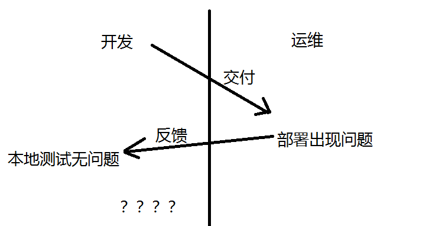
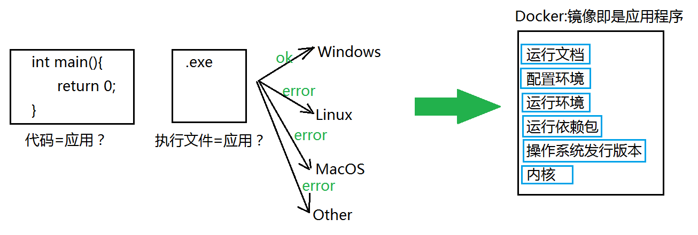
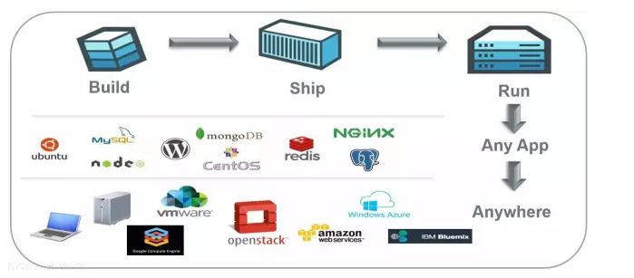
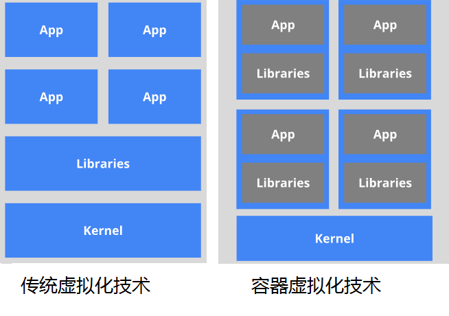
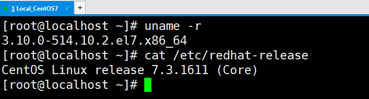
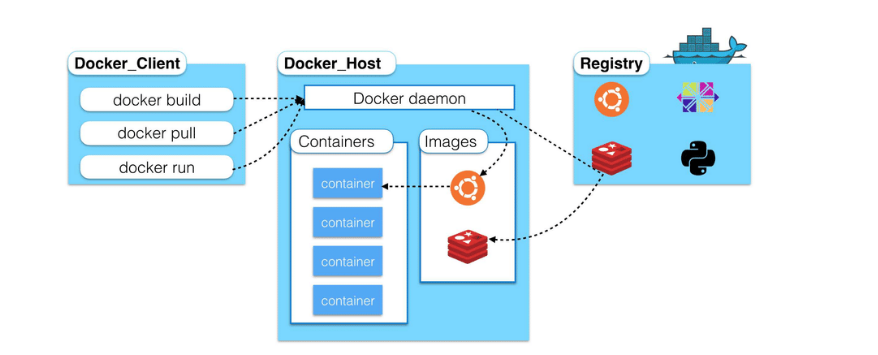
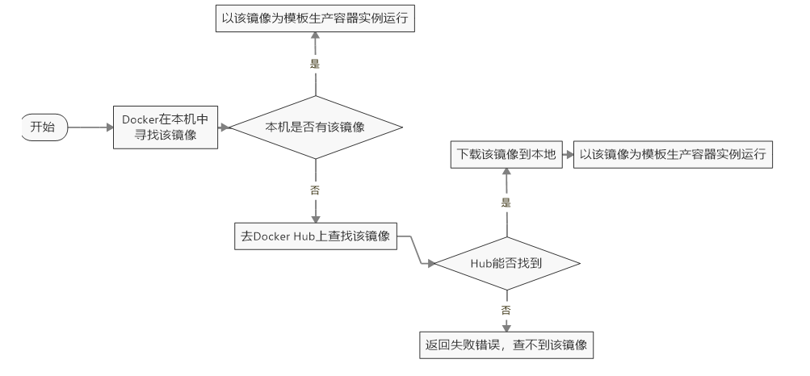

## 一、Docker基础

### 1、前提知识

* 熟悉Linux命令和相关背景

* 建议了解Git、Maven相关知识和概念

### 2、Docker方向选择

* JavaEE研发方向：掌握Docker基本用法和相关概念
* Docker研发方向：主要开发语言是go，Swarm、Compose、Machine、K8S等

### 3、Docker是什么

一款产品从开发到上线，从操作系统，到运行环境，再到应用配置。作为开发+运维之间的协作我们需要关心很多东西，这也是很多互联网公司都不得不面对的问题，特别是各种版本的迭代之后，不同版本环境的兼容，对运维人员都是考验
Docker之所以发展如此迅速，也是因为它对此给出了一个标准化的解决方案。

环境配置如此麻烦，换一台机器，就要重来一次，费力费时。很多人想到，能不能从根本上解决问题，软件可以带环境安装？也就是说，安装的时候，把原始环境一模一样地复制过来。开发人员利用 Docker 可以消除协作编码时**在我的机器上可正常工作**的问题。



这就好比，我安装了Windows操作系统，里面安装了各种开发环境，某天我重装了系统，各种开发工具和环境我都要重新配置一次，即使是这样也不能保证和以前完全一致。所以，现在我改为在虚拟机里面做开发，把我整个操作系统打包成一个虚拟机镜像文件，下次就可以通过镜像把整个虚拟机转移，里面的东西丝毫不会改变，Docker就是把应用程序、配置文件、各种需要的环境打包，这样便可以方便运维人员移植！所以对于Docker来说：**镜像就是应用程序**



### 4、Docker的理念

Docker是基于Go语言实现的云开源项目。

Docker的主要目标是“Build，Ship and Run Any App,Anywhere”，也就是通过对应用组件的封装、分发、部署、运行等生命周期的管理，使用户的APP（可以是一个WEB应用或数据库应用等等）及其运行环境能够做到“一次封装，到处运行”。



Linux 容器技术的出现就解决了这样一个问题，而 Docker 就是在它的基础上发展过来的。将应用运行在 Docker 容器上面，而 Docker 容器在任何操作系统上都是一致的，这就实现了跨平台、跨服务器。只需要一次配置好环境，换到别的机子上就可以一键部署好，大大简化了操作.


一句话解释Docker就是：解决了运行环境和配置问题软件容器，方便做持续集成并有助于整体发布的容器虚拟化技术。

其实我们很容易发现这和Java的初衷有点像，Java的特性之一就是跨平台，但是只是针对Java虚拟机，针对Java程序的一次编译到处运行，所以Docker是针对所有应用程序的！

### 5、Docker能干啥

#### 虚拟机技术（virtual machine）

虚拟机（virtual machine）就是带环境安装的一种解决方案。
它可以在一种操作系统里面运行另一种操作系统，比如在Windows 系统里面运行Linux 系统。应用程序对此毫无感知，因为虚拟机看上去跟真实系统一模一样，而对于底层系统来说，虚拟机就是一个普通文件，不需要了就删掉，对其他部分毫无影响。这类虚拟机完美的运行了另一套系统，能够使应用程序，操作系统和硬件三者之间的逻辑不变。比如VMware Workstation Pro，但是这样是资源占用多、冗余步骤多、启动慢


#### Linux Containers（LXC）

Linux 容器不是模拟一个完整的操作系统，而是对进程进行隔离。有了容器，就可以将软件运行所需的所有资源打包到一个隔离的容器中。容器与虚拟机不同，不需要捆绑一整套操作系统，只需要软件工作所需的库资源和设置。系统因此而变得高效轻量并保证部署在任何环境中的软件都能始终如一地运行。



所以可以把Docker理解为缩小版、精细版的Linux系统！

#### 开发/运维

##### 更快速的应用交付和部署

传统的应用开发完成后，需要提供一堆安装程序和配置说明文档，安装部署后需根据配置文档进行繁杂的配置才能正常运行。Docker化之后只需要交付少量容器镜像文件，在正式生产环境加载镜像并运行即可，应用安装配置在镜像里已经内置好，大大节省部署配置和测试验证时间。

##### 更便捷的升级和扩缩容

随着微服务架构和Docker的发展，大量的应用会通过微服务方式架构，应用的开发构建将变成搭乐高积木一样，每个Docker容器将变成一块“积木”，应用的升级将变得非常容易。当现有的容器不足以支撑业务处理时，可通过镜像运行新的容器进行快速扩容，使应用系统的扩容从原先的天级变成分钟级甚至秒级。

##### 更简单的系统运维

应用容器化运行后，生产环境运行的应用可与开发、测试环境的应用高度一致，容器会将应用程序相关的环境和状态完全封装起来，不会因为底层基础架构和操作系统的不一致性给应用带来影响，产生新的BUG。当出现程序异常时，也可以通过测试环境的相同容器进行快速定位和修复。

##### 更高效的计算资源利用

Docker是内核级虚拟化，其不像传统的虚拟化技术一样需要额外的Hypervisor支持，所以在一台物理机上可以运行很多个容器实例，可大大提升物理服务器的CPU和内存的利用率。

### 6、Docker安装前的准备

Docker支持以下的CentOS版本：
CentOS 7 (64-bit)
CentOS 6.5 (64-bit) 或更高的版本

目前，CentOS 仅发行版本中的内核支持 Docker。
Docker 运行在 CentOS 7 上，要求系统为64位、系统内核版本为 3.10 以上。
Docker 运行在 CentOS-6.5 或更高的版本的 CentOS 上，要求系统为64位、系统内核版本为 2.6.32-431 或者更高版本。

uname命令用于打印当前系统相关信息（内核版本号、硬件架构、主机名称和操作系统类型等）



### 7、Docker的基本组成

#### 镜像 image

Docker 镜像（Image）就是一个只读的模板。镜像可以用来创建 Docker 容器，一个镜像可以创建很多容器。

镜像与容器的关系就好比面向对象编程中的对象与类

| Docker | 面向对象 |
| ------ | -------- |
| 容器   | 对象     |
| 镜像   | 类       |

#### 容器 container

Docker 利用容器（Container）独立运行的一个或一组应用。容器是用镜像创建的运行实例。

它可以被启动、开始、停止、删除。每个容器都是相互隔离的、保证安全的平台。

可以把容器看做是一个简易版的 Linux 环境（包括root用户权限、进程空间、用户空间和网络空间等）和运行在其中的应用程序。

容器的定义和镜像几乎一模一样，也是一堆层的统一视角，唯一区别在于容器的最上面那一层是可读可写的。

#### 仓库 respository

仓库（Repository）是集中存放镜像文件的场所。
仓库(Repository)和仓库注册服务器（Registry）是有区别的。仓库注册服务器上往往存放着多个仓库，每个仓库中又包含了多个镜像，每个镜像有不同的标签（tag）。

仓库分为公开仓库（Public）和私有仓库（Private）两种形式。
最大的公开仓库是 Docker Hub(https://hub.docker.com/)，
存放了数量庞大的镜像供用户下载。国内的公开仓库包括阿里云 、网易云等


需要正确的理解仓储/镜像/容器这几个概念:
Docker 本身是一个容器运行载体或称之为管理引擎。我们把应用程序和配置依赖打包好形成一个可交付的运行环境，这个打包好的运行环境就似乎 image镜像文件。只有通过这个镜像文件才能生成 Docker 容器。

image 文件可以看作是容器的模板。Docker 根据 image 文件生成容器的实例。同一个 image 文件，可以生成多个同时运行的容器实例。

image 文件生成的容器实例，本身也是一个文件，称为镜像文件。

一个容器运行一种服务，当我们需要的时候，就可以通过docker客户端创建一个对应的运行实例，也就是我们的容器
至于仓储，就是放了一堆镜像的地方，我们可以把镜像发布到仓储中，需要的时候从仓储中拉下来就可以了。



### 8、Docker的安装

https://docs.docker.com/install/linux/docker-ce/centos/

参考官方文档，分为企业版和社区版，下面说说我的操作过程（我的系统是CentOS 7_x64）

1、更新yum

```bash
yum update
```

2、安装依赖

```bash
yum install -y yum-utils device-mapper-persistent-data lvm2
```

3、设置存储仓库

```bash
yum-config-manager --add-repo https://download.docker.com/linux/centos/docker-ce.repo
```

4、安装DockerCE（CE是社区版）

```bash
yum install docker-ce docker-ce-cli containerd.io
```

```
如果提示接受GPG密钥，请验证指纹是否匹配060A 61C5 1B55 8A7F 742B 77AA C52F EB6B 621E 9F35，如果匹配，则接受该指纹 :
Importing GPG key 0x621E9F35:
Userid     : "Docker Release (CE rpm) <docker@docker.com>"
Fingerprint: 060a 61c5 1b55 8a7f 742b 77aa c52f eb6b 621e 9f35
From       : https://download.docker.com/linux/centos/gpg
```

5、启动Docker

```
systemctl start docker
```

6、验证安装Docker

```
docker version
docker run hello-world
```

7、阿里云镜像加速

国外的仓库很慢的，就和Maven一样，所以需要配置阿里云的仓库(CentOS 7)

打开这个网站：https://cr.console.aliyun.com/cn-hangzhou/instances/mirrors

通过修改daemon配置文件/etc/docker/daemon.json来使用加速器

```bash
sudo mkdir -p /etc/docker
sudo tee /etc/docker/daemon.json <<-'EOF'
{
  "registry-mirrors": ["https://g7g0wjjq.mirror.aliyuncs.com"]
}
EOF
sudo systemctl daemon-reload
sudo systemctl restart docker
```

### 9、看看Docker的HelloWorld

```
[root@localhost ~]# docker run hello-world
Unable to find image 'hello-world:latest' locally
latest: Pulling from library/hello-world
1b930d010525: Pull complete 
Digest: sha256:6540fc08ee6e6b7b63468dc3317e3303aae178cb8a45ed3123180328bcc1d20f
Status: Downloaded newer image for hello-world:latest

Hello from Docker!
This message shows that your installation appears to be working correctly.

To generate this message, Docker took the following steps:
 1. The Docker client contacted the Docker daemon.
 2. The Docker daemon pulled the "hello-world" image from the Docker Hub.
    (amd64)
 3. The Docker daemon created a new container from that image which runs the
    executable that produces the output you are currently reading.
 4. The Docker daemon streamed that output to the Docker client, which sent it
    to your terminal.

To try something more ambitious, you can run an Ubuntu container with:
 $ docker run -it ubuntu bash

Share images, automate workflows, and more with a free Docker ID:
 https://hub.docker.com/

For more examples and ideas, visit:
 https://docs.docker.com/get-started/
```

通过上面的HelloWorld我的可以得到这个Docker的运行流程：



