# Docker镜像

镜像是一种轻量级、可执行的独立软件包，用来打包软件运行环境和基于运行环境开发的软件，它包含运行某个软件所需的所有内容，包括代码、运行时、库、环境变量和配置文件。

## UnionFS（联合文件系统）

UnionFS（联合文件系统）：Union文件系统（UnionFS）是一种分层、轻量级并且高性能的文件系统，它支持对文件系统的修改作为一次提交来一层层的叠加，同时可以将不同目录挂载到同一个虚拟文件系统下(unite several directories into a single virtual filesystem)。Union 文件系统是 Docker 镜像的基础。镜像可以通过分层来进行继承，基于基础镜像（没有父镜像），可以制作各种具体的应用镜像。

特性：一次同时加载多个文件系统，但从外面看起来，只能看到一个文件系统，联合加载会把各层文件系统叠加起来，这样最终的文件系统会包含所有底层的文件和目录


##  Docker镜像加载原理

docker的镜像实际上由一层一层的文件系统组成，这种层级的文件系统UnionFS。
bootfs(boot file system)主要包含bootloader和kernel, bootloader主要是引导加载kernel, Linux刚启动时会加载bootfs文件系统，在Docker镜像的最底层是bootfs。这一层与我们典型的Linux/Unix系统是一样的，包含boot加载器和内核。当boot加载完成之后整个内核就都在内存中了，此时内存的使用权已由bootfs转交给内核，此时系统也会卸载bootfs。

rootfs (root file system) ，在bootfs之上。包含的就是典型 Linux 系统中的 /dev, /proc, /bin, /etc 等标准目录和文件。rootfs就是各种不同的操作系统发行版，比如Ubuntu，Centos等

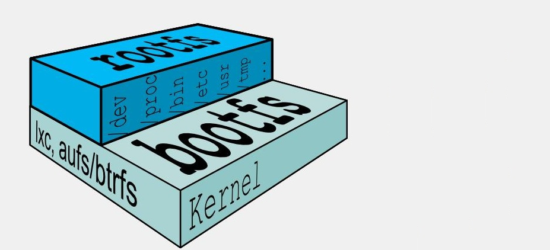

这也就解释了为什么我们开的虚拟机很大，但是Docker里面的镜像却很小：

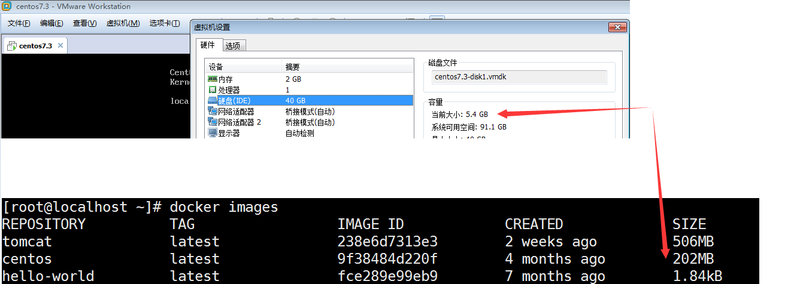

对于一个精简的OS，rootfs可以很小，只需要包括最基本的命令、工具和程序库就可以了，因为底层直接用Host的kernel，自己只需要提供 rootfs 就行了。由此可见对于不同的linux发行版, bootfs基本是一致的, rootfs会有差别, 因此不同的发行版可以公用bootfs。

## 分层的镜像

以pull为例，在下载的过程中可以看到docker的镜像好像是在一层一层的在下载，这也就解释了为什么Tomcat的镜像那么大

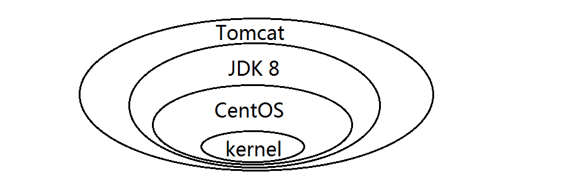

 

最大的一个好处就是 - **共享资源**

比如：有多个镜像都从相同的 base 镜像构建而来，那么宿主机只需在磁盘上保存一份base镜像，
同时内存中也只需加载一份 base 镜像，就可以为所有容器服务了，而且镜像的每一层都可以被共享。

## 镜像的特点

Docker镜像都是只读的，当容器启动时，一个新的可写层被加载到镜像的顶部。这一层通常被称作“容器层”，“容器层”之下的都叫“镜像层”。

## Docker镜像commit操作

docker commit 提交容器副本使之成为一个新的镜像

`docker commit -m="提交的描述信息" -a="作者" 容器ID 要创建的目标镜像名:[标签名]`

演示操作

1、先下载一个Tomcat镜像，并且运行Tomcat 

docker pull tomcat

docker run -it -p 8888:8080 tomcat (使用-P是随机分配端口，分配的是Docker对外暴露的端口)

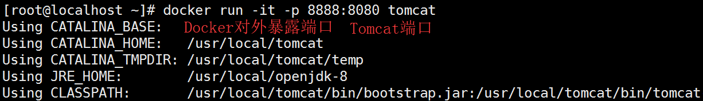

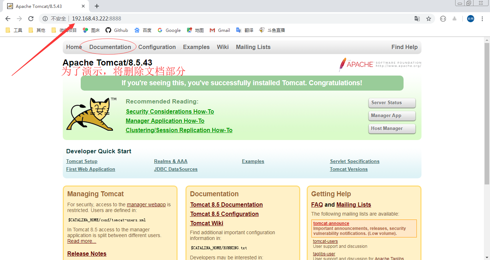

2、删除Tomcat的docs部分

进入到这个容器中，删除webapps下的docs文件夹

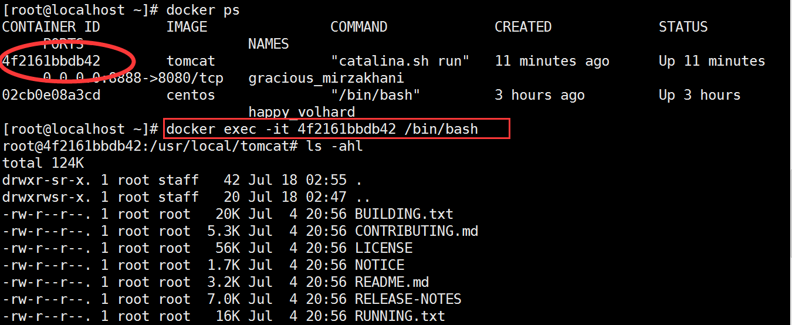

此时访问docs就会404，说明我们删除成功

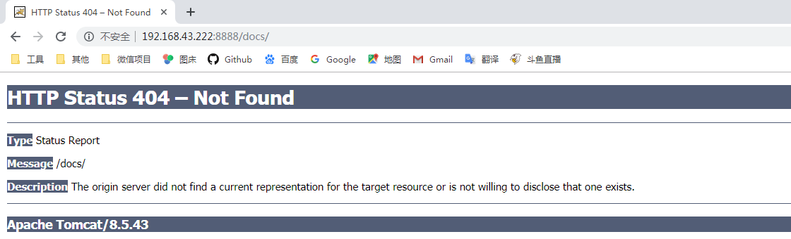

也即当前的tomcat运行实例是一个没有文档内容的容器，以它为模板commit一个没有doc的tomcat新镜像xpu/tomcat_02 （xpu是命名空间，就相当于类的包名）

3、命令打包

```
[root@localhost ~]# docker commit -m="This is my Tomcat" -a="Tim" 4f2161bbdb42 xpu/tomcat_02:1.2
sha256:b29a3c2a5e09af550d3bee9b6ff3cd9cf8e2b2b2397dc53278f4c495607f748f
[root@localhost ~]#
```

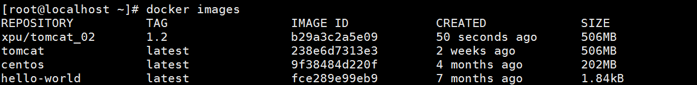

```
docker rm -f $(docker ps -q) 删除正在运行的所有容器
```

4、后台方式启动Tomcat

```
docker run -d -p 8080:8080 tomcat
```

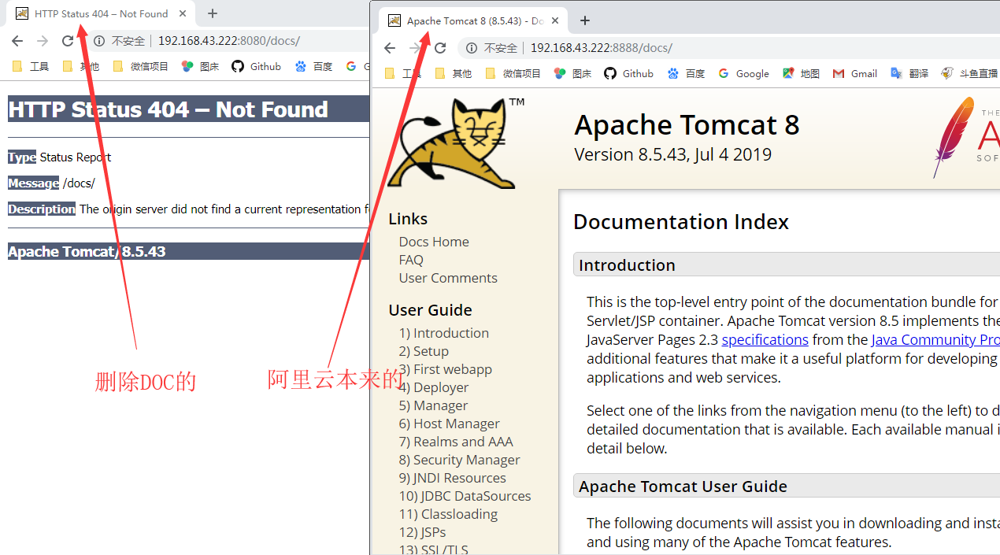

# Docker容器数据卷


先来看看Docker的理念：

1、将运用与运行的环境打包形成容器运行 ，运行可以伴随着容器，但是我们对数据的要求希望是持久化的

2、容器之间希望有可能共享数据

Docker容器产生的数据，如果不通过docker commit生成新的镜像，使得数据做为镜像的一部分保存下来，
那么当容器删除后，数据自然也就没有了。

为了能保存数据在Docker中我们使用卷，也就是容器数据卷！

Docker容器数据卷有点类似我们Redis里面的rdb和aof文件，也就是把运行时的数据持久化在硬盘上


卷就是目录或文件，存在于一个或多个容器中，由docker挂载到容器，但不属于联合文件系统，因此能够绕过Union File System提供一些用于持续存储或共享数据的特性：

卷的设计目的就是数据的持久化，完全独立于容器的生存周期，因此Docker不会在容器删除时删除其挂载的数据卷

特点：
1：数据卷可在容器之间共享或重用数据
2：卷中的更改可以直接生效
3：数据卷中的更改不会包含在镜像的更新中
4：数据卷的生命周期一直持续到没有容器使用它为止


## 添加数据卷 _使用-v命令

 docker run -it -v /宿主机绝对路径目录:/容器内目录      镜像名

```
docker run -it -v /myDataVolume:/dataVolumeContainer centos
```

这样便添加了数据卷

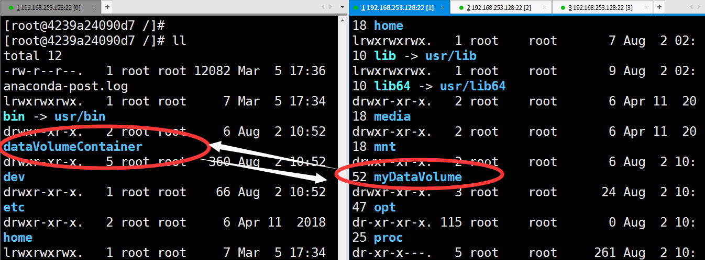

同样的，使用docker inspect 容器名称 便可以查看JSON形式描述的容器：

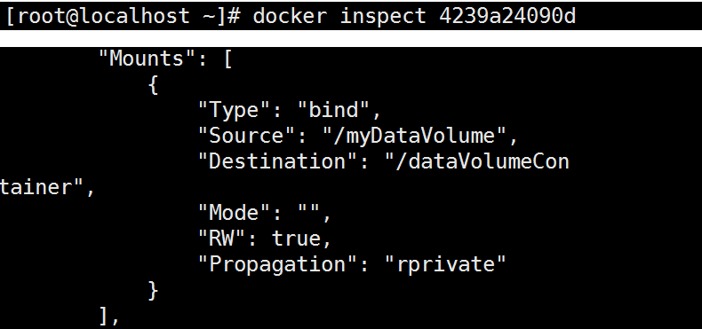

测试一下两者的文件通信共享(容器和宿主机之间数据共享)

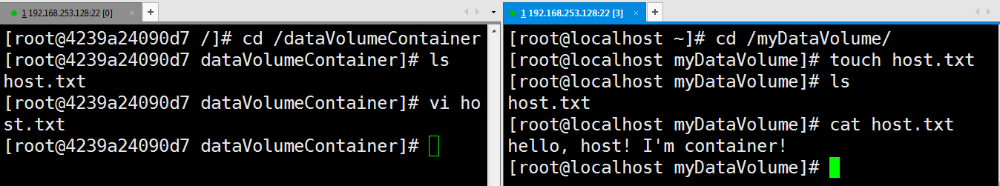容器停止退出后，主机修改后数据是否同步

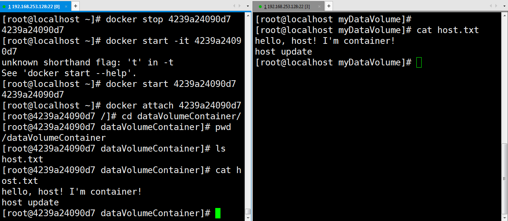

带有写保护权限的数据卷

```
docker run -it -v /宿主机绝对路径目录:/容器内目录:ro 镜像名
```

ro即是ReadOnly，只读，不允许容器修改数据卷，而宿主机才可以！

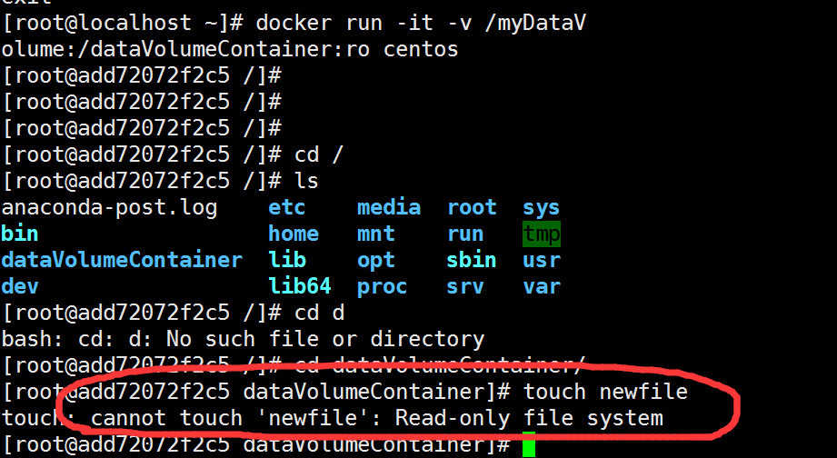

## 添加数据卷_使用Dockerfile

在Linux下写项目很多时候用到makefile来构建工程，或者是通过Shell脚本把一系列的操作封装起来，所以理解Dockerfile就不难，之前说过镜像是层层包裹的，就比如：Tomcat镜像肯定是依赖于JDK镜像的，所以Dockerfile还是很重要的

先编写Dockerfile (注意VOLUME后面有空格)

```bash
[root@localhost mydocker]# cat Dockerfile 
# volume test
FROM centos
VOLUME ["/dataVolume1","/dataVolume2"]
CMD echo "finished, ------success"
CMD /bin/bash
[root@localhost mydocker]# 
```

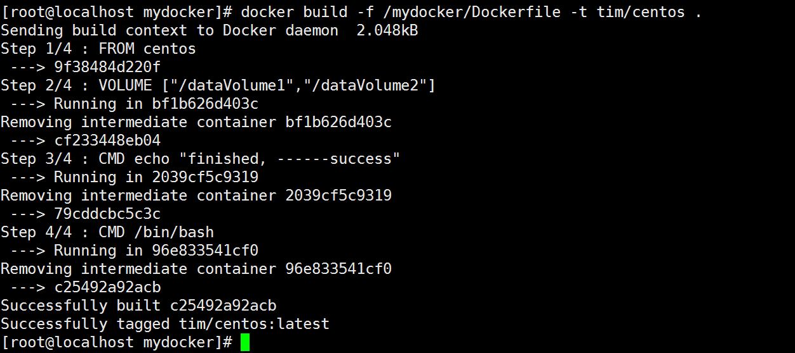

由上图输出也可以看出，这个镜像是分层构建的！接下来检测一下构建结果：

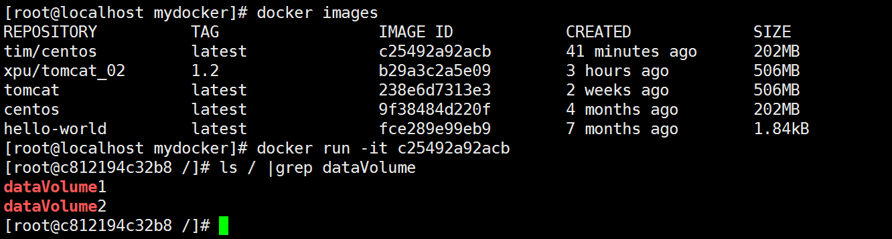

那么对应的宿主机器目录在哪呢？虽然我们没有手动指定，但是dockerfile有默认的路径，使用docker inspect 容器ID查看容器细节： 

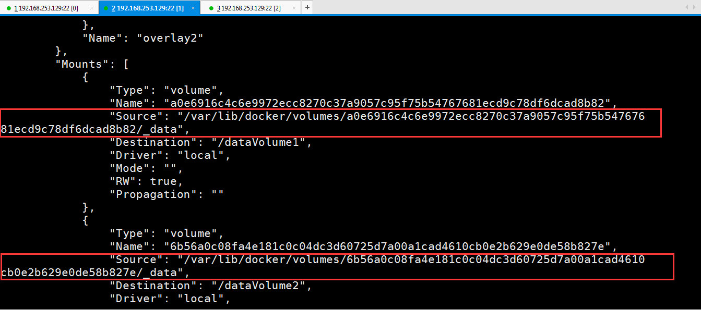

如果Docker挂载主机目录Docker访问出现cannot open directory .: Permission denied，解决办法：在挂载目录后多加一个`--privileged=true`参数即可

所以到目前为止可以吧数据卷简单的理解为虚拟机和物理机的共享文件夹，上面讲述了两种创建容器数据卷的方式，方式一不是很常用，使用Dockerfile的方式是更适合使用的！


## 数据卷容器

命名的容器挂载数据卷，其它容器通过挂载这个(父容器)实现数据共享，挂载数据卷的容器，称之为数据卷容器

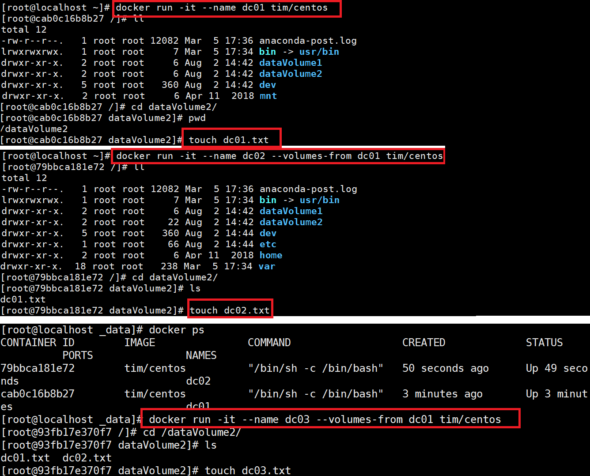

先见了三个容器，dc01是之前建好的，里面有容器卷dataVolume1，dataVolume2，剩下两个容器分别是dc02，dc03，然后通过

```
docker run -it --name dc02 --volumes-from dc01 tim/centos
```

这样的命令去新建一个dc02容器继承父容器dc01，同样的，使用此命令新建dc03容器继承父容器dc01，于是dc02和dc03都含有一两个容器卷dataVolume1，dataVolume2，于是dc01、dc02、dc03都是数据共享的：

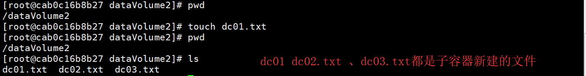

接下来删除dc01，然后dc02新建一个dc02_update.txt，虽然dc03是继承自dc01的，但是dc03仍然可以看到dc02_update.txt，看下图：

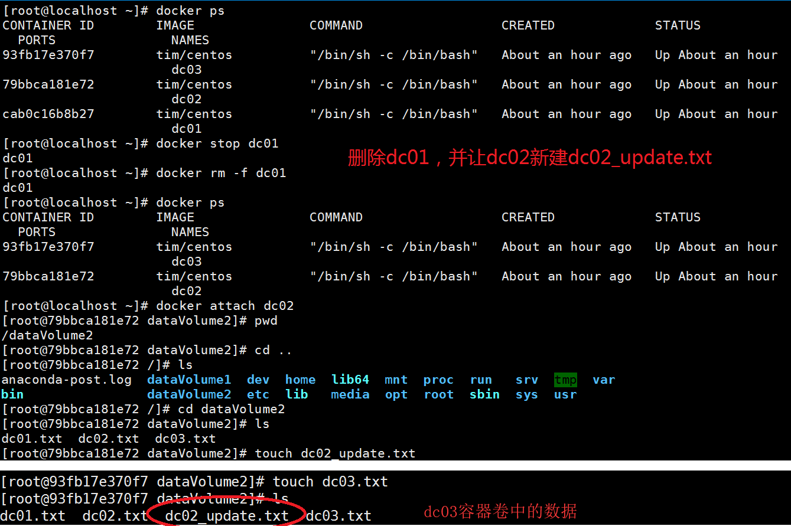

由此得出一个重要结论：

**容器之间配置信息的传递，数据卷的生命周期一直持续到没有容器使用它为止**