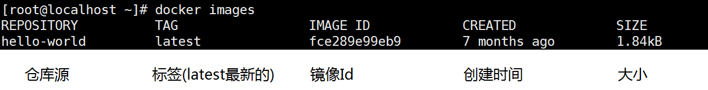

## Docker 是如何工作的

Docker是一个Client-Server结构的系统，Docker守护进程运行在主机上， 然后通过Socket连接从客户端访问，守护进程从客户端接受命令并管理运行在主机上的容器。 **容器，是一个运行时环境，就是我们前面说到的集装箱。**


docker有着比虚拟机更少的抽象层。由于docker不需要Hypervisor实现硬件资源虚拟化，运行在docker容器上的程序直接使用的都是实际物理机的硬件资源。因此在CPU、内存利用率上docker将会在效率上有明显优势。

docker利用的是宿主机的内核,而不需要Guest OS。因此,当新建一个容器时，docker不需要和虚拟机一样重新加载一个操作系统内核。仍而避免引寻、加载操作系统内核返个比较费时费资源的过程，当新建一个虚拟机时，虚拟机软件需要加载Guest OS，返个新建过程是分钟级别的。而docker由于直接利用宿主机的操作系统,则省略了返个过程，因此新建一个docker容器只需要几秒钟。


所以，把两者对比来看


所以结合之前的理解，镜像与容器的关系更清楚了


## Docker常用命令

```bash
Usage:	docker [OPTIONS] COMMAND
```

### 1、帮助命令

docker version 查看版本

docker info 查看详细信息

docker --help 帮助命令

### 2、镜像命令

① docker images 列出本地主机上的镜像

选项参数

-a :列出本地所有的镜像（含中间映像层）

-q:只显示镜像ID

--digests :显示镜像的摘要信息

--no-trunc :显示完整的镜像信息



同一仓库源可以有多个 TAG，代表这个仓库源的不同个版本，我们使用 REPOSITORY:TAG 来定义不同的镜像。
如果你不指定一个镜像的版本标签，例如你只使用 ubuntu，docker 将默认使用 ubuntu:latest 镜像（也就是最新的）

② docker search 某个XXX镜像名字

从https://hub.docker.com 这个网站去查找，从阿里云下载，和Maven是一样的


选项参数

--no-trunc : 显示完整的镜像描述

-s : 列出收藏数不小于指定值的镜像

--automated : 只列出 automated build类型的镜像

③ docker pull 某个XXX镜像名字

下载镜像 docker pull 镜像名字[:TAG]


接下来看看Tomcat的镜像大小，居然是506M，为什么？


④ docker rmi 某个XXX镜像名字ID

删除单个 docker rmi  -f 镜像ID

删除多个 docker rmi -f 镜像名1:TAG 镜像名2:TAG 

删除全部 docker rmi -f $(docker images -qa)

### 3、容器命令

#### 新建并且启动容器

有镜像才能创建容器，这是根本前提(下载一个CentOS镜像演示)

新建并启动容器 docker run [OPTIONS] IMAGE [COMMAND] [ARG...]

OPTIONS参数说明：有些是一个减号，有些是两个减号

--name="容器新名字": 为容器指定一个名称；
-d 后台运行容器，并返回容器ID，也即启动守护式容器；
-i 以交互模式运行容器，通常与 -t 同时使用；
-t 为容器重新分配一个伪输入终端，通常与 -i 同时使用；
-P 随机端口映射；
-p 指定端口映射，有以下四种格式
	ip:hostPort:containerPort
	ip::containerPort
	hostPort:containerPort
	containerPort

所以下面的 `-it` 就是交互模式并且登录伪终端


#### 查看运行中和最近运行容器

查看正在运行的容器 docker ps [OPTIONS]


OPTIONS说明（常用）：
-a : 列出当前所有正在运行的容器+历史上运行过的
-l : 显示最近创建的容器
-n：显示最近n个创建的容器
-q : **静默模式，只显示容器编号**
--no-trunc : 不截断输出


#### 退出容器

两种退出容器的方式：

* exit 容器停止并退出

* Ctrl + P + Q 容器不停止退出

#### 启动容器

docker start 容器ID或者容器名

#### 重启容器

docker restart 容器ID或者容器名

#### 停止容器

docker stop 容器ID或者容器名

#### 强制停止容器

docker kill 容器ID或者容器名

#### 删除已停止的容器

docker rm 容器ID

一次性删除多个容器

* docker rm -f $(docker ps -a -q)
* docker ps -a -q | xargs docker rm


### 4、重要的容器命令

#### 启动守护式容器

docker run -d 容器名称


很显然启动了一个守护式容器centos，但是启动完成后容器却立马退出了，为什么？

很重要的要说明的一点: Docker容器后台运行,就必须有一个前台进程.
容器运行的命令如果不是那些一直挂起的命令（比如运行top，tail），就是会自动退出的。

这个是docker的机制问题,比如你的web容器,我们以nginx为例，正常情况下,我们配置启动服务只需要启动响应的service即可。例如service nginx start。但是这样做，nginx为后台进程模式运行，就导致docker前台没有运行的应用，这样的容器后台启动后，会立即自杀，因为他觉得他没事可做了。所以，**最佳的解决方案是，将你要运行的程序以前台进程的形式运行**

#### 查看容器日志

```bash
docker logs -f -t --tail 容器ID

-t 是加入时间戳

-f 跟随最新的日志打印

--tail 数字 显示最后多少条
```

比如在我们启动守护式容器的时候，可以这样启动：

```
docker run -d centos /bin/sh -c "while true; do each hello tim; sleep 2; done"
```

这样保持运行而且一直打印日志


#### 查看容器内运行的进程

```bash
docker top 容器ID
```

#### 查看容器内部细节

```bash
docker inspect 容器ID
```


#### 进入正在运行的容器并以命令行交互

```bash
docker exec -it 容器ID bashShell

重新进入docker attach 容器ID
```

两种方式的区别：

attach 直接进入容器启动命令的终端，不会启动新的进程

exec 是在容器中打开新的终端，并且可以启动新的进程

**所以如果是要在容器中执行很多命令的时候可以进入容器执行，那么就用attach，退出时用Ctrl + Q + P，如果只是一条命令，那么直接使用exec即可！**

#### 从容器内拷贝文件到主机上

```bash
docker cp  容器ID:容器内路径 目的主机路径
```


### 5、常用命令的总结

