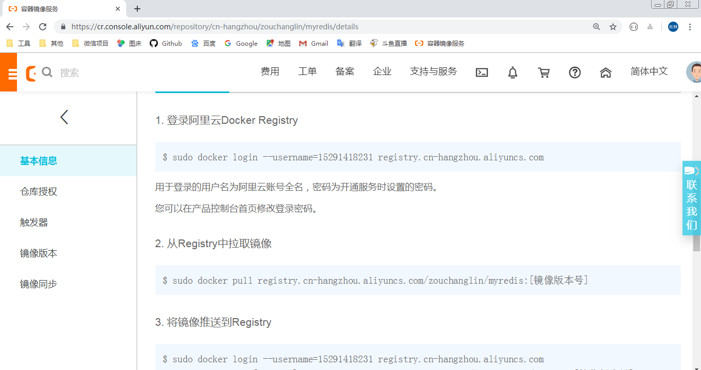
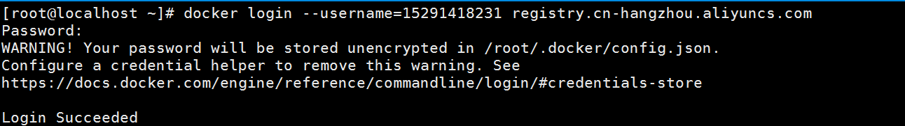

## Docker安装MySQL

下面将使用Docker来安装Mysql，先搜索，然后拉取：

```bash
[root@localhost ~]# docker pull mysql
[root@localhost ~]# docker run -p 3306:3306 --restart=always --name mysql -v /root/mysql/conf:/etc/mysql/conf.d -v /root/mysql/logs:/logs -v /root/mysql/data:/var/lib/mysql -e MYSQL_ROOT_PASSWORD=123456 -d mysql
77de7fb81728c289744d4adba8db2d4f60124dd0955eea5a7b6bcd4e6277b138
[root@localhost ~]# docker exec -it x
"docker exec" requires at least 2 arguments.
See 'docker exec --help'.

Usage:  docker exec [OPTIONS] CONTAINER COMMAND [ARG...]

Run a command in a running container
[root@localhost ~]# docker ps
CONTAINER ID        IMAGE               COMMAND                  CREATED             STATUS              PORTS                               NAMES
77de7fb81728        mysql               "docker-entrypoint.s…"   18 seconds ago      Up 17 seconds       0.0.0.0:3306->3306/tcp, 33060/tcp   mysql

# 进入mysql容器
[root@localhost ~]# docker exec -it 77de7fb81728 /bin/bash
root@77de7fb81728:/# mysql -uroot -p
Enter password: 
Welcome to the MySQL monitor.  Commands end with ; or \g.
Your MySQL connection id is 8
Server version: 8.0.17 MySQL Community Server - GPL

Copyright (c) 2000, 2019, Oracle and/or its affiliates. All rights reserved.

Oracle is a registered trademark of Oracle Corporation and/or its
affiliates. Other names may be trademarks of their respective
owners.

Type 'help;' or '\h' for help. Type '\c' to clear the current input statement.

# 解决外部工具连接不上的问题
mysql> ALTER USER 'root'@'%' IDENTIFIED BY '123456' PASSWORD EXPIRE NEVER;
Query OK, 0 rows affected (0.02 sec)

mysql> FLUSH PRIVILEGES;
Query OK, 0 rows affected (0.01 sec)

mysql> 
```

Docker安装MySQL需要注意的问题：

1、搜索时在 https://hub.docker.com/ 这个网站进行搜索，比如搜索MySQL


下面就有版本号，默认是最新的，也就是latest

2、`docker run -p 3306:3306 --restart=always --name mysql -v /root/mysql/conf:/etc/mysql/conf.d -v /root/mysql/logs:/logs -v /root/mysql/data:/var/lib/mysql -e MYSQL_ROOT_PASSWORD=123456 -d mysql ` 这条命令的意思：其实很近简单--restart=always是让容器在Docker服务启动后也跟随启动，我的Docker设置的是开机启动，所以开机后一旦Docker服务启动，mysql容器也会启动，通过-v命令添加了三个容器卷，分别是~/mysql/conf、~/mysql/logs、~/mysql/data ，这样的话我们在宿主机上就可以配置MySQL、查看log、以及备份数据！


## Docker安装Tomcat

同样的安装Tomcat也是先查找，然后直接根据自己的版本号直接`docker pull tomcat:标签`

```
docker run -it -p 8080:8080 --restart=always --name tomcat -v /root/tomcat/webapps:/usr/local/tomcat/webapps  -v /root/tomcat/logs:/usr/local/tomcat/logs  tomcat /bin/bash
```

不知道为啥，这个Tomcat需要手动启动，所以使用 -it 模式进入bin目录start.sh才可以开启Tomcat，另外，如果像上面这个路径去添加容器卷的话，webapp和logs目录会清空，我是直接把webapps的东西copy进去就好了！


## Docker安装Redis

同样的安装redis也是先查找，然后直接根据自己的版本号直接`docker pull redis:标签

```
docker run -p 6379:6379 -v /root/redis/data:/data -v /root/redis/conf/redis.conf:/usr/local/etc/redis/redis.conf  -d redis:3.2 redis-server /usr/local/etc/redis/redis.conf --appendonly yes
```

在主机/root/redis/conf/redis.conf目录下新建redis.conf文件 vim /root/redis/conf/redis.conf/redis.conf

配置文件如下：

测试redis-cli连接和测试持久化文件生成

docker exec -it 容器编号 redis-cli


## Docker镜像发布到阿里云


镜像的生成方法，编写DockerFile，这个在上一篇文章DockerFile已经说过了。或者从容器生成一个新的镜像：

```
docker commit [OPTIONS] 容器ID [REPOSITORY[:TAG]]
```

登录到阿里云的镜像服务：https://cr.console.aliyun.com/cn-hangzhou/instances/repositories

创建一个命名空间，创建本地仓库:


将镜像推送到阿里云，推送方式阿里云文档里面就有



按照提示操作，先登录



登录成功后，由于我之前没还没制作镜像，现在开始制作镜像并且推送镜像


出现下面这种，即说明推送完毕（其实这和Pull是一样的，镜像分层都是一层一层的结构）


在阿里云执行搜索，一定要是公有仓库才能搜到，下面看看我的Redis


这样就和那些mysql镜像一样了，可以直接下载，先删除本地的镜像，然后再拉取


## Docker安装Jenkins

首先在DockerHub上搜索后得出，安装Jenkins只需要命令docker pull jenkins，拉取完毕


直接 docker run -p 8080:8080 -p 50000:50000 -v /root/jenkins:/var/jenkins_home jenkins 即可运行

但是出现这种情况：

Can not write to /root/jenkins/copy_reference_file.log. Wrong volume permissions?

touch: cannot touch ‘/root/jenkins/copy_reference_file.log’: Permission denied

此时需要把/root/jenkins这个目录进行更改拥有者的操作：

chown -R 1000 /root/jenkins 即可

