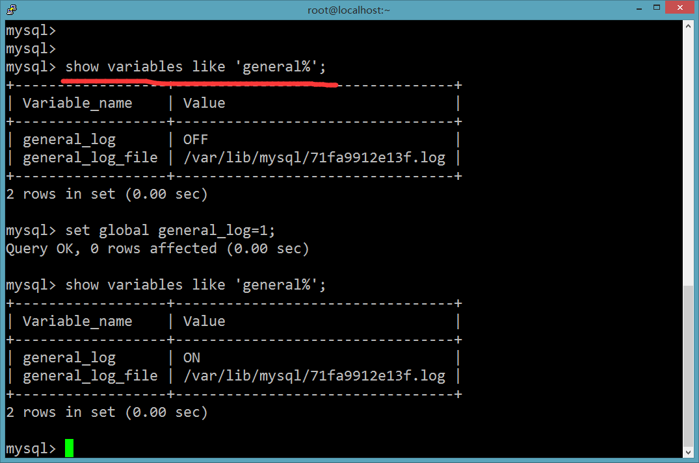
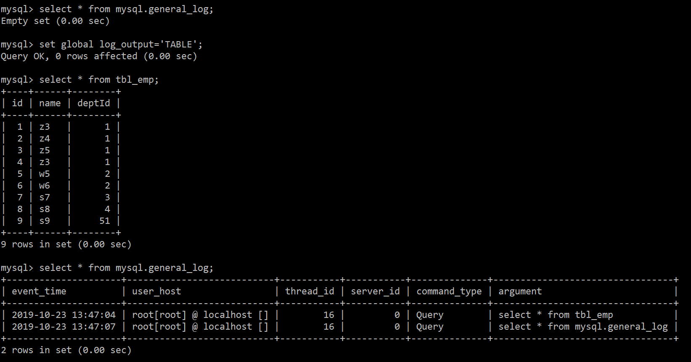

# 全局查询日志

 全局查询日志用于保存所有的sql执行记录，该功能主要用于测试环境，在生产环境中永远不要开启该功能。 

在MySQL的my.cn中，设置如下:

```ini
# 开启
general_log=1
# 记录日志文件的路径
general_log_file=/path/logfile
# 输出格式
log_output=FILE
```

命令方式设置

```sql
set global general_log=1;
set global log_output='TABLE';
```

此后，你编写的SQL语句，将会记录到MySQL库里的general_log表，可使用下面的命令查看

```sql
select * from mysql.general_log;
```



通过以上配置，执行过的sql语句将会记录到MySQL库中general_log表中：



①通过命令方式开启该功能，重启MYSQL后失效，除非写在配置文件中

②全局查询日志只用在测试环境，切记生产环境中永远不要开启该功能

