# 分布式的定义

由多个计算机完成一系列任务， 一个业务拆分成多个子系统，部署在不同的服务器上  

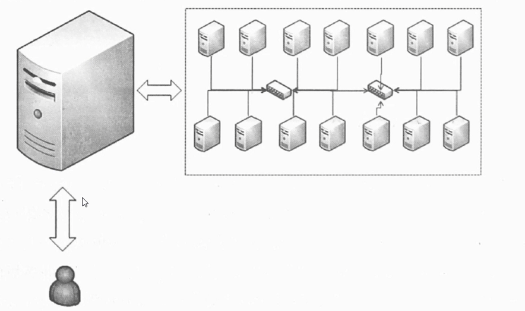

分布式系统需要解决的问题：

1、任务分解

2、节点通信

# 分布式与集群

分布式： 一个业务拆分成多个子系统，部署在不同的服务器上

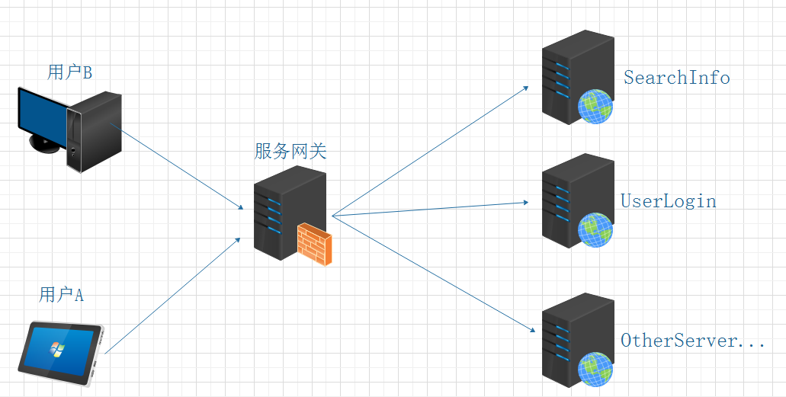

集群：  同一个业务，部署在多个服务器上

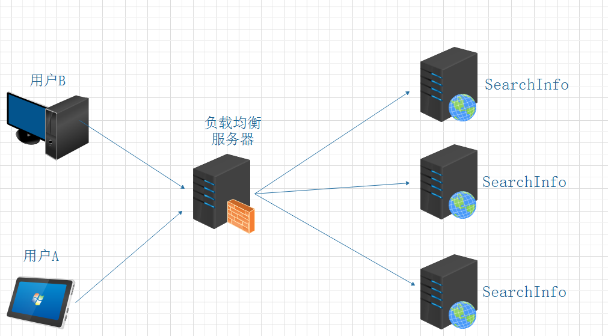

# 分布式与微服务

 微服务与分布式的细微差别是，微服务的应用不一定是分散在多个服务器上，它也可以是同一个服务器，上面运行着不同的服务

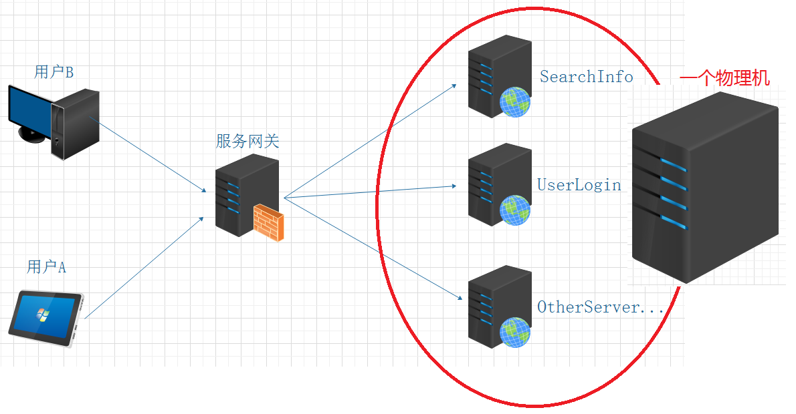

# 架构演变过程

1、第一版

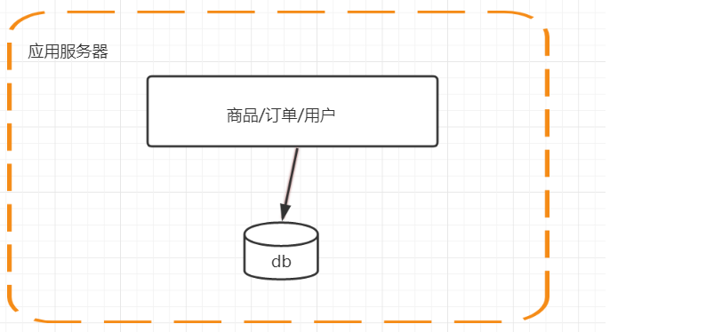

2、第二版

单机负载越来越高，数据库服务器和应用服务器分离

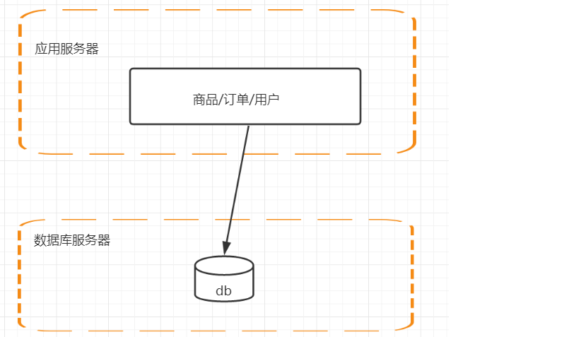

3、第三版

应用服务器做集群

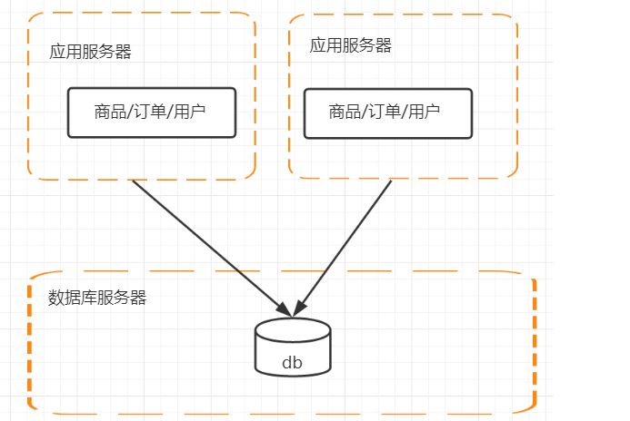

4、第四版

数据库的高性能操作

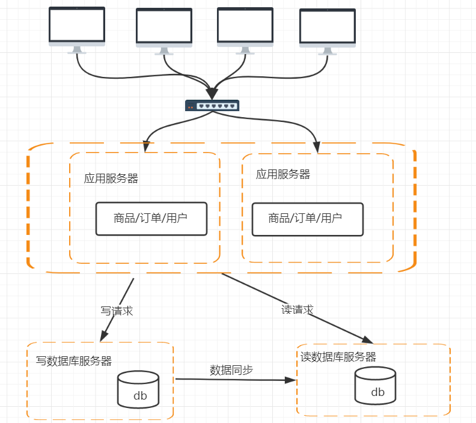

5、第五版

加入搜索集群

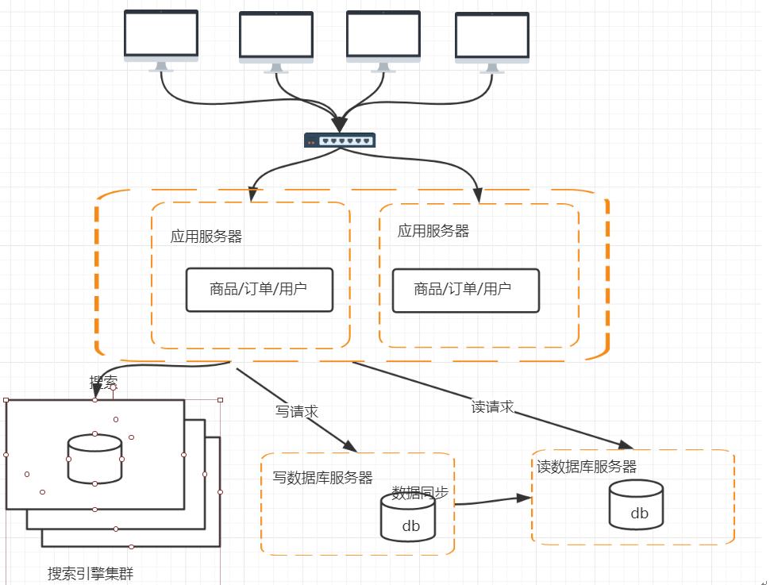

6、第六版

解决访问量持续增高，引入缓存机制 (页面缓存 + CDN)

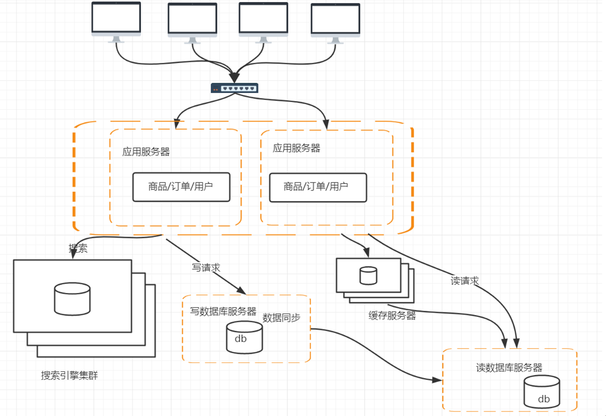         7、第七版

数据库的水平/垂直拆分

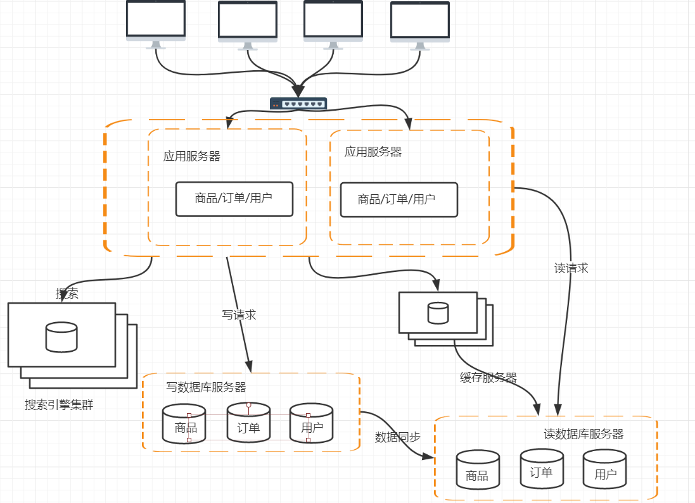  

8、第八版

服务拆分，微服务化

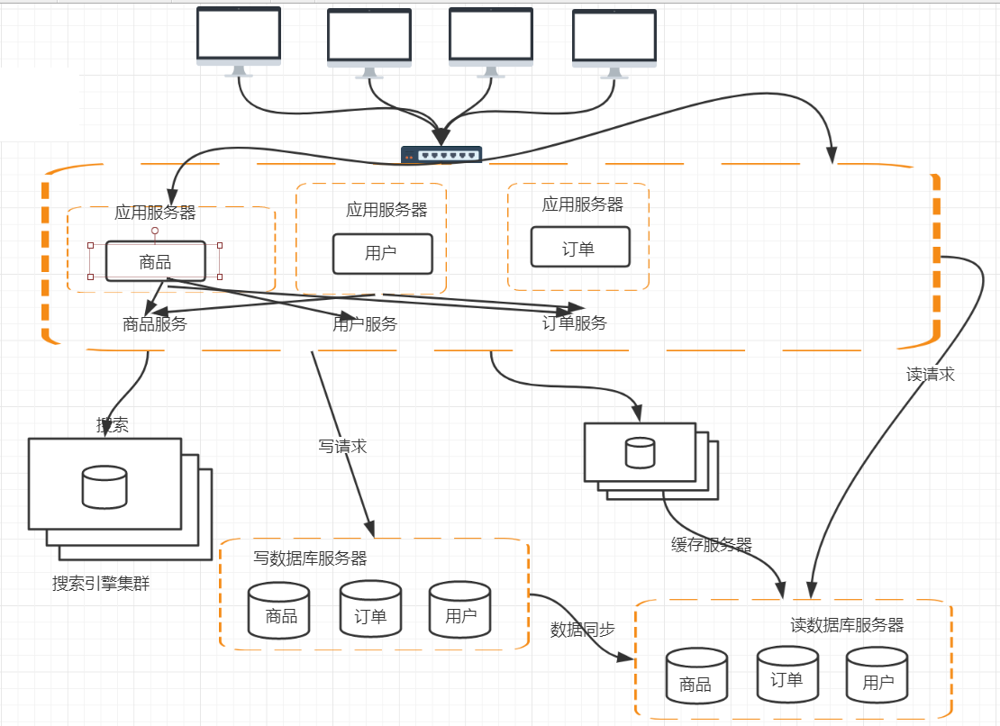

