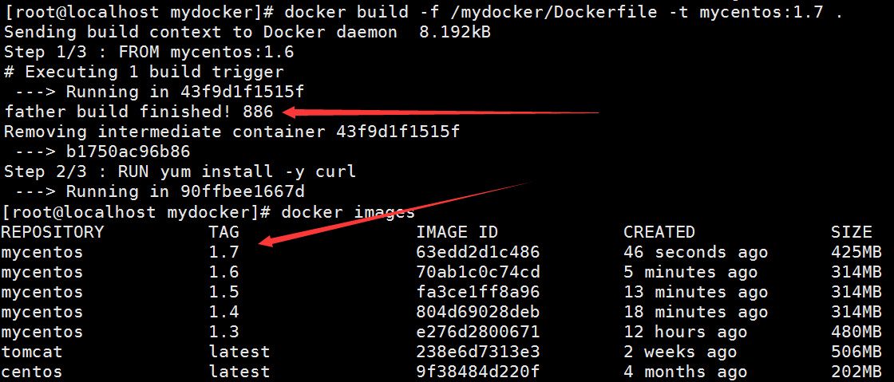

# Dockerfile

## 什么是Dockerfile

Dockerfile是用来构建Docker镜像的构建文件，是由一系列命令和参数构成的脚本。通俗的理解，和Maven一样，只需要写好pom文件就可以定义整个工程的构建，DockerFile是一样的，通过这个脚本可以构建出自己想要的容器！

## Dockerfile构建步骤

* 编写Dockerfile文件
* docker build
* docker run

以我们熟悉的CentOS为例 ，看看CentOS的Dockerfile的内容：

```bash
FROM scratch (scratch相当于Object，是所有镜像的祖先镜像)
MAINTAINER The CentOS Project <cloud-ops@centos.org>
ADD c68-docker.tar.xz /
LABEL name="CentOS Base Image" \
	vendor="CentOS" \
	license="GPLv2" \
	build-date="2016-06-02"
	
# Default command
CMD ["/bin/bash"]
```

DockerFile基础语法

1：每条保留字指令都必须为大写字母且后面要跟随至少一个参数

2：指令按照从上到下，顺序执行

3：#表示注释

4：每条指令都会创建一个新的镜像层，并对镜像进行提交


**Docker执行Dockerfile的大致流程**

（1）docker从基础镜像运行一个容器

（2）执行一条指令并对容器作出修改

（3）执行类似docker commit的操作提交一个新的镜像层

（4）docker再基于刚提交的镜像运行一个新容器

（5）执行dockerfile中的下一条指令直到所有指令都执行完成


从应用软件的角度来看，Dockerfile、Docker镜像与Docker容器分别代表软件的三个不同阶段：

1、Dockerfile 是软件的原材料
2、Docker 镜像是软件的交付品
3、Docker 容器则可以认为是软件的运行态。

Dockerfile面向开发，Docker镜像成为交付标准


1 Dockerfile，需要定义一个Dockerfile，Dockerfile定义了进程需要的一切东西。Dockerfile涉及的内容包括执行代码或者是文件、环境变量、依赖包、运行时环境、动态链接库、操作系统的发行版、服务进程和内核进程(当应用进程需要和系统服务和内核进程打交道，这时需要考虑如何设计namespace的权限控制)等等;

2 Docker镜像，在用Dockerfile定义一个文件之后，docker build时会产生一个Docker镜像，当运行 Docker镜像时，会真正开始提供服务;

3 Docker容器，容器是直接提供服务的。

## DockerFile体系结构

FROM

基础镜像，当前新镜像是基于哪个镜像的


MAINTAINER

镜像维护者的姓名和邮箱地址


RUN

容器构建时需要运行的命令


EXPOSE

当前容器对外暴露出的端口


WORKDIR

指定在创建容器后，终端默认登陆的进来工作目录，一个落脚点


ENV

用来在构建镜像过程中设置环境变量，比如ENV MY_PATH /usr/mytest，这个环境变量可以在后续的任何RUN指令中使用，这就如同在命令前面指定了环境变量前缀一样；也可以在其它指令中直接使用这些环境变量，比如：WORKDIR $MY_PATH


ADD

将宿主机目录下的文件拷贝进镜像且**ADD命令会自动处理URL和解压tar压缩包**


COPY

类似ADD，拷贝文件和目录到镜像中。将从构建上下文目录中 <源路径> 的文件/目录复制到新的一层的镜像内的 <目标路径> 位置

COPY的写法有两种：`COPY src dest` 或者 `COPY ["src", "dest"]`


VOLUME

容器数据卷，用于数据保存和持久化工作


CMD

指定一个容器启动时要运行的命令

CMD命令也是两种格式，一种是Shell脚本 `CMD< 命令>`，另一种是 `CMD ["可执行文件", "参数一",  "参数二"]`， **Dockerfile 中可以有多个 CMD 指令，但只有最后一个生效，CMD 会被 docker run 之后的参数替换**


ENTRYPOINT

指定一个容器启动时要运行的命令

ENTRYPOINT 的目的和 CMD 一样，都是在指定容器启动程序及参数


ONBUILD

当构建一个被继承的Dockerfile时运行命令，父镜像在被子继承后父镜像的onbuild被触发


## Dockerfile案例

Docker Hub 中 99% 的镜像都是通过在 base 镜像中安装和配置需要的软件构建出来的

### 一、自定义一个CentOS


现在我们需要自定义一个镜像来支持vim、ifconfig、并且登录后的默认路径改做修改

编写Dockerfile：

```dockerfile
# 从标准centos构建
FROM centos

# 定义作者信息
MAINTAINER tim<15291418231@163.com>

# 定义一个变量
ENV mypath /tmp

# 设置登录后的落脚点
WORKDIR $mypath

# 安装vim和net-tools工具
RUN yum -y install vim
RUN yum -y install net-tools

EXPOSE 80

CMD echo $mypath
CMD echo "success----------ok"
CMD /bin/bash
```

接下来开始构建

```
docker build -f /mydocker/Dockerfile -t mycentos:1.3 .
```


然后启动镜像，测试一下：


看看构建过程是否是如前面所说，这也证实了镜像的分层：


### 二、制作可以查询IP信息的镜像

Dockerfile 中可以有多个 CMD 指令，但只有最后一个生效，CMD 会被 docker run 之后的参数替换，这是什么意思呢？


Tomcat 并没有运行起来，就是因为Docker的run命令后面加了参数！所以ENTRYPOINT命令就更好用了，ENTRYPOINT不会覆盖，只是追加命令！

首先解释一下curl命令


curl命令可以用来执行下载、发送各种HTTP请求，指定HTTP头部等操作。如果系统没有curl可以使用yum install curl安装，也可以下载安装。curl是将下载文件输出到stdout使用命令：curl http://www.baidu.com，执行后，www.baidu.com的html页面就会以文本的形式显示在屏幕上了。

这是最简单的使用方法。用这个命令获得了http://curl.haxx.se指向的页面，同样，如果这里的URL指向的是一个文件或者一幅图都可以直接下载到本地。如果下载的是HTML文档，那么缺省的将只显示文件头部，即HTML的header。要全部显示，请加参数-i

```dockerfile
FROM centos

RUN yum install -y curl

CMD ["curl", "-s", "https://ip.cn"]
```

使用curl这个工具就可以查看IP，现在使用构件好的镜像run一下：


哈哈，居然给我识别成渭南的，这个工具不是很准呀！如果要显示HTML的header需要加参数-i，下面我们来试一下：


很显然不好使了，这就是为什么CMD指令不生效的原因，就是因为后面加的参数，所以出现了ENTRYPOINT指令，接下来使用ENTRYPOINT指令构建一下镜像：

```dockerfile
FROM centos

RUN yum install -y curl

ENTRYPOINT ["curl", "-s", "https://ip.cn"]
```

果然，在ENTRYPOINT指令下加参数是可用的


### 三、ONBUILD指令的使用

```dockerfile
FROM centos

RUN yum install -y curl

ENTRYPOINT ["curl", "-s", "https://ip.cn"]

ONBUILD RUN echo "father build finished! 886"
```

在父镜像构建完成的时候执行ONBUILD的指令，执行构建，构建出父镜像为mycentos:1.6


接下来编写子镜像的Dockerfile

```dockerfile
# 由于需要从父镜像构建，所以FROM写成mycentos1.6
FROM mycentos:1.6

RUN yum install -y curl

ENTRYPOINT ["curl", "-s", "https://ip.cn"]
```



可以看到，在构建父镜像完成后执行了ONBUILD的后面的内容！

### 四、自定义构建Tomcat

新建一个文件夹，里面包含（apache-tomcat-9.0.8.tar.gz、jdk-8u171-linux-x64.tar.gz、a.txt）

编写Dockerfile

```dockerfile
FROM         centos
MAINTAINER    tim<15291418231@163.com>
#把宿主机当前上下文的a.txt拷贝到容器/usr/local/路径下
COPY a.txt /usr/local/cincontainer.txt
#把java与tomcat添加到容器中
ADD jdk-8u171-linux-x64.tar.gz /usr/local/
ADD apache-tomcat-9.0.8.tar.gz /usr/local/
#安装vim编辑器
RUN yum -y install vim
#设置工作访问时候的WORKDIR路径，登录落脚点
ENV MYPATH /usr/local
WORKDIR $MYPATH
#配置java与tomcat环境变量
ENV JAVA_HOME /usr/local/jdk1.8.0_171
ENV CLASSPATH $JAVA_HOME/lib/dt.jar:$JAVA_HOME/lib/tools.jar
ENV CATALINA_HOME /usr/local/apache-tomcat-9.0.8
ENV CATALINA_BASE /usr/local/apache-tomcat-9.0.8
ENV PATH $PATH:$JAVA_HOME/bin:$CATALINA_HOME/lib:$CATALINA_HOME/bin
#容器运行时监听的端口
EXPOSE  8080
#启动时运行tomcat
# ENTRYPOINT ["/usr/local/apache-tomcat-9.0.8/bin/startup.sh" ]
# CMD ["/usr/local/apache-tomcat-9.0.8/bin/catalina.sh","run"]
CMD /usr/local/apache-tomcat-9.0.8/bin/startup.sh && tail -F /usr/local/apache-tomcat-9.0.8/bin/logs/catalina.out
```

开始构建

```
docker build -t mytomcat:1.1
```

开始运行

```bash
docker run -d -p 8080:8080 --name mytomcat9 -v /tim/mydockerfile/tomcat9/test:/usr/local/apache-tomcat-9.0.8/webapps/test -v /tim/mydockerfile/tomcat9/tomcat9logs/:/usr/local/apache-tomcat-9.0.8/logs --privileged=true mytomcat9
```

其实这条命令虽然看起来很长，但是无非是启动镜像并且添加了两个数据卷，privileged 是Docker挂载主机目录Docker访问出现cannot open directory .: Permission denied的时候需要加上的参数！

## Dockerfile的总结

