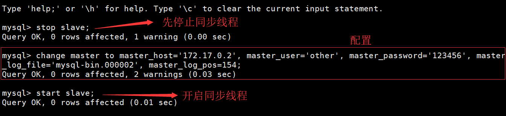

## 再谈谈数据库优化

如上图，MySQL优化呢无非就是从这几个方面入手，第一是数据库设计，第二是SQL优化！但是随着数据表的增长，数据会越来越多，通过MySQL优化是可以解决部分性能问题的，但是一台服务器的资源是有限的，无论怎么优化始终无法解决MySQL的性能瓶颈问题。举一个经典的例子，一个卡车无论再怎么优化发动机，优化传动结构，优化材料设计都没办法拉着金字塔这种沉重的负载，这种情况就属于MySQL的瓶颈，无论如何优化，只要数据量达到一定的规模，一台MySQL肯定是撑不住的：

## 如何用架构进行优化

对于千万级的表如何进行优化呢？见下图，加索引，优化SQL都是之前的优化方法，至于不解决问题，把问题留给后面的程序员这种做法最好还是放弃吧，啊哈哈，其中加缓存和数据库拆分是很常见的解决方案，下面说一下如何通过MySQL主从复制来解决MySQL的性能瓶颈问题：

## 

主从复制（又叫做读写分离），主从复制的目的：**分散压力**

为什么要读写分离呢？如果对数据库的读操作和写操作都在同一个数据库服务器中进行，业务系统性能会降低，所以需要进行读写分离，通常情况下遵循二八原则，即20%的时候进行写操作，80%的时候进行读操作：

生活中有很形象的例子，比如你在自助咖啡厅买咖啡（如果只有一台咖啡机）：

如果有多台咖啡机，很明显大家买咖啡的效率就上去了：

所以主从复制的简单原理图如下：

一台MySQL作为写服务器，另外几台MySQL作为读服务器，这样便完成了分散压力，为了几台服务器之间的数据一致，所以需要做一个数据库主从复制，即读写分离！

## Docker实现MySQL主从复制

那么如何使用Docker实现MySQL主从复制呢？我先在Docker里面跑了两个MySQL：

Docker命令是：`docker run -p 3306:3306 --restart=always --name mysql_master -v /root/mysql/conf:/etc/mysql/conf.d -v /root/mysql/logs:/logs -v /root/mysql/data:/var/lib/mysql -e MYSQL_ROOT_PASSWORD=123456 -d mysql`

接着查看一下两台机器的IP地址

首先进入到master机器，使用vi编辑器编辑`/etc/my.cnf`，我直接使用docker pull mysql:5.7 ，里面默认是Ubuntu系的内核，所以没有vim编辑器，可以使用apt包管理器下载，下载命令是apt install vim ，如果无法下载那应该是没有更新，使用apt update即可更新！但是我发现其实我的配置文件地址不一样，我的在` /etc/mysql/mysql.conf.d/mysqld.cnf` ，编辑这个配置文件就好了，主机的配置文件：

编辑完成后重启mysql，CentOS下直接`systemctl restart mysql` 即可，但是在Ubuntu要使用的命令是`service mysql restart`  （另外，在Ubuntu下重启MySQL会导致用户退出Docker容器，Docker关闭，所以需要再次开启MySQL的容器，使用`docker exec -it mysql_master /bin/bash` 进入容器，然而在CentOS下却不需要） 

接下来给主机添加一个用户，并设置密码，然后重启容器：

接下来进入主机，使用如下命令即可看到binaryLog，以及binaryLog文件的偏移量：

接着需要配置从机，和编辑主机的配置文件是一样的，只不过从机的配置只需要指定 server_id 即可，我们指定从机的server_id=2，然后停止同步线程， 并做主从配置，完成后开启同步线程：

检查是否开启成功：

查看主从复制的状态

接下来测试一下，主机新建数据库，从机自动同步，主机新建表，从机自动同步，主机插入数据，从机自动同步：

## 主从复制的原理

上面已经完成了MySQL的主从复制，接下来看看主从复制究竟是怎么实现的？

上面的图其实很能说明问题，主机的数据发生更改的时候会产生一个BinaryLog文件，然后从机的IO线程会去取这个二进制文件，取回来之后会将主机的BinaryLog拷贝到中继日志中，SQL线程直接通过中继日志来改变自身的数据。那么说到这里可能很多人会有疑问，不是说主机用来写，从机用来读吗？为啥还是需要从机的写操作，事实上这并不是写操作，而且直接修改数据的操作，举一个很简单的例子，如果是普通的修改数据，会首先找到要修改的数据的二进制位置，这样才能发生更改，如果直接告诉你在哪个位置要修改成什么数据，会不会更快呢？很明显，主从复制是非常能提交数据库系统的效率的。

一个小坑：如果主机上面的并发量特别高的话，从机同步数据的能力会下降，甚至一个数据插入到主机几小时后才能同步到从机，这种情况的根本原因就是从机的IO线程是单线程的，如果配置为多线程就能解决这种问题！