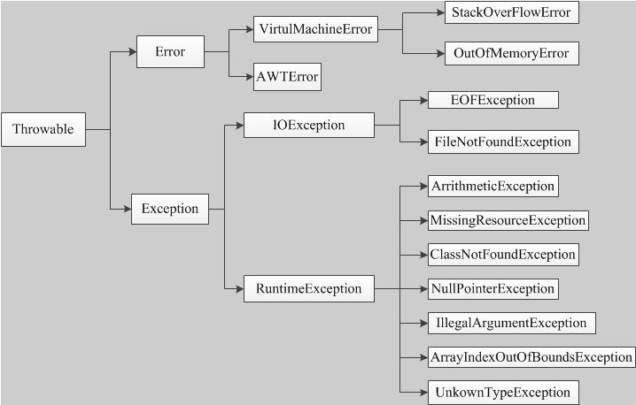
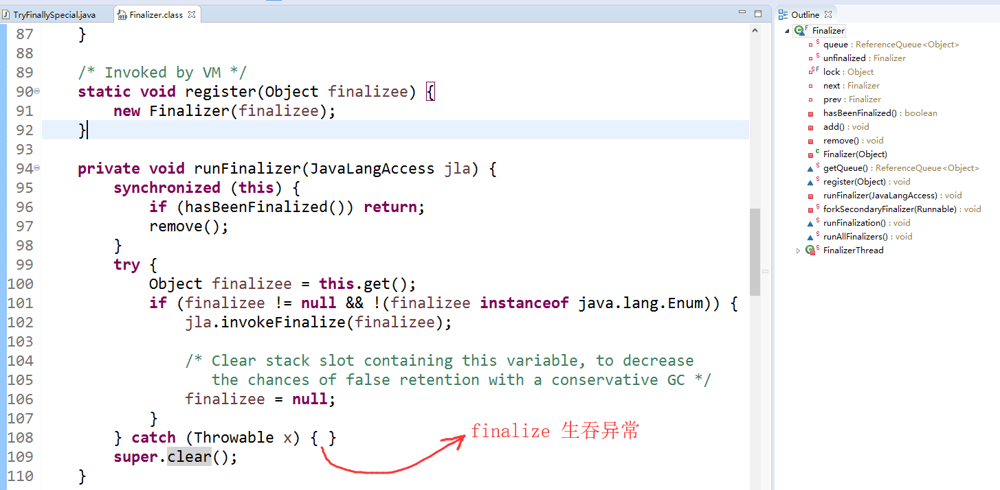

# 1、Java异常体系图



# 2、从性能的角度看异常

1、try-catch 代码段会产生额外的性能开销，或者换个角度说，它往往会影响 JVM 对代码进行优化，所以建议仅捕获有必要的代码段，尽量不要一个大的 try 包住整段的代码；与此同时，利用异常控制代码流程，也不是一个好主意，远比我们通常意义上的条件语句（if/else、switch）要低效。

2、Java 每实例化一个 Exception，都会对当时的栈进行快照，这是一个相对比较重的操作。如果发生的非常频繁，这个开销可就不能被忽略了。


# 3、受查异常的争论

业界有一种争论（甚至可以算是某种程度的共识），Java 语言的 Checked Exception 也许是个设计错误，反对者列举了几点：

① Checked Exception 的假设是我们捕获了异常，然后恢复程序。但是，其实我们大多数情况下，根本就不可能恢复。Checked Exception 的使用，已经大大偏离了最初的设计目的。

② Checked Exception 不兼容 functional 编程，如果写过 Lambda/Stream 代码，应该深有体会。
异常的捕获，在生产环境中往往需要打印到日志中，不要直接打印到标准错误流， printStackTrace()的解释：

public void printStackTrace()Prints this throwable and its backtrace to the standard error stream. This method prints a stack trace for this Throwable object on the error output stream that is the value of the field System.err. The first line of output contains the result of the [toString()](https://docs.oracle.com/javase/9/docs/api/java/lang/Throwable.html#toString--) method for this object. Remaining lines represent data previously recorded by the method [fillInStackTrace()](https://docs.oracle.com/javase/9/docs/api/java/lang/Throwable.html#fillInStackTrace--). 

我的看法，毕竟Java经受住了这么多考验，成为企业级应用程序开发的首选肯定有它的设计思想的。而且那些非受查异常很多都是程序员自己犯的错，可能只需要修改代码逻辑即可避免异常的出现，那些受查异常通常是由于环境因素导致的，并非程序设计本身的逻辑不严谨，不但使得程序更加高可用，而且代码更人性化。毕竟有时候在追求极致性能的同时也要兼顾一下程序的可读性！


# 4、NoClassDefFoundError 与 ClassNotFoundException

NoClassDefFoundError 和 ClassNotFoundException 有什么区别呢？

两者本质的区别：NoClassDefFoundError是一个错误(Error)，而ClassNOtFoundException是一个异常，在Java中错误和异常是有区别的，我们可以从异常中恢复程序但却不应该尝试从错误中恢复程序。

ClassNotFoundException的产生原因：

1、Java支持使用Class.forName方法来动态地加载类，任意一个类的类名如果被作为参数传递给这个方法都将导致该类被加载到JVM内存中，如果这个类在类路径中没有被找到，那么此时就会在运行时抛出ClassNotFoundException异常。要解决这个问题很容易，唯一需要做的就是要确保所需的类连同它依赖的包存在于类路径中。当Class.forName被调用的时候，类加载器会查找类路径中的类，如果找到了那么这个类就会被成功加载，如果没找到，那么就会抛出ClassNotFountException，除了Class.forName，ClassLoader.loadClass、ClassLOader.findSystemClass在动态加载类到内存中的时候也可能会抛出这个异常。

2、另外还有一个导致ClassNotFoundException的原因就是：当一个类已经某个类加载器加载到内存中了，此时另一个类加载器又尝试着动态地从同一个包中加载这个类。

NoClassDefFoundError产生的原因：

1、如果JVM或者ClassLoader实例尝试加载（可以通过正常的方法调用，也可能是使用new来创建新的对象）类的时候却找不到类的定义。要查找的类在编译的时候是存在的，运行的时候却找不到了。这个错误往往是你使用new操作符来创建一个新的对象但却找不到该对象对应的类。这个时候就会导致NoClassDefFoundError。由于NoClassDefFoundError是有JVM引起的，所以不应该尝试捕捉这个错误。

总结一下就是：加载时从外存储器找不到需要的class就出现ClassNotFoundException。连接时从内存找不到需要的class就出现NoClassDefFoundError。


# 5、JDK7 的Try-With-Resource

```java
public class TryWithResourceDemo {
    public void usuallyTry(String[] args) {
       FileInputStream fileInputStream = null;
       try {
           fileInputStream = new FileInputStream(new File("filename"));
           //TODO ...
       } catch (IOException e) {
           e.printStackTrace();
       }finally {
           try {
               fileInputStream.close();
           } catch (IOException e) {
               e.printStackTrace();
           }
       }
    }
    
    public void tryWithResource(String[] args) {
       try(FileInputStream fileInputStream = new FileInputStream(new File("filename"))) {
           //TODO ...
       }catch (IOException e) {
           e.printStackTrace();
       }
    }
}
```

异常抑制：通过反编译的代码，代码中有一处对异常的特殊处理：

```c
var2.addSuppressed(var11);
```

这是try-with-resource语法涉及的另外一个知识点，叫做异常抑制。当对外部资源进行处理（例如读或写）时，如果遭遇了异常，且在随后的关闭外部资源过程中，又遭遇了异常，那么你catch到的将会是对外部资源进行处理时遭遇的异常，关闭资源时遭遇的异常将被 "抑制" 但不是丢弃，通过异常的getSuppressed方法，可以提取出被抑制的异常。需要明白一点：那就是这个try-with-resource 只是语法糖而已！


最后说一种 try finally的特殊情况:

```java
try {
    System.exit(0);
}finally {
    System.out.println("finally...");
}
```

这种情况下finally是不会被执行的!

# 6、别指望 finalize() 释放资源

非常不建议使用finalize，对于 finalize，我们要明确它是不推荐使用的，业界实践一再证明它不是个好的办法，在Java 9 中，甚至明确将 Object.finalize() 标记为 deprecated！如果没有特别的原因，不要实现 finalize 方法，也不要指望利用它来进行资源回收。为什么呢？

简单说，你无法保证 finalize 什么时候执行，执行的是否符合预期。使用不当会影响性能，导致程序死锁、挂起等。利用 try-with-resources 或者 try-finally 机制，是非常好的回收资源的办法。finalize 的执行是和垃圾收集关联在一起的，一旦实现了非空的 finalize 方法，就会导致相应对象回收呈现数量级上的变慢，有人专门做过 benchmark，大概是 40~50 倍的下降。因为，finalize 被设计成在对象被垃圾收集前调用，这就意味着实现了 finalize 方法的对象是个“特殊公民”，JVM 要对它进行额外处理。finalize 本质上成为了快速回收的阻碍者，可能导致你的对象经过多个垃圾收集周期才能被回收。有人也许会问，我用 System.runFinalization () 告诉 JVM 积极一点，是不是就可以了？也许有点用，但是问题在于，这还是不可预测、不能保证的，所以本质上还是不能指望。实践中，因为 finalize 拖慢垃圾收集，导致大量对象堆积，也是一种典型的导致 OOM 的原因。从另一个角度，我们要确保回收资源就是因为资源都是有限的，垃圾收集时间的不可预测，可能会极大加剧资源占用。这意味着对于消耗非常高频的资源，千万不要指望 finalize 去承担资源释放的主要职责，最多让 finalize 作为最后的“守门员”，况且它已经暴露了如此多的问题。资源用完即显式释放，或者利用资源池来尽量重用。


finalize生吞异常，通过查看源代码 package java.lang.ref.Finalizer ;可以看出finalize方法根本没有做异常的处理，  这里的Throwable 是被生吞了的！也就意味着一旦出现异常或者出错，你得不到任何有效信息。况且，Java 在 finalize 阶段也没有好的方式处理任何信息，不然更加不可预测。   




在《深入理解Java虚拟机中》 已经明确告诉了我们finalize()方法的用途和初衷，已经对象通过finalize()方法进行自我拯救的过程，所以说把进行重写finalize方法的对象在JVM眼里就是特殊公民，但是由于GC的不确定性导致资源的释放并不是由我们自己决定的，而且finalize方法只会被调用一次，不会第二次执行，是非常不适合用来做资源释放的！


# 7、finally与return

这是初学者很容易发生疑惑的地方：

try 中的 return 语句调用的函数先于 finally 中调用的函数执行，也就是说 try 中的 return 语句先执行，finally 语句后执行，但try中的 return 并不是让函数马上返回结果，而是 return 语句执行后，将把返回结果放置进函数栈中，此时函数并不是马上返回，它要执行 finally 语句后才真正开始返回。但此时会出现两种情况：

① 如果finally中也有return，则会直接返回finally中的return结果，并终止程序，函数栈中的return不会被完成

② 如果finally中没有return，则在执行完finally中的代码之后，会将函数栈中保存的try return的内容返回并终止程序