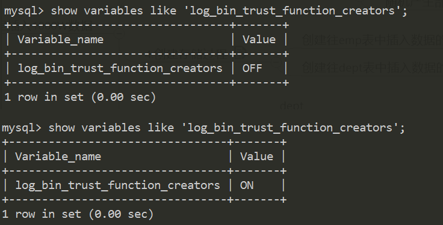
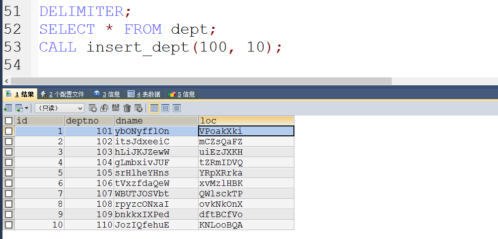
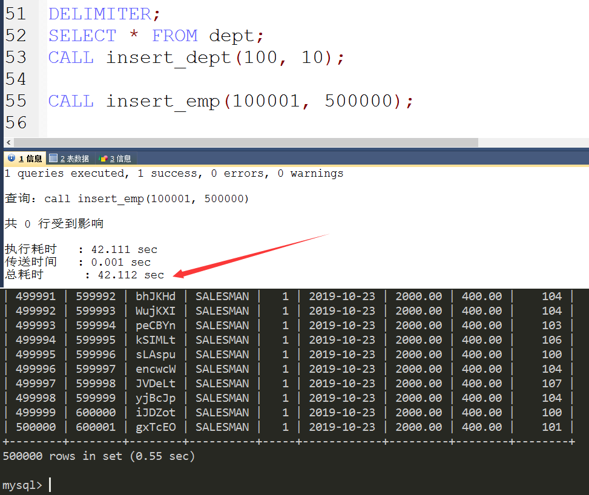
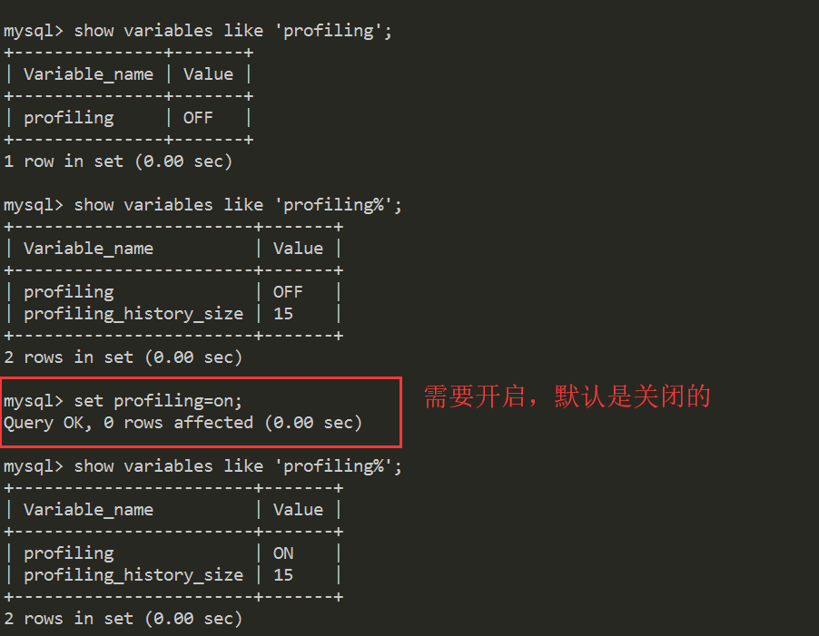
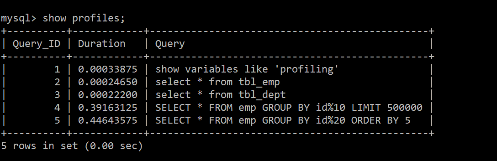
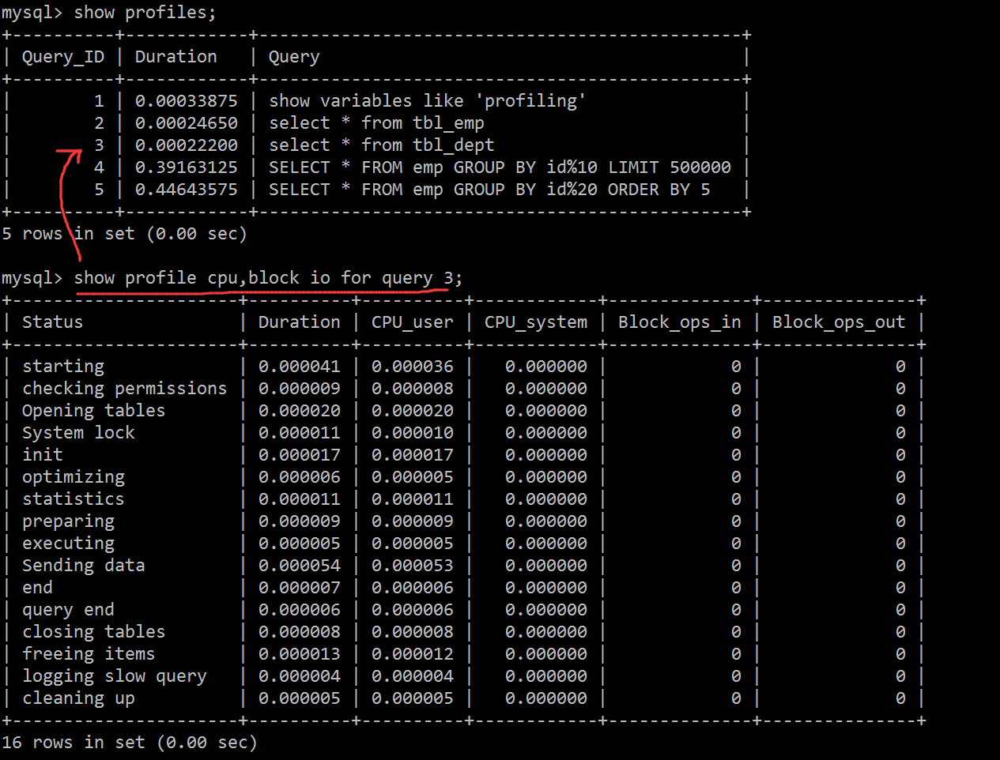
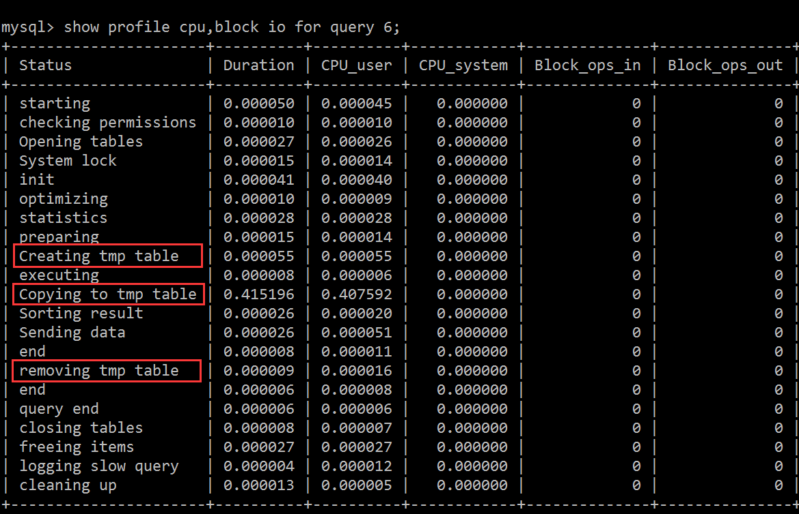

# SQL批量插入

## 1、建库建表

```sql
CREATE TABLE dept(
	id INT UNSIGNED PRIMARY KEY AUTO_INCREMENT,
	deptno MEDIUMINT UNSIGNED NOT NULL DEFAULT 0,
	dname VARCHAR(20) NOT NULL DEFAULT "",
	loc VARCHAR(13) NOT NULL DEFAULT ""
)ENGINE=INNODB DEFAULT CHARSET=GBK;

CREATE TABLE emp(
	id INT UNSIGNED PRIMARY KEY AUTO_INCREMENT,
	empno MEDIUMINT UNSIGNED NOT NULL DEFAULT 0, /*编号*/
	ename VARCHAR(20) NOT NULL DEFAULT "",/*名字*/
	job VARCHAR(9) NOT NULL DEFAULT "",/*工作*/
	mgr MEDIUMINT UNSIGNED NOT NULL DEFAULT 0,/*上级编号*/
	hiredate DATE NOT NULL,/*入职时间*/
	sal DECIMAL(7,2) NOT NULL,/* 薪水*/
	comm DECIMAL(7,2) NOT NULL,/*红利*/
	deptno MEDIUMINT UNSIGNED NOT NULL DEFAULT 0 /*部门编号*/
)ENGINE=INNODB DEFAULT CHARSET=GBK;
```

## 2、设置参数

创建函数，假如报错: This function has none of DETERMINIST...， 由于开启过慢查询日志，因为我们开启了bin-log，我们就必须为我们的function指定一个参数。



但是这样设置会导致的问题是：如果MySQL重启，上述参数又会丢失，所以到达到永久配置的效果，需要修改配置文件，在`/etc/my.cnf[mysqld]`下加上 global log_bin_trust_function_creators=1;

## 3、创建函数，保证数据的随机性

随机产生字符串

```sql
DELIMITER $$
CREATE FUNCTION rand_string(n INT) RETURNS VARCHAR(255)
BEGIN
 DECLARE chars_str VARCHAR(100) DEFAULT 'abcdefghijklmnopqrstuvwxyzABCDEFJHIJKLMNOPQRSTUVWXYZ';
 DECLARE return_str VARCHAR(255) DEFAULT '';
 DECLARE i INT DEFAULT 0;
 WHILE i< n DO
 SET return_str = CONCAT(return_str, SUBSTRING(chars_str,FLOOR(1+RAND()*52),1));
 SET i = i + 1;
 END WHILE;
 RETURN return_str;
END $$
```

随机产生数字编号

```sql
DELIMITER $$
CREATE FUNCTION rand_num( ) RETURNS INT(5)
BEGIN
 DECLARE i INT DEFAULT 0;
 SET i = FLOOR(100 + RAND()*10);
RETURN i;
END $$
```

## 4、创建存储过程

向emp表存储数据的存储过程

```sql
/* 建立存储过程（插入数据emp）*/
DELIMITER $$
CREATE PROCEDURE insert_emp(IN START INT(10) ,IN max_num INT(10) )
BEGIN
DECLARE i INT DEFAULT 0;
#set autocommit =0把autocommit设置成0
SET autocommit = 0;
 REPEAT
 SET i = i + 1;
 INSERT INTO emp(empno, ename, job, mgr, hiredate, sal, comm, deptno) VALUES ((START+i), rand_string(6) , 'SALESMAN', 0001, CURDATE(), 2000, 400, rand_num());
 UNTIL i = max_num
 END REPEAT;
 COMMIT;
END $$
```

向dept表存储数据的存储过程

```sql
/* 向dept表存储数据的存储过程 */
DELIMITER $$
CREATE PROCEDURE insert_dept(IN START INT(10),IN max_num INT(10))
BEGIN
DECLARE i INT DEFAULT 0;
SET autocommit = 0; 
REPEAT
SET i = i+ 1;
INSERT INTO dept(deptno, dname, loc) VALUES ((START+i) ,rand_string(10), rand_string(8));
UNTIL i = max_num
END REPEAT;
COMMIT; 
END $$
```

## 5、调用存储过程

由于定义函数的时候是以`$$` 这个符号作为结束符，现在要更换为普通语句：

```sql
DELIMITER;
```

下面开始调用：

```sql
CALL insert_dept(100, 10);
```



试试向emp表添加50万条数据：

```sql
CALL insert_emp(100001, 500000);
```

哈哈，虚拟机还可以，OK 妥妥的50万条数据！



# Show profiles

## 1、Show profiles是什么

Show profiles是什么：是mysql提供可以用来分析当前会话中语句执行的资源消耗情况，可以用于SQL的调优测量

这就好比去超市买东西，买什么东西花了多少钱都是有明确的记录的，Show profiles也是一样，记录SQL执行步骤耗时，每一步都做了记录。默认情况下，参数处于关闭状态，并保存最近15次的运行结果

## 2、Show profiles分析步骤

① 查看当前版本是否支持

② 开启功能，默认是关闭，使用前需要开启

```sql
show variables like 'profiling%'
```




把之前的测试数据放过来

```sql
create table tbl_dept(
    id int(11) not NULL auto_increment,
    deptName varchar(30) default NULL,
    locAdd varchar(40) default NULL,
    primary key (id)
)engine=INNODB auto_increment=1 default charset=utf8;

create table tbl_emp(
    id int(11) not null auto_increment,
    name varchar(20) default null,
    deptId int(11) default null,
    primary key (id),
    key fk_dept_id(deptId)
    #constraint fk_dept_id foregin key('deptId') references tbl_dept(id)
)engine=innodb auto_increment=1 default charset=utf8;

insert into tbl_dept(deptName, locAdd) values ('RD', 11);
insert into tbl_dept(deptName, locAdd) values ('HR', 12);
insert into tbl_dept(deptName, locAdd) values ('MK', 13);
insert into tbl_dept(deptName, locAdd) values ('MIS', 14);
insert into tbl_dept(deptName, locAdd) values ('FD', 15);

insert into tbl_emp(name, deptId) VALUES ('z3', 1);
insert into tbl_emp(name, deptId) VALUES ('z4', 1);
insert into tbl_emp(name, deptId) VALUES ('z5', 1);
insert into tbl_emp(name, deptId) VALUES ('z3', 1);

insert into tbl_emp(name, deptId) VALUES ('w5', 2);
insert into tbl_emp(name, deptId) VALUES ('w6', 2);
insert into tbl_emp(name, deptId) values ('s7', 3);
insert into tbl_emp(name, deptId) values ('s8', 4);
insert into tbl_emp(name, deptId) values ('s9', 51);
```

然后开启Show profile，进行了几条查询再show profile



下面开始选取一条开始分析。

## 3、分析执行过程

现在假设分析的是语句3 ，也就是select * from tbl_dept:



从上面可以看出，通过show profile 的分析，完整的呈现了一条SQL执行的全流程，配合着MySQL架构模型，其实很容易看出，先进行权限检查，打开表，初始化，优化器优化等等一系列的执行流程...

只能查看CPU和IO吗？当然不是，下面给出了常用的查询字段：

①ALL：显示所有的开销信息。

②BLOCK IO：显示块IO开销。

③CONTEXT SWITCHES：上下文切换开销。

④CPU：显示CPU开销信息。

⑤IPC：显示发送和接收开销信息。

⑥MEMORY：显示内存开销信息。

⑦PAGE FAULTS：显示页面错误开销信息。

⑧SOURCE：显示和Source_function，Source_file，Source_line相关的开销信息。

⑨SWAPS：显示交换次数开销信息

## 4、日常开发需要注意的结论

Status里面出现的字段：

① converting HEAP to MyISAM 查询结果太大，内存都不够用了往磁盘上搬了。

② creating tmp table 创建临时表：说说创建临时表为什么这么费事呢？首先需要新建临时表，然后需要拷贝数据到临时表，数据推送后需要删除数据，这也就是为什么创建临时表非常损耗性能的原因

③ copying to tmp table on disk 把内存中临时表复制到磁盘，危险！！！这说明临时表都存不下了，只能往磁盘丢

④ locked 锁定了

 如果在show profile诊断结果中出现了以上4条结果中的任何一条，则sql语句需要优化。 

下面看看临时表的处理过程：



可以看出，拷贝数据到临时表是非常消耗时间的！

