# 锁的理解

锁是计算机协调多个进程或线程并发访问某一资源的机制。

在数据库中，除传统的计算资源(如CPU、RAM、l/O等) 的争用以外，数据也是一种供许多用户共享的资源。如何保证数据并发访问的一致性、有效性是所有数据库必须解决的一个问题，锁冲突也是影响数据库并发访问性能的一一个重要因素。从这个角度来说锁对数据库而言显得尤其重要，也更加复杂。

最经典的例子莫过于抢购商品，如果还有一个库存的时候，这个时候如果还有另一个人买，那么如何解决是你买到还是另一个人买到的问的？这里肯定要用到事务，我们先从库存表中取出物品数量，然后插入订单，付款后插入付款表信息，然后更新商品数量。在这个过程中，使用锁可以对有限的资源进行保护，解决隔离和并发的矛盾。

# 锁的分类

从数据操作的类型（读、写）分：

读锁（共享锁）：针对同一份数据，多个读操作可以同时进行而不会互相影响

写锁（排它锁）：当前写操作没有完成前，它会阻断其他写锁和读锁。


从对数据操作的颗粒度：

表锁、行锁


开销、加锁速度、死锁、粒度、并发性能，只能就具体应用的特点来说哪种锁更合适

# 表锁（偏读）

特点：偏向MyISAM存储引擎，开销小，加锁快，无死锁，锁定粒度大，发生锁冲突的概率最高，并发最低 

下面看看案例分析

建表插入数据语句

```sql
CREATE TABLE mylock(
id INT NOT NULL PRIMARY KEY AUTO_INCREMENT,
NAME VARCHAR(20)
)ENGINE MYISAM;


INSERT INTO mylock (NAME) VALUES ('a');
INSERT INTO mylock (NAME) VALUES ('b');
INSERT INTO mylock (NAME) VALUES ('c');
INSERT INTO mylock (NAME) VALUES ('d');
INSERT INTO mylock (NAME) VALUES ('e');

SELECT * FROM mylock;
```

手动增加一个表锁

```sql
lock table 表名称 read(write)，表名称2 read(write)，其他；
```

查看表上加过的锁

```sql
show open tables;
```

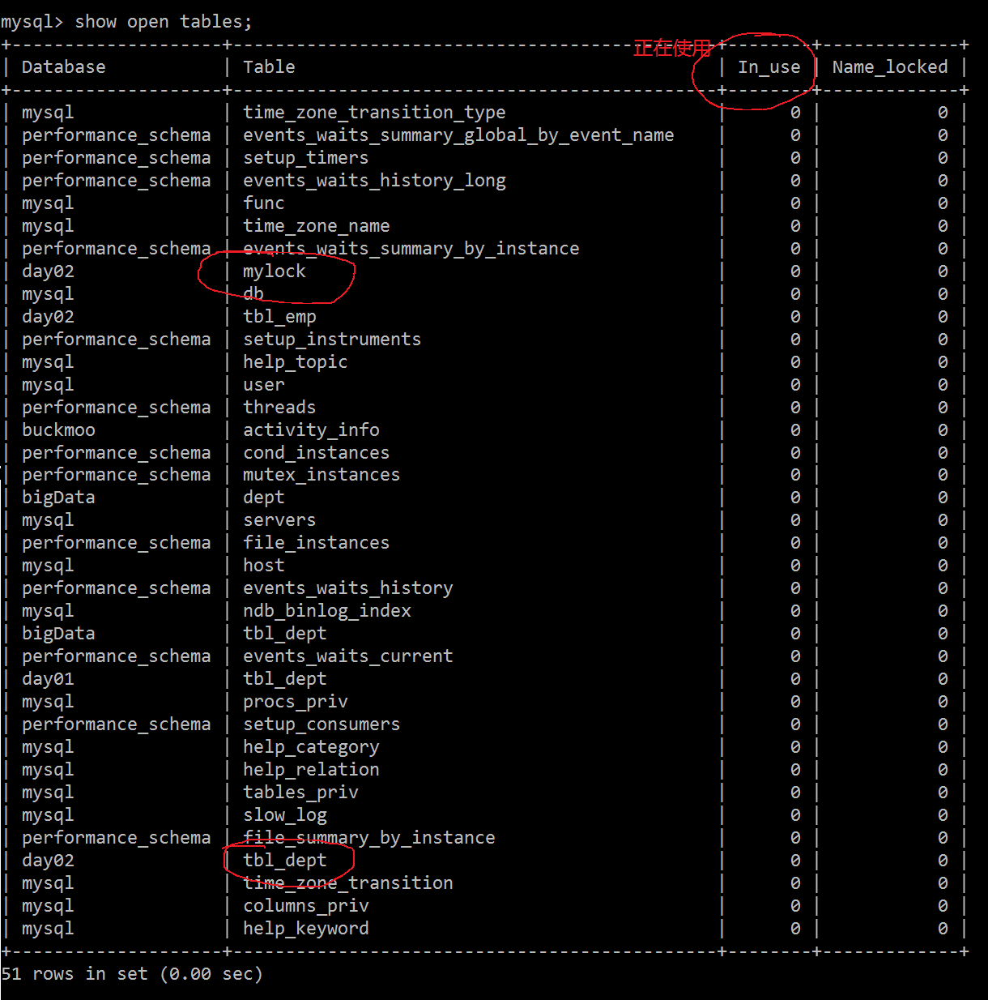

现在呢，给mylock上读锁，给tbl_dept上写锁：

```sql
lock table mylock read, tbl_dept write;
```

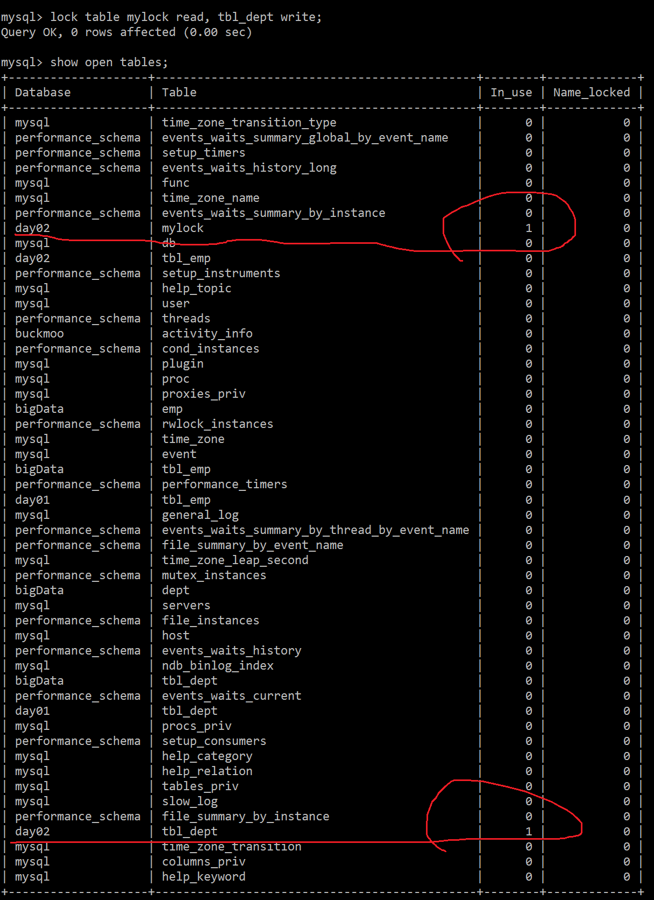

释放表锁

```sql
unlock tables;
```

## 读阻塞写 - 示例

好了，释放成功了接下来只给mylock加个读锁

```sql
lock table mylock read;
```

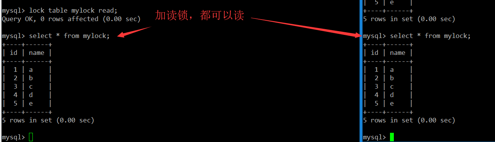

可以看出，session1对mylock加了读锁，大家都是可以读的。下面看看其他的情况：

session1 对mylock加读锁：
1、大家都可以读
2、自己不能修改、别人（session2）也不能修改
3、自己也不能查询别的表
4、别人（session2） 对mylock的表修改会发生阻塞
5、自己（session1）解锁后，阻塞解除

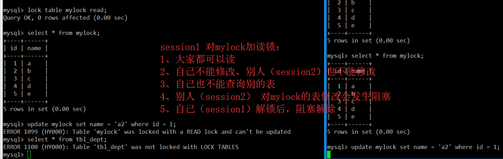

现在session1解除对mylock表的读锁：

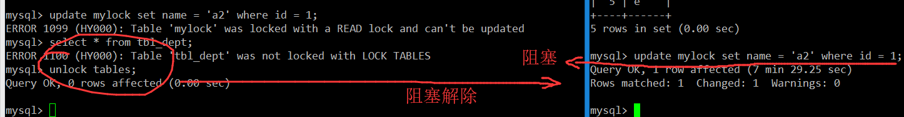

session1对mylock表加的读锁，从session2想修改mylock表的数据到session1解锁，也就是个7分29秒，哈哈这很致命！

## 写阻塞读 - 示例

下面对mylock加写锁

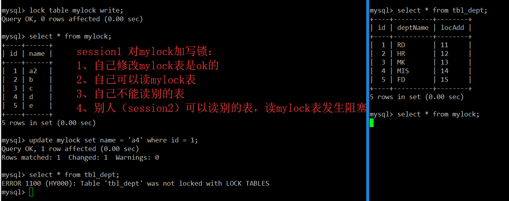

session1 对mylock加写锁：

1、自己修改mylock表是ok的
2、自己可以读mylock表
3、自己不能读别的表
4、别人（session2）可以读别的表，读mylock表发生阻塞
5、别人（session2）更不能写mylock表了


session1解除写锁，session2才可以解除被阻塞的状态：

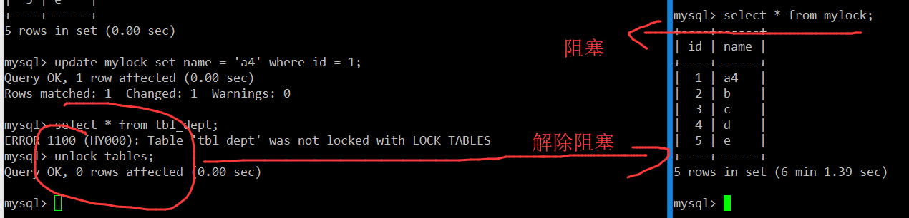

很显然，这次查询被session1阻塞了6分多钟才查询出结果。


注意：如果在session2中出现查询并未被阻塞的情况，那就是MySQL直接从缓存中取得数据，在MySQL5.7 以后的版本中不会发生此问题！


## 得出结论

MyISAM在执行查询语句(SELECT) 前，会自动给涉及的所有表加读锁，在执行增删改操作前，会自动给涉及的表加写锁。
MySQL的表级锁有两种模式:
表共享读锁 (Table Read Lock)
表独占写锁 (Table Write Lock)


结合上表，所以对MyISAM表进行操作，会有以下情况:
1、对MyISAM表的读操作(加读锁)，不会阻塞其他进程对同一表的读请求，但会阻塞对同一表的写请求。只有当读锁释放后，才会执行其它进程的写操作。
2、对MyISAM表的写操作(加写锁)，会阻塞其他进程对同一表的读和写操作，只有当写锁释放后，才会执行其它进程的读写操作。

简而言之，就是读锁会阻塞写，但是不会堵塞读。而写锁则会把读和写都堵塞


## 表锁分析

看看那些表被加锁了：

```sql
show open tables;
```

0 表示未加锁，1 表示已经被锁定


如何分析表锁定

可以通过检查tables_locks_writed和table_locks_immediate 状态变量来分析系统上的表锁定：

```sql
show status like 'table%';
```

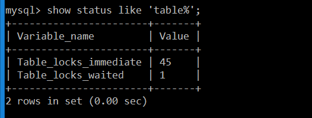

这里有两个状态变量记录MySQL内部表级锁定的情况，两个变量说明如下:

Table_locks_immediate:  产生表级锁定的次数，表示可以立即获取锁的查询次数，每立即获取锁值加1 ;
Table_locks_waited: 出现表级锁定争用而发生等待的次数(不能立即获取锁的次数，每等待一次锁值加1)，此值高则说明存在着较严重的表级锁争用情况；


所以，这也就是MyISAM引擎的缺陷：MyISAM的读写锁调度是写优先，这也是MyISAM不适合做写为主的表的引擎。因为写锁后，其他线程不能做任何操作，大量的更新会使查询很难得到锁，从而造成永远阻塞！


# 行锁（偏写）

偏向InnoDB存储引擎，开销大，加锁慢；会出现死锁；锁定粒度最小，发生锁冲突的概率最低，并发度也最高。

InnoDB与MyISAM的最大不同有两点：一是支持事务（TRANSACTION）；二是采用了行级锁

## 事物和ACID

事务是由一组SQL语句组成的逻辑处理单元，事务具有以下4个属性，通常简称为事务的ACID属性。

1、原子性 (Atomicity)  ：事务是一个原子操作单元， 其对数据的修改，要么全都执行，要么全都不执行。
2、一致性(Consistent)  : 在事 务开始和完成时， 数据都必须保持一致状态。这意味着所有相关的数据规则都必须应用于事务的修改，以保持数据的完整性；事务结束时，所有的内部数据结构(如B树索引或双向链表)也都必须是正确的。
3、隔离性(Isolation) : 数据库系统提供一定的隔离机制，保证事务在不受外部并发操作影响的“独立”环境执行。这意味着事务处理过程中的中间状态对外部是不可见的，反之亦然。
4、持久性(Durable) : 事务完成之后，它对于数据的修改是永久性的，即使出现系统故障也能够保持。

## 并发事务处理带来的问题

1、更新丢失

当两个或多个事务选择同一行，然后基于最初选定的值更新该行时，由于每个事务都不知道其他事务的存在，就会发生丢失更新问题，这就是最后的更新覆盖了由其他事务所做的更新。

例如，两个程序员修改同一个Java文件。每程序员独立地更改其副本，然后保存更改后的副本，这样就覆盖了原始文档。最后保存其更改副本的编辑人员覆盖前一个程序员所做的更改。如果在一个程序员完成并提交事务之前，另一个程序员不能访问同一文件，则可避免此问题。

2、脏读

一个事务正在对一条记录做修改，在这个事务完成并提交前，这条记录的数据就处于不一致状态，这时，另一个事务也来读取同一条记录，如果不加控制，第二个事务读取了这些 “脏” 数据，并据此做进一步的处理， 就会产生未提交的数据依赖关系。这种现象被形象地叫做”脏读”。

一句话：事务A读取到了事务B已修改但尚未提交的的数据，还在这个数据基础上做了操作。此时，如果B事务回滚，A读取的数据无效，不符合一致性要求。

3、不可重复读

一个事务在读取某些数据后的某个时间，再次读取以前读过的数据，却发现其读出的数据已经发生了改变、或某些记录已经被删除了！这种现象就叫做“不可重复读”。
一句话：事务A读取到了事务B已经提交的修改数据，不符合隔离性

4、幻读

一个事务按相同的查询条件重新读取以前检索过的数据，却发现其他事务插入了满足其查询条件的新数据，这种现象就称为“幻读”。

一句话：事务A读取到了事务B体提交的新增数据，不符合隔离性

注意：幻读和脏读有点类似，脏读是事务B里面修改了数据，幻读是事务B里面新增了数据。

## 事物隔离级别

脏读、不可重复读和幻读，其实都是数据库读一致性问题，必须由数据库提供一定的事务隔离机制来解决。


数据库的事务隔离越严格，并发副作用越小，但付出的代价也就越大，因为事务隔离实质上就是使事务在一定程度上 “串行化” 进行，这显然与“并发”是矛盾的。同时，不同的应用对读一致性和事务隔离程度的要求也是不同的，比如许多应用对 “不可重复读” 和 “幻读” 并不敏感，可能更关心数据并发访问的能力。

常看当前数据库的事务隔离级别:

```sql
 show variables like 'tx_isolation';
```

## 案例分析

### 1、建表SQL

```sql
CREATE TABLE test_innodb_lock (a INT(11), b VARCHAR(16))ENGINE=INNODB;
INSERT INTO test_innodb_lock VALUES(1,'b2');
INSERT INTO test_innodb_lock VALUES(3,'3');
INSERT INTO test_innodb_lock VALUES(4, '4000');
INSERT INTO test_innodb_lock VALUES(5, '5000');
INSERT INTO test_innodb_lock VALUES(6,'6000');
INSERT INTO test_innodb_lock VALUES(7,'7000');
INSERT INTO test_innodb_lock VALUES(8,'8000');
INSERT INTO test_innodb_lock VALUES(9,'9000');
INSERT INTO test_innodb_lock VALUES(1,'b1');

CREATE INDEX test_innodb_a_ind ON test_innodb_lock(a);
CREATE INDEX test_innodb_lock_b_ind test_innodb_lock(b);

SELECT * FROM test_innodb_lock;
```

### 2、行锁定基本演示

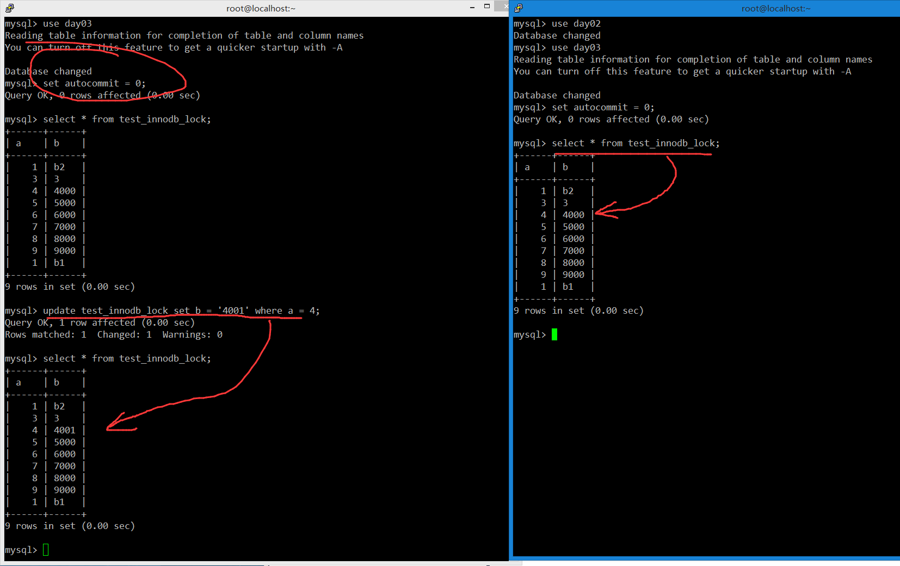

可以看出，session1加了行锁之后，修改一条数据，session1自己是可见的，但是session2查出来的数据仍然是原来未修改的数据！

现在将session1的事物提交了，在看看session2查到的数据，还是4000，这是因为session2的事物还未提交：

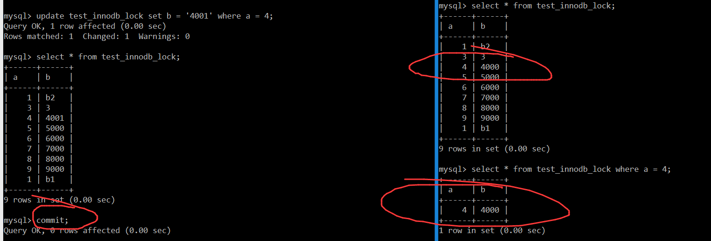

所以接下来提交session2的事物，再次执行查询

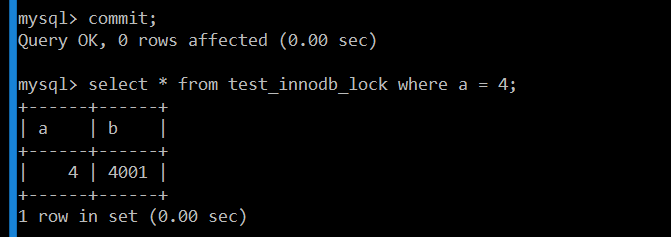

证实了事物的隔离性，接下来试试修修改数据：

session1 修改第四条数据，未提交
session2 此时修改第四条数据，发生阻塞

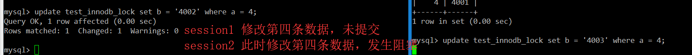

此时，session1提交事务，session2解除被阻塞状态


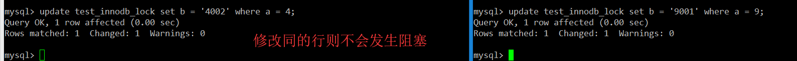

对了，到这里顺吐槽一下datagrip，每次就算写连续的SQL它也要分成事物，比如我写了100行的Insert插入，没错，它会开100个事物.... 


### 3、无索引行锁升级为表锁

在建表的时候对a和b字段都建立了索引：

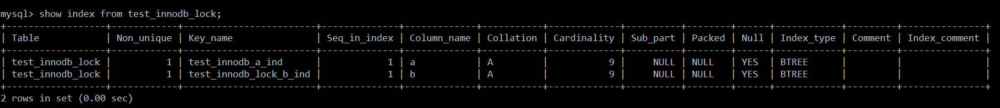

现在假设session1对b='4000' 这条记录做了修改，但是由于错误的写法导致索引失效：

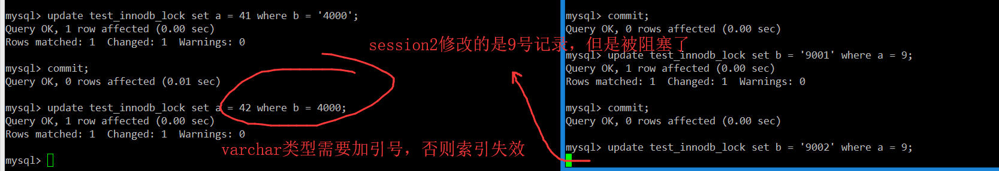

很明显，虽然session1和session2操作的数据是同一条，但是session2被阻塞了，这就说明了如果修改数据的时候导致索引失效，那么行锁会变成表锁！ 

同样的，变成表锁的话session2就需要等session1 commit之后才能提交事务！


### 4、间隙锁的危害

什么是间隙锁？
当我们用范围条件而不是相等条件检索数据，并请求共享或排他锁时，InnoDB会给符合条件的已有数据记录的索引项加锁；对于键值在条件范围内但并不存在的记录，叫做“间隙(GAP)” ，InnoDB也会对这个“间隙”加锁，这种锁机制就是所谓的间隙锁(Next-Key锁) 


间隙锁的危害：
因为Query执行过程中通过过范围查找的话，他会锁定整个范围内所有的索引键值，即使这个键值并不存在。
间隙锁有一个比较致命的弱点， 就是当锁定一个范围键值之后， 即使某些不存在的键值也会被无辜的锁定，而造成在锁定的时候无法插入锁定键值范围内的任何数据，在某些场景下这可能会对性能造成很大的危害


好了，接下来看看这个现象

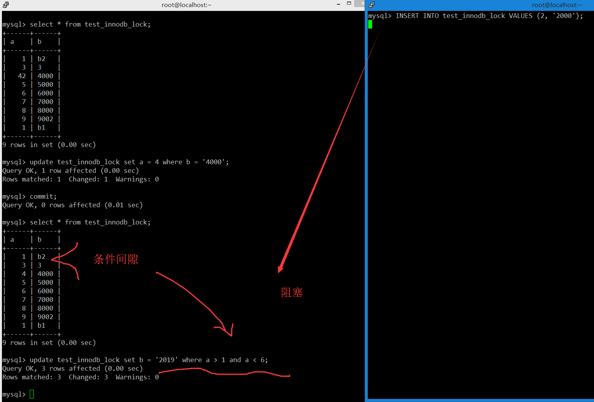

session1只是在更改一个范围的数据，session2只是在插入一条新的数据，但是同样发生了阻塞！

同样的，需要等待session1 commit之后，session2才能插入成功！

很显然，在InnoDB看来，就算没有2，但是你在我的范围里，那我也把你锁了，这也就是为什么session2会被是阻塞的原因！InnoDB想的就是宁可错杀一千不可放过一个，哈哈

### 5、如何锁定一行

看看下面这个示例：

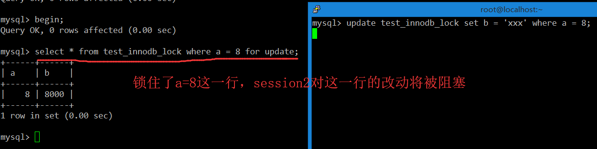

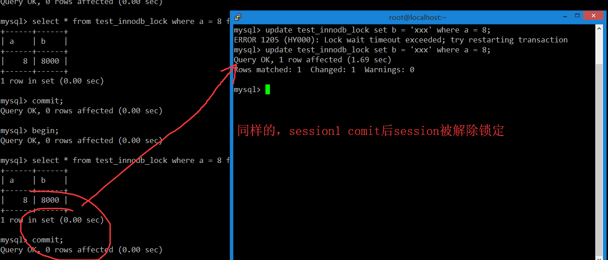

## 行锁结论

Innodb存储引擎由于实现了行级锁定，虽然在锁定机制的实现方面所带来的性能损耗可能比表级锁定会要更高一些，但是在整体并发处理能力方面要远远优于MyISAM的表级锁定的。当系统并发量较高的时候，Innodb的整体性能和MyISAM相比就会有比较明显的优势了。

但是，Innodb的行级锁定同样也有其脆弱的一面，当我们使用不当的时候，可能会让Innodb的整体性能表现不仅不能比MyISAM高，甚至可能会更差，也就是必须要避免行锁变表锁！

```sql
 show status like 'innodb_row_lock%';
```

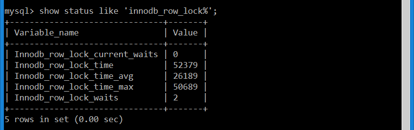

对各个状态量的说明如下:
Innodb_row_lock_current_waits: 当前正在等待锁定的数量
Innodb_row_lock_ time: 从系统启动到现在锁定总时间长度
Innodb_row_lock_time_avg: 每次等待所花平均时间
Innodb_row_lock_time_max: 从系统启动到现在等待最常的一次所花的时间
Innodb_row_lock_waits: 系统启动后到现在总共等待的次数

对于这5个状态变量，比较重要的主要是
Innodb_row_lock_time_avg (等待平均时长)、
Innodb_ row_lock_waits ( 等待总次数)、
Innodb_row_lock_time (等待总时长) 这三项。
尤其是当等待次数很高，而且每次等待时长也不小的时候，我们就需要分析系统中为什么会有如此多的等待，然后根据分析结果着手指定优化计划。


# 页锁

开销和加锁时间界于表锁和行锁之间：会出现死锁；锁定粒度界于表锁和行锁之间，并发度一般。

# 优化建议

1、尽可能让所有数据检索都通过索引来完成，避免无索引行锁升级为表锁

2、合理设计索引，尽量缩小锁的范围

3、尽可能较少检索条件，避免间隙锁

4、尽量控制事务大小，减少锁定资源量和时间长度

5、尽可能低级别事务隔离