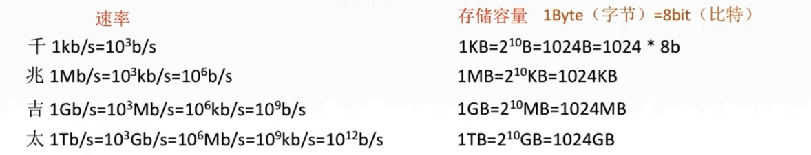
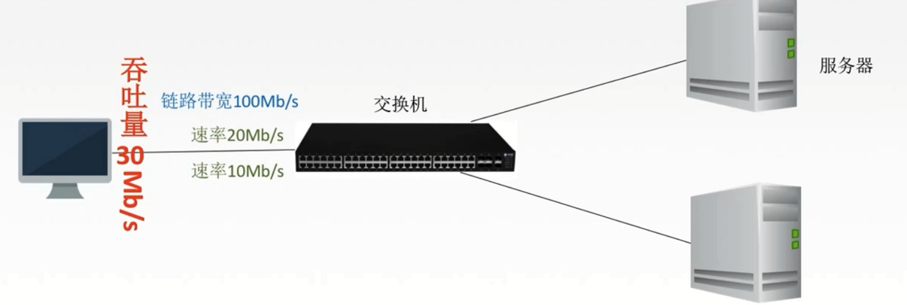
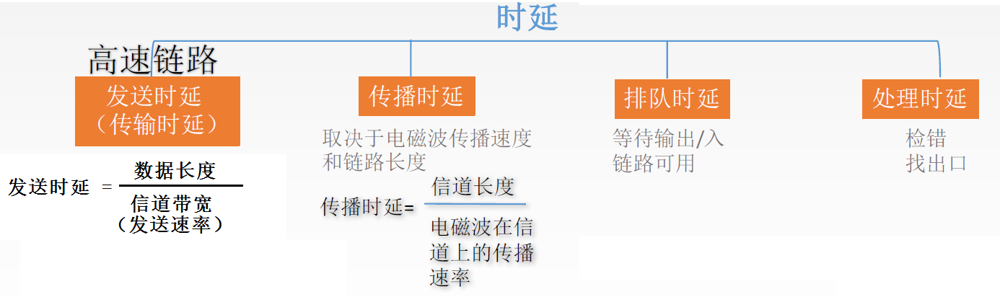
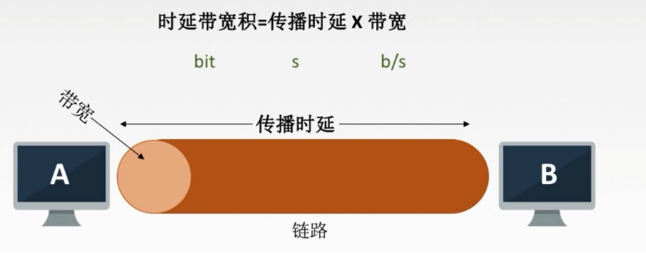
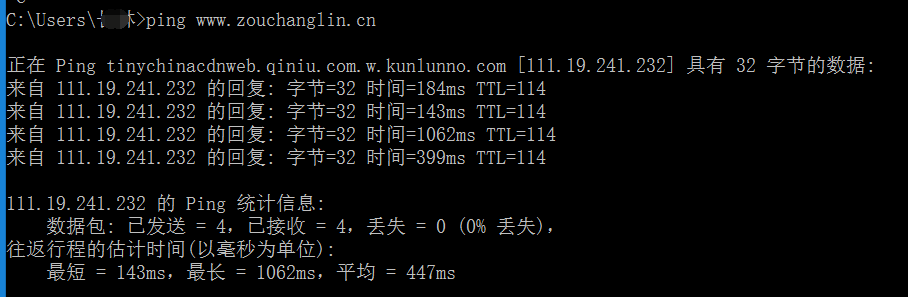
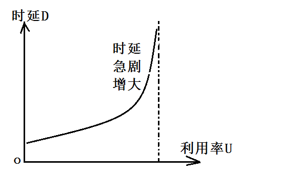
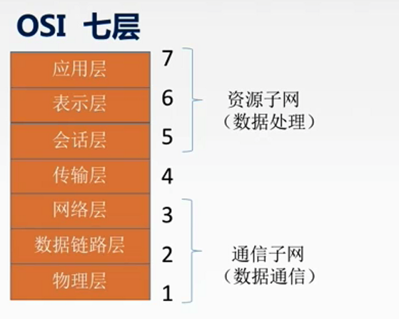
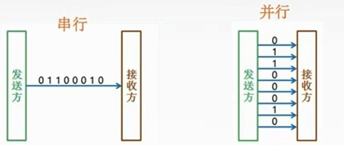

# 计算机网络性能指标

## 1、速率

速率即数据率或称数据传输率或比特率。连接在计算机网络上的主机在数字信道上传送数据位数的速率。单位是b/s，kb/s， Mb/s，Gb/s, Tb/s。下面是速率和存储容量的区别：

## 2、带宽

原本指某个信号具有的频带宽度，即最高频率与最低频率之差，单位是赫兹(Hz)。
计算机网络中，带宽用来表示网络的通信线路传送数据的能力，通常是指单位时间内从网络中
的某一点到另一点所能通过的“最高数据率”。单位是"比特每秒"，b/s， kb/s, Mb/s， Gb/s。表示在单位时间内通

## 3、吞吐量

过某个网络(或信道、接口)的数据量。单位b/s, kb/s, Mb/s等。吞吐量受网络的带宽或网络的额定速率的限制。

## 4、时延

指数据(报文/分组/比特流)从网络(或链路)的一端传送到另一端所需的时间。也叫延迟或迟延。单位是s。

## 5、时延带宽积

## 6、往返时延 RTT

从发送方发送数据开始，到发送方收到接收方的确认(接收方收到数据后立即发送确认)，总共经历的时延。

RTT越大，在收到确认之前，可以发送的数据越多。因为我等得越久，就有更多的时间发送数据。RTT包括往返传播时延，也就是传播时延的二倍，同时也包括了末端处理时间。

## 7、利用率

信道利用率和网络利用率，信道利用率是有数据通过的时间 / (有+无)数据通过的时间

网络利用率就是信道利用率加权平均值

# 网络其他概念

## 1、OSI 参考模型

## 2、三种通信方式

① 单工通信

单工通信只有一个方向的通信 而没有反方向的交互，仅需要一条信道。

② 半双工通信

半双工通信通信的双方都可以发送或接收信息，但任何一方都不能同时发送和接收，需要两条信道。

③ 全双工通信

全双工通信通信双方可以同时发送和接受信息，也需要两条信道。

## 3、两种数据传输方式

串行与并行

# 其他通信协议

