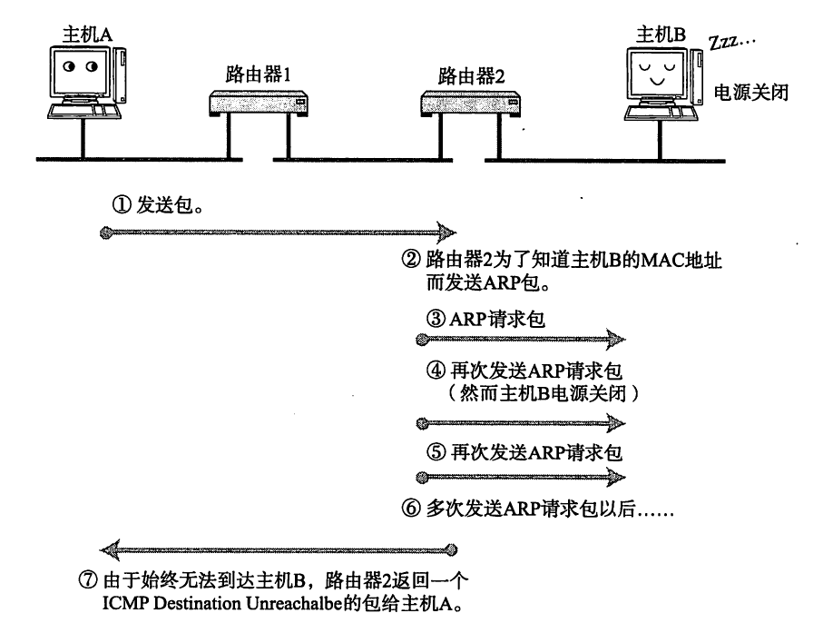
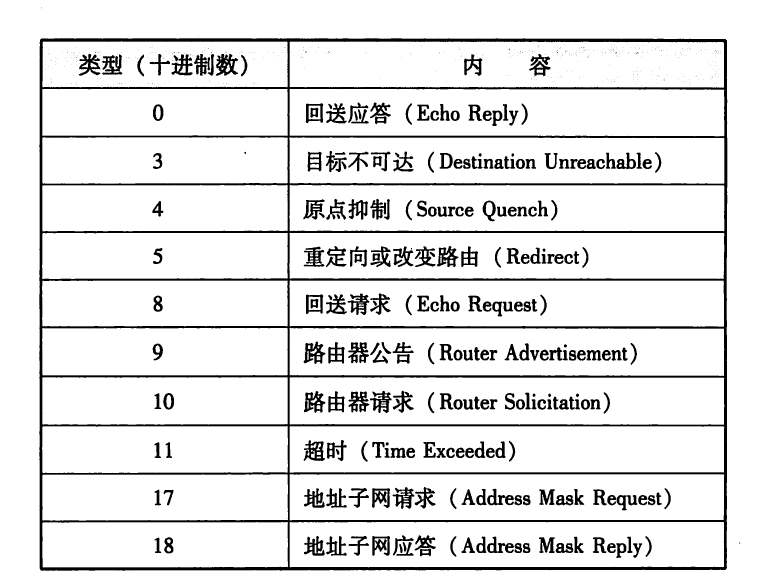
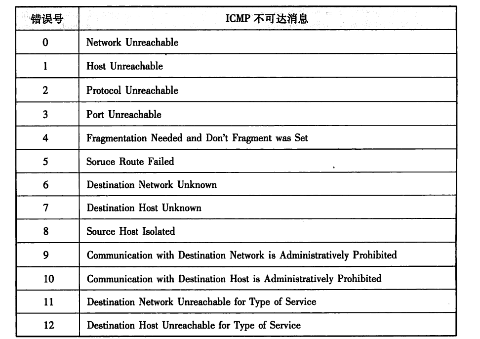
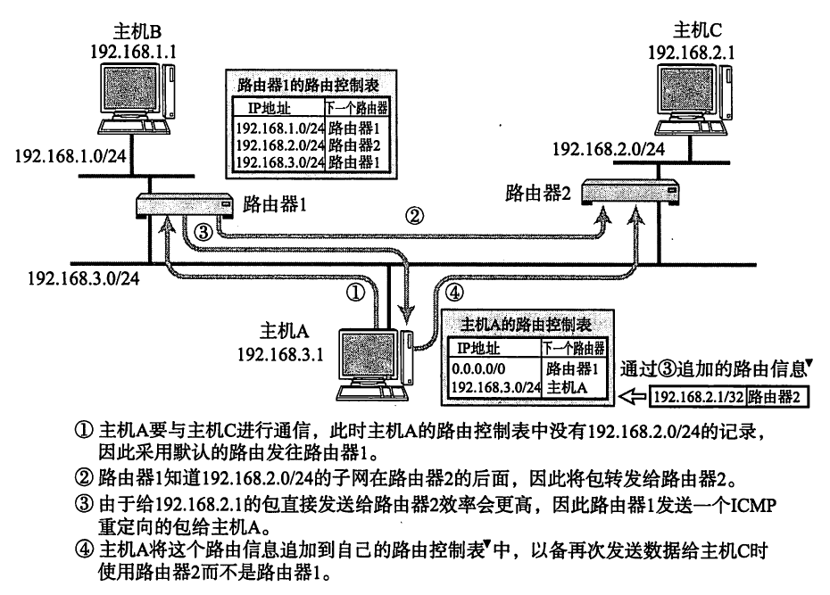
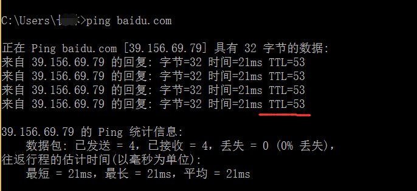
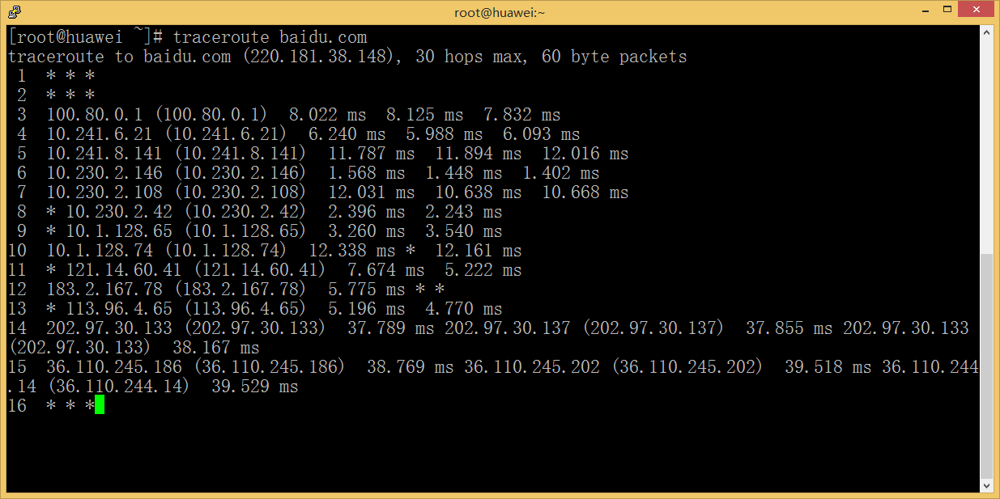

# 1、ICMP协议概述

ICMP主要是用于确认IP包是否成功发送至目标地址，通知在发送过程中，IP包被废弃的具体原因，改善网络设置等。有了这些功能就方便对网络进行诊断。

ICMP也是基于IP协议工作的，但是它并不是传输层的功能，因此人们仍然把它归结为网络层协议；

很好理解，如果主机A向B发送了报文，中途的路由器2却未发现主机B的存在，这个时候，路由器2便向A主机发送一个ICMP包，说明未能发往B主机：

ICMP大概分为两类报文：一类是通知出错原因、一类是用于诊断查询

# 2、主要的ICMP消息

1、不可达消息

IP路由器无法将IP数据包发送给目标地址时，会给发送端主机返回一个目标不可达( Destination Unreachable Message)的ICMP消息，并在这个消息中显示不可达的具体原因：

2、ICMP重定向消息
如果路由器发现发送端主机使用了次优的路径发送数据，那么它会返回一个ICMP重定向(ICMP Redirect Message)的消息给这个主机。在这个消息中包含了最合适的路由信息和源数据。这主要发生在路由器持有更好的路由信息的情况下。路由器会通过这样的ICMP消息给发送端主机一个更合适的发送路由，但是这样做很容易成为引发问题的原因，一般不这么干。

3、超时消息

IP包中有一个字段叫做TTL (Time To Live，生存周期)，它的值随着每经过一次路由器就会减1，直到减到0时该IP包会被丢弃。此时IP 路由器将会发送一个ICMP超时的消息(ICMP Time Exceeded Message，错误号0 )给发送端主
机，并通知该包已被丟弃。设置IP包生存周期的主要目的，是为了在路由控制遇到问题发生循环状况时，避免IP包无休止地在网络上被转发。此外，有时可以用TTL控制包的到达范围，例如设置一个较小的TTL值，如下图所示：

4、回送消息

ping命令同样也是回送消息的体现

有一款充分利用ICMP超时消息的应用叫做traceroute。它可以显示出由执行程序的主机到达特定主机之前历经多少路由器。它的原理就是利用IP包的生存期限从1开始按照顺序递增的同时发送UDP包，强制接收ICMP超时消息的一种方法。这样可以将所有路由器的IP地址逐一呈现。这个程序在网络上发生问题时，是问题诊断常用的一个强大工具。具体用法是在UNIX命令行里输入“traceroute目标主机地址”即可。

